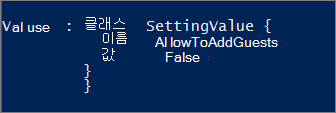

# <a name="prevent-guest-users-from-being-added-to-a-specific-microsoft-365-group-or-microsoft-teams-team"></a>Hindra gäst användare från att läggas till i en viss Microsoft 365-grupp eller Microsoft Teams-team

Om du vill tillåta gäst åtkomst till de flesta grupper och team, men om du vill förhindra gäst åtkomst kan du blockera gäst åtkomst för enskilda grupper och team. (Blockering av gäst åtkomst till ett team utförs genom att blockera gäst åtkomst till den associerade gruppen.) Detta förhindrar att nya gäster läggs till, men inga gäster som redan finns i gruppen eller teamet tas bort.

Om du använder känslighets etiketter i organisationen rekommenderar vi att du använder dem för att kontrol lera gäst åtkomst per grupp. Information om hur du gör detta finns [i känslighets etiketter för att skydda innehåll i Microsoft Teams, microsoft 365-grupper och SharePoint-webbplatser](https://docs.microsoft.com/microsoft-365/compliance/sensitivity-labels-teams-groups-sites). Det här är den metod som rekommenderas.

## <a name="change-group-settings-using-microsoft-powershell"></a>Ändra grupp inställningar med hjälp av Microsoft PowerShell

Du kan också förhindra att nya gäster läggs till enskilda grupper med PowerShell.

Du måste använda för hands versionen av [Azure Active Directory PowerShell för graf](https://docs.microsoft.com/powershell/azure/active-directory/install-adv2) (modul name **AzureADPreview**) för att ändra inställningen för gäst åtkomst på grupp nivå:

- Om du inte har installerat någon version av Azure AD PowerShell-modulen förut läser du [Installera Azure AD-modulen](https://docs.microsoft.com/powershell/azure/active-directory/install-adv2?view=azureadps-2.0-preview&preserve-view=true) och följa anvisningarna för att installera den offentliga för hands versionen.

- Om du har 2,0 General Availability-versionen av Azure AD PowerShell-modulen (AzureAD) installerad måste du avinstallera den genom att köra `Uninstall-Module AzureAD` i din PowerShell-session och sedan installera för hands versionen genom att köra `Install-Module AzureADPreview` .

- Om du redan har installerat för hands versionen måste du `Install-Module AzureADPreview` kontrol lera att den är den senaste versionen av den här modulen.

> [!NOTE]
> Du måste ha global administratörs behörighet för att köra de här kommandona. 

Kör följande skript och ändra */<GroupName/>* till namnet på den grupp där du vill blockera gäst åtkomst.

```PowerShell
$GroupName = "<GroupName>"

Connect-AzureAD

$template = Get-AzureADDirectorySettingTemplate | ? {$_.displayname -eq "group.unified.guest"}
$settingsCopy = $template.CreateDirectorySetting()
$settingsCopy["AllowToAddGuests"]=$False
$groupID= (Get-AzureADGroup -SearchString $GroupName).ObjectId
New-AzureADObjectSetting -TargetType Groups -TargetObjectId $groupID -DirectorySetting $settingsCopy
```

Kör det här kommandot för att bekräfta dina inställningar:

```PowerShell
Get-AzureADObjectSetting -TargetObjectId $groupID -TargetType Groups | fl Values
```

Verifieringen ser ut så här:
    

  
## <a name="allow-or-block-guest-access-based-on-their-domain"></a>Tillåta eller blockera gäst åtkomst baserat på deras domän

Du kan tillåta eller blockera gäst användare som använder en viss domän. Om ditt företag till exempel har ett samarbete med ett annat företag (Fabrikam) kan du lägga till Fabrikam i listan Tillåt så att användarna kan lägga till dem i sina grupper.

Mer information finns i [tillåta eller blockera inbjudningar för B2B-användare från specifika organisationer](https://docs.microsoft.com/azure/active-directory/b2b/allow-deny-list).

## <a name="add-guests-to-the-global-address-list"></a>Lägga till gäster i den globala adress listan

Som standard är inte gästerna synliga i den globala adress listan för Exchange. Följ stegen nedan om du vill göra en gäst synlig i den globala adress listan.

Hitta gäst användarens ObjectID genom att köra:

```PowerShell
Get-AzureADUser -Filter "userType eq 'Guest'"
```

Kör sedan följande värden för ObjectID, GivenName, efter namn, DisplayName och TelephoneNumber.

```PowerShell
Set-AzureADUser -ObjectId cfcbd1a0-ed18-4210-9b9d-cf0ba93cf6b2 -ShowInAddressList $true -GivenName 'Megan' -Surname 'Bowen' -DisplayName 'Megan Bowen' -TelephoneNumber '555-555-5555'
```

## <a name="related-articles"></a>Relaterade artiklar

[Hantera grupp medlemskap i administrations centret för Microsoft 365](https://docs.microsoft.com/microsoft-365/admin/create-groups/add-or-remove-members-from-groups)
  
[Åtkomst granskning för Azure Active Directory](https://docs.microsoft.com/azure/active-directory/active-directory-azure-ad-controls-perform-access-review)

[Set-AzureADUser](https://docs.microsoft.com/powershell/module/azuread/set-azureaduser)
