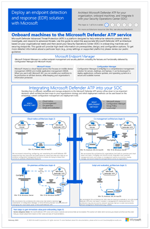
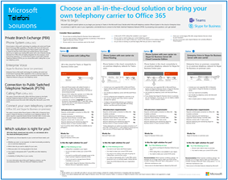

# Produktivitetsillustrationer för Microsoft 365Microsoft 365 productivity illustrations

Microsoft 365 Enterprise Solution Series tillhandahåller vägledning för implementering av Microsoft 365-funktioner, särskilt när det gäller funktioner, bland annat Teams-arkitektur diagram.The Microsoft 365 enterprise solution series provides guidance for implementing Microsoft 365 capabilities, especially where capabilities cross technologies, including Teams architecture diagrams.

### Microsoft Teams och relaterade produktivitetstjänster i Microsoft 365 för IT-arkitekterMicrosoft Teams and related productivity services in Microsoft 365 for IT architects
Den logiska arkitekturen för produktivitetstjänster i Microsoft 365, med Microsoft Teams i spetsen.The logical architecture of productivity services in Microsoft 365, leading with Microsoft Teams.

| ObjektItem | BeskrivningDescription |
|:-----|:-----|
|   [PDF](https://github.com/MicrosoftDocs/microsoft-365-docs/raw/public/microsoft-365/downloads/msft-m365-teams-logical-architecture.pdf) \| [Visio](https://github.com/MicrosoftDocs/OfficeDocs-Enterprise/raw/live/Enterprise/downloads/msft-m365-teams-logical-architecture.vsdx)[PDF](https://github.com/MicrosoftDocs/microsoft-365-docs/raw/public/microsoft-365/downloads/msft-m365-teams-logical-architecture.pdf) \| [Visio](https://github.com/MicrosoftDocs/OfficeDocs-Enterprise/raw/live/Enterprise/downloads/msft-m365-teams-logical-architecture.vsdx)   Uppdaterad i april 2019Updated April 2019   |Microsoft erbjuder ett utbud av produktivitetstjänster som samverkar för att tillhandahålla samarbetsupplevelser med funktioner för datastyrning, säkerhet och efterlevnad.Microsoft provides a suite of productivity services that work together to provide collaboration experiences with data governance, security, and compliance capabilities.    Den här serien med illustrationer ger en översikt över produktivitetstjänsternas logiska arkitektur för företagsarkitekter, med Microsoft Teams i spetsen.This series of illustrations provides a view into the logical architecture of productivity services for enterprise architects, leading with Microsoft Teams.|

### Grupper i Microsoft 365 för IT-arkitekterGroups in Microsoft 365 for IT Architects
Det IT-arkitekter behöver veta om grupper i Microsoft 365What IT architects need to know about groups in Microsoft 365

| ObjektItem | BeskrivningDescription |
|:-----|:-----|
|   [PDF](https://github.com/MicrosoftDocs/microsoft-365-docs/raw/public/microsoft-365/downloads/msft-m365-groups.pdf) \| [Visio](https://github.com/MicrosoftDocs/OfficeDocs-Enterprise/raw/live/Enterprise/downloads/msft-m365-groups.vsdx)[PDF](https://github.com/MicrosoftDocs/microsoft-365-docs/raw/public/microsoft-365/downloads/msft-m365-groups.pdf) \| [Visio](https://github.com/MicrosoftDocs/OfficeDocs-Enterprise/raw/live/Enterprise/downloads/msft-m365-groups.vsdx)   Uppdaterat maj 2020Updated May 2020|De här illustrationerna beskriver de olika typerna av grupper, hur de skapas och hanteras samt några rekommendationer för styrning.These illustrations detail the different types of groups, how these are created and managed, and a few governance recommendations.|

### Microsoft 365 informations skydd och funktioner för efterlevnadMicrosoft 365 information protection and compliance capabilities

Microsoft 365 innehåller en mängd olika funktioner för informations skydd och efterlevnad.Microsoft 365 includes a broad set of information protection and compliance capabilities. Tillsammans med Microsofts produktivitets verktyg är de här funktionerna utformade för att hjälpa organisationer att samar beta i real tid, samtidigt som de uppfyller stränga villkor för efterlevnad.Together with Microsoft’s productivity tools, these capabilities are designed to help organizations collaborate in real time while adhering to stringent regulatory compliance frameworks. 

Denna uppsättning illustrationer använder en av de mest reglerade industrierna, finans tjänsterna, för att demonstrera hur dessa funktioner kan användas för att åtgärda gemensamma reglerings krav.This set of illustrations uses one of the most regulated industries, financial services, to demonstrate how these capabilities can be applied to address common regulatory requirements. Du kan anpassa dessa illustrationer för eget bruk.Feel free to adapt these illustrations for your own use. 

| ObjektItem | BeskrivningDescription |
|:-----|:-----|
|   [Ladda ned som PDF](https://download.microsoft.com/download/3/a/6/3a6ab1a3-feb0-4ee2-8e77-62415a772e53/m365-compliance-illustrations.pdf) \| [Ladda ned som Visio](https://download.microsoft.com/download/3/a/6/3a6ab1a3-feb0-4ee2-8e77-62415a772e53/m365-compliance-illustrations.vsdx)  [Download as a PDF](https://download.microsoft.com/download/3/a/6/3a6ab1a3-feb0-4ee2-8e77-62415a772e53/m365-compliance-illustrations.pdf)  \| [Download as a Visio](https://download.microsoft.com/download/3/a/6/3a6ab1a3-feb0-4ee2-8e77-62415a772e53/m365-compliance-illustrations.vsdx)   Uppdaterat 2020Updated October 2020|BeskrivsIncludes: <ul><li>  Microsoft informations skydd och skydd mot data förlustMicrosoft information protection and data loss prevention</li><li>Bevarande principer och bevarande etiketterRetention policies and retention labels </li><li>InformationsbarriärerInformation barriers</li><li>KommunikationsefterlevnadCommunication compliance</li><li>Insider-riskInsider risk</li><li>Data intag från tredje partThird-party data ingestion</li>|

### Säkerhet och informationsskydd för organisationer i flera regionerSecurity and Information Protection for Multi-Region Organizations
Säkerhet och informationsskydd för organisationer i flera regioner med en enda Microsoft 365-klientorganisationSecurity and information protection for multi-region organizations with a single microsoft 365 tenant

| ObjektItem | BeskrivningDescription |
|:-----|:-----|
|   [PDF](https://github.com/MicrosoftDocs/microsoft-365-docs/raw/public/microsoft-365/downloads/msft-security-info-protect-multi-region.pdf) \| [Visio](https://github.com/MicrosoftDocs/microsoft-365-docs/raw/public/microsoft-365/downloads/msft-security-info-protect-multi-region.vsdx)[PDF](https://github.com/MicrosoftDocs/microsoft-365-docs/raw/public/microsoft-365/downloads/msft-security-info-protect-multi-region.pdf) \| [Visio](https://github.com/MicrosoftDocs/microsoft-365-docs/raw/public/microsoft-365/downloads/msft-security-info-protect-multi-region.vsdx) Uppdaterad i mars 2020Updated March 2020 |Användning av en enda Microsoft 365-klientorganisation för din globala organisation är det bästa alternativet och den bästa upplevelsen av många olika anledningar.Using a single Microsoft 365 tenant for your global organization is the best choice and experience for many reasons. Men många arkitekter kämpar med hur de ska uppfylla kraven för säkerhet och informationsskydd i olika regioner.However, many architects wrestle with how to meet security and information protection objectives across different regions. De här avsnitten innehåller rekommendationer.This set of topics provides recommendations. |

### Microsoft Defender för distributions strategi för slut punktMicrosoft Defender for Endpoint deployment strategy

Beroende på din miljö passar vissa verktyg bättre för vissa arkitekturer.Depending on your environment, some tools are better suited for certain architectures.

| ObjektItem | BeskrivningDescription |
|:-----|:-----|
|  [PDF](https://github.com/MicrosoftDocs/windows-itpro-docs/raw/public/windows/security/threat-protection/microsoft-defender-atp/downloads/mdatp-deployment-strategy.pdf)  \| [Visio](https://github.com/MicrosoftDocs/windows-itpro-docs/raw/public/windows/security/threat-protection/microsoft-defender-atp/downloads/mdatp-deployment-strategy.vsdx)[PDF](https://github.com/MicrosoftDocs/windows-itpro-docs/raw/public/windows/security/threat-protection/microsoft-defender-atp/downloads/mdatp-deployment-strategy.pdf)  \| [Visio](https://github.com/MicrosoftDocs/windows-itpro-docs/raw/public/windows/security/threat-protection/microsoft-defender-atp/downloads/mdatp-deployment-strategy.vsdx)  Uppdaterad i februari 2020Updated February 2020| Med hjälp av arkitekturmaterialet kan du planera din distribution för följande arkitekturer:The architectural material helps you plan your deployment for the following architectures: <ul><li> MolnbaseradCloud-native </li><li> SamhanteringCo-management </li><li> LokalOn-premise</li><li>Utvärdering och lokal registreringEvaluation and local onboarding</li>

### Identitet och enhets skydd för Microsoft 365Identity and device protection for Microsoft 365

Rekommenderade funktioner för att skydda identiteter och enheter som kommer åt Microsoft 365, andra SaaS-tjänster och lokala program som har publicerats med Azure AD Application Proxy.Recommended capabilities for protecting identities and devices that access Microsoft 365, other SaaS services, and on-premises applications published with Azure AD Application Proxy.

| ObjektItem | BeskrivningDescription |
|:-----|:-----|
|    [Visa som en PDF-fil](../downloads/MSFT_cloud_architecture_identity&device_protection.pdf) \| [Ladda ned som PDF](https://github.com/MicrosoftDocs/microsoft-365-docs/raw/public/microsoft-365/downloads/MSFT_cloud_architecture_identity&device_protection.pdf) \| [Ladda ned som Visio](https://github.com/MicrosoftDocs/microsoft-365-docs/raw/public/microsoft-365/downloads/MSFT_cloud_architecture_identity&device_protection.vsdx)  [View as a PDF](../downloads/MSFT_cloud_architecture_identity&device_protection.pdf) \| [Download as a PDF](https://github.com/MicrosoftDocs/microsoft-365-docs/raw/public/microsoft-365/downloads/MSFT_cloud_architecture_identity&device_protection.pdf)  \| [Download as a Visio](https://github.com/MicrosoftDocs/microsoft-365-docs/raw/public/microsoft-365/downloads/MSFT_cloud_architecture_identity&device_protection.vsdx)   Uppdaterat 2020 septemberUpdated September 2020|Det är viktigt att använda konsekventa skyddsnivåer för dina data, identiteter och enheter.It's important to use consistent levels of protection across your data, identities, and devices. Den här modellen visar vilka funktioner som är jämförbara med mer information om funktioner för att skydda identiteter och enheter.This model shows you which capabilities are comparable with more information on capabilities to protect identities and devices.    |
 

### Avancerad eDiscovery-arkitektur i Microsoft 365Advanced eDiscovery architecture in Microsoft 365

Avancerat arbets flöde från slut punkt till slut punkt för Avancerad eDiscovery, inklusive i Microsoft 365 multi-geo-miljöer.Advanced eDiscovery end-to-end workflow and data flow, including within Microsoft 365 Multi-Geo environments. 

| ObjektItem | BeskrivningDescription |
|:-----|:-----|
|   [Visa som en bild](../media/solutions-architecture-center/m365-advanced-ediscovery-architecture.png) \| [Ladda ned som PDF](https://download.microsoft.com/download/d/1/c/d1ce536d-9bcf-4d31-b75b-fcf0dc560665/m365-advanced-ediscovery-architecture.pdf) \| [Ladda ned som Visio](https://download.microsoft.com/download/d/1/c/d1ce536d-9bcf-4d31-b75b-fcf0dc560665/m365-advanced-ediscovery-architecture.vsdx)  [View as an image](../media/solutions-architecture-center/m365-advanced-ediscovery-architecture.png) \| [Download as a PDF](https://download.microsoft.com/download/d/1/c/d1ce536d-9bcf-4d31-b75b-fcf0dc560665/m365-advanced-ediscovery-architecture.pdf)  \| [Download as a Visio](https://download.microsoft.com/download/d/1/c/d1ce536d-9bcf-4d31-b75b-fcf0dc560665/m365-advanced-ediscovery-architecture.vsdx)   Uppdaterat 2020Updated October 2020|BeskrivsIncludes: <ul><li>  Arbets flödet från slut punkt till slut punkt i en enda miljöEnd-to-end workflow in a single environment</li><li>Arbets flöde från slut punkt till slut punkt i en Microsoft 365 multi-geo-miljöEnd-to-end workflow in a Microsoft 365 Multi-Geo environment </li><li>Data flöde från slut punkt till slut punkt som stöder EDRM-arbetsflödetEnd-to-end data flow supporting the EDRM workflow</li> |
  
<!--

### File protection solutions in Office 365

Recommended capabilities for protecting files in Office 365 based on three different sensitivity levels.
  
| Item | Description |
|:-----|:-----|
|[          ](https://www.microsoft.com/download/details.aspx?id=55523)   [PDF](https://go.microsoft.com/fwlink/?linkid=2004320)  \| [Visio](https://download.microsoft.com/download/7/8/9/789645A5-BD10-4541-BC33-F8D1EFF5E911/MSFT_cloud_architecture_O365%20file%20protection.vsdx)   |It's important to use consistent levels of protection across your data, identities, and devices. This document shows you which capabilities are comparable with more information on capabilities to protect files in Office 365.    |
   

### Office 365 Information Protection for GDPR

Prescriptive recommendations for discovering, classifying, protecting, and monitoring personal data. This solution uses General Data Protection Regulation (GDPR) as an example, but you can apply the same process to achieve compliance with many other regulations.

| Item | Description |
|:-----|:-----|
|    [PDF](https://download.microsoft.com/download/E/C/D/ECD5A339-EF10-4420-B3A9-99098884D716/MSFT_Cloud_architecture_information%20protection%20for%20GDPR.pdf) \| [Visio](https://download.microsoft.com/download/E/C/D/ECD5A339-EF10-4420-B3A9-99098884D716/MSFT_Cloud_architecture_information%20protection%20for%20GDPR.vsdx)    |To see this content in article format, see [Office 365 Information Protection for GDPR](https://docs.microsoft.com/Office365/SecurityCompliance/office-365-information-protection-for-gdpr).      |

### Microsoft Security Guidance for Political Campaigns, Nonprofits, and Other Agile Organizations 

This guidance describes how to implement a secure cloud environment. The solution guidance can be used by any organization. It includes extra help for agile organizations with BYOD access and guest accounts. You can use this guidance as a starting-point for designing your own environment.

| Item | Description |
|:-----|:-----|
|**Microsoft Security Guidance for Political Campaigns**   [          ](https://download.microsoft.com/download/B/4/D/B4D520C3-4D0C-4B4D-BFB9-09F0651C2775/MSFT_Cloud_architecture_security%20for%20political%20campaigns.pdf)   [PDF](https://download.microsoft.com/download/B/4/D/B4D520C3-4D0C-4B4D-BFB9-09F0651C2775/MSFT_Cloud_architecture_security%20for%20political%20campaigns.pdf)  \| [Visio](https://download.microsoft.com/download/B/4/D/B4D520C3-4D0C-4B4D-BFB9-09F0651C2775/MSFT_Cloud_architecture_security%20for%20political%20campaigns.vsdx)   |This guidance uses a political campaign organization as an example. Use this guidance as a starting point for any environment.    |
|**Microsoft Security Guidance for Nonprofits**   [          ](https://download.microsoft.com/download/9/4/3/94389612-C679-4061-8DF2-D9A15D72B65F/Microsoft_Cloud%20Architecture_Security%20for%20Nonprofits.pdf)   [PDF](https://download.microsoft.com/download/9/4/3/94389612-C679-4061-8DF2-D9A15D72B65F/Microsoft_Cloud%20Architecture_Security%20for%20Nonprofits.pdf)  \| [Visio](https://download.microsoft.com/download/9/4/3/94389612-C679-4061-8DF2-D9A15D72B65F/Microsoft_Cloud%20Architecture_Security%20for%20Nonprofits.vsdx)   |This guide is slightly revised for nonprofit organizations. For example, it references Office 365 Nonprofit plans. The technical guidance is the same as the political campaign solution guide.    |

This guidance includes Test Lab Guides. For more information, see [Microsoft Security Guidance for Political Campaigns, Nonprofits, and Other Agile Organizations](https://docs.microsoft.com/Office365/SecurityCompliance/microsoft-security-guidance-for-political-campaigns-nonprofits-and-other-agile-o).

-->

### Microsofts telefonilösningarMicrosoft Telephony Solutions

Microsoft har stöd för flera olika alternativ när du påbörjar övergången till Teams i Microsoft-molnet.Microsoft supports several options as you begin your journey to Teams in the Microsoft cloud. Med den här affischen får du hjälp att avgöra vilken Microsoft-telefonilösning (telefonsystem i molnet eller VoIP för företag lokalt) som passar för användarna i din organisation, och hur din organisation kan ansluta till det publika telenätet (PSTN).This poster helps you decide which Microsoft telephony solution (Phone System in the cloud or Enterprise Voice on-premises) is right for users in your organization, and how your organization can connect to the Public Switched Telephone Network (PSTN).

  
[PDF](https://github.com/MicrosoftDocs/OfficeDocs-SkypeForBusiness/raw/live/Teams/downloads/telephony-solutions/microsoft-telephony-solutions-12-19.pdf) | [Visio](https://github.com/MicrosoftDocs/OfficeDocs-SkypeForBusiness/raw/live/Teams/downloads/telephony-solutions/microsoft-telephony-solutions-12-18.vsdx)[PDF](https://github.com/MicrosoftDocs/OfficeDocs-SkypeForBusiness/raw/live/Teams/downloads/telephony-solutions/microsoft-telephony-solutions-12-19.pdf) | [Visio](https://github.com/MicrosoftDocs/OfficeDocs-SkypeForBusiness/raw/live/Teams/downloads/telephony-solutions/microsoft-telephony-solutions-12-18.vsdx)  
Uppdaterad i januari 2019Updated January 2019

Mer information finns i artikeln för denna affisch: [Microsofts telefonilösningar](https://docs.microsoft.com/SkypeForBusiness/hybrid/msft-telephony-solutions).For more information, see the article for this poster: [Microsoft Telephony Solutions](https://docs.microsoft.com/SkypeForBusiness/hybrid/msft-telephony-solutions).
  
  
## Se ävenSee Also

[Arkitekturmodeller för SharePoint, Exchange, Skype för företag och LyncArchitectural models for SharePoint, Exchange, Skype for Business, and Lync](https://docs.microsoft.com/microsoft-365/enterprise/architectural-models-for-sharepoint-exchange-skype-for-business-and-lync)
  
[Testlabbguider för integrering med molntjänsterCloud adoption Test Lab Guides (TLGs)](https://docs.microsoft.com/microsoft-365/enterprise/cloud-adoption-test-lab-guides-tlgs)
