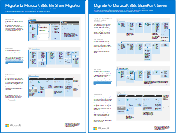
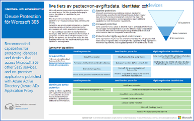

# Produktivitetsillustrationer för Microsoft 365Microsoft 365 productivity illustrations

The Microsoft 365 enterprise solution series provides guidance for implementing Microsoft 365 capabilities, especially where capabilities cross technologies, including Teams architecture diagrams.The Microsoft 365 enterprise solution series provides guidance for implementing Microsoft 365 capabilities, especially where capabilities cross technologies, including Teams architecture diagrams.

## Microsoft Teams och relaterade produktivitetstjänster i Microsoft 365 för IT-arkitekterMicrosoft Teams and related productivity services in Microsoft 365 for IT architects
Den logiska arkitekturen för produktivitetstjänster i Microsoft 365, med Microsoft Teams i spetsen.The logical architecture of productivity services in Microsoft 365, leading with Microsoft Teams.

| ObjektItem | BeskrivningDescription |
|:-----|:-----|
|   [PDF](https://github.com/MicrosoftDocs/microsoft-365-docs/raw/public/microsoft-365/downloads/msft-m365-teams-logical-architecture.pdf) \| [Visio](https://github.com/MicrosoftDocs/microsoft-365-docs/raw/public/microsoft-365/downloads/msft-m365-teams-logical-architecture.vsdx)[PDF](https://github.com/MicrosoftDocs/microsoft-365-docs/raw/public/microsoft-365/downloads/msft-m365-teams-logical-architecture.pdf) \| [Visio](https://github.com/MicrosoftDocs/microsoft-365-docs/raw/public/microsoft-365/downloads/msft-m365-teams-logical-architecture.vsdx)   Uppdaterades januari 2021Updated January 2021   |Microsoft erbjuder ett utbud av produktivitetstjänster som samverkar för att tillhandahålla samarbetsupplevelser med funktioner för datastyrning, säkerhet och efterlevnad.Microsoft provides a suite of productivity services that work together to provide collaboration experiences with data governance, security, and compliance capabilities.    Den här serien med illustrationer ger en översikt över produktivitetstjänsternas logiska arkitektur för företagsarkitekter, med Microsoft Teams i spetsen.This series of illustrations provides a view into the logical architecture of productivity services for enterprise architects, leading with Microsoft Teams.|

## Grupper i Microsoft 365 för IT-arkitekterGroups in Microsoft 365 for IT Architects
Den här bilden innehåller information för IT-arkitekter om Microsoft 365 grupper.This illustration includes information for IT architects about Microsoft 365 Groups. Mer information om hur du [konfigurerar](/microsoft-365/solutions/setup-secure-collaboration-with-teams) och administrerar Microsoft 365 grupper och grupper för samarbete i din organisation finns i Konfigurera säkert samarbete med Microsoft 365 och Vad är styrning [av samarbete?](/microsoft-365/solutions/collaboration-governance-overview)To learn about configuring and administering Microsoft 365 Groups and teams for collaboration in your organization, see [Set up secure collaboration with Microsoft 365](/microsoft-365/solutions/setup-secure-collaboration-with-teams) and [What is collaboration governance?](/microsoft-365/solutions/collaboration-governance-overview).

| ObjektItem | BeskrivningDescription |
|:-----|:-----|
|   [PDF](https://github.com/MicrosoftDocs/microsoft-365-docs/raw/public/microsoft-365/downloads/msft-m365-groups.pdf) \| [Visio](https://github.com/MicrosoftDocs/OfficeDocs-Enterprise/raw/live/Enterprise/downloads/msft-m365-groups.vsdx)[PDF](https://github.com/MicrosoftDocs/microsoft-365-docs/raw/public/microsoft-365/downloads/msft-m365-groups.pdf) \| [Visio](https://github.com/MicrosoftDocs/OfficeDocs-Enterprise/raw/live/Enterprise/downloads/msft-m365-groups.vsdx)   Uppdaterades maj 2020Updated May 2020|De här illustrationerna beskriver de olika typerna av grupper, hur de skapas och hanteras samt några rekommendationer för styrning.These illustrations detail the different types of groups, how these are created and managed, and a few governance recommendations.|

## Migrera till Microsoft 365Migrate to Microsoft 365

Microsoft tillhandahåller verktyg för att migrera dina lokala nätverksfilresurser och SharePoint Server-webbplatser för att Microsoft 365 med en betoning på att skydda och säkerställa innehållets säkerhet under migreringen.Microsoft provides tools to migrate your on-premises network file shares and SharePoint Server sites to Microsoft 365 with an emphasis on protecting and ensuring your content's security during migration. Den här uppsättningen illustrationer visar de olika metoder som finns tillgängliga för att flytta innehåll till SharePoint, Teams och OneDrive och hur dina data flödar genom processen.This set of illustrations demonstrates the various methods available to move your content to SharePoint, Teams, and OneDrive and how your data flows through the process. 

| ObjektItem | BeskrivningDescription |
|:-----|:-----|
|  [PDF](https://download.microsoft.com/download/0/5/b/05b7fb7c-1557-4ebb-9036-c5fc3a4cd94c/m365-migration-posters-mm-spmt.pdf)\|[Visio](https://download.microsoft.com/download/0/5/b/05b7fb7c-1557-4ebb-9036-c5fc3a4cd94c/m-365-migration-posters-mm-spmt.vsdx)[PDF](https://download.microsoft.com/download/0/5/b/05b7fb7c-1557-4ebb-9036-c5fc3a4cd94c/m365-migration-posters-mm-spmt.pdf)\|[Visio](https://download.microsoft.com/download/0/5/b/05b7fb7c-1557-4ebb-9036-c5fc3a4cd94c/m-365-migration-posters-mm-spmt.vsdx)   Uppdaterades mars 2021Updated March 2021 |Innehåller:Includes: <ul><li>  Migrering av filresursFile share migration</li><li>SharePoint ServermigreringSharePoint Server migration </li> </ul>  Mer information finns i [Migrera ditt innehåll till Microsoft 365](/sharepointmigration/migrate-to-sharepoint-online).For more information, see [Migrate your content to Microsoft 365](/sharepointmigration/migrate-to-sharepoint-online).|

## Microsoft 365 funktioner för informationsskydd och efterlevnadMicrosoft 365 information protection and compliance capabilities

Microsoft 365 innehåller en omfattande uppsättning funktioner för informationsskydd och efterlevnad.Microsoft 365 includes a broad set of information protection and compliance capabilities. Tillsammans med Microsofts produktivitetsverktyg är dessa funktioner utformade för att hjälpa organisationer att samarbeta i realtid samtidigt som de följer strikt reglerande ramverk för efterlevnad.Together with Microsoft’s productivity tools, these capabilities are designed to help organizations collaborate in real time while adhering to stringent regulatory compliance frameworks. 

I den här uppsättningen illustrationer används en av de mest reglerade branscherna och finansiella tjänsterna för att visa hur dessa funktioner kan tillämpas för att uppfylla vanliga regleringskrav.This set of illustrations uses one of the most regulated industries, financial services, to demonstrate how these capabilities can be applied to address common regulatory requirements. Du kan anpassa illustrationerna för eget bruk.Feel free to adapt these illustrations for your own use. 

| ObjektItem | BeskrivningDescription |
|:-----|:-----|
|   Engelska:[Ladda ned som PDF](https://download.microsoft.com/download/3/a/6/3a6ab1a3-feb0-4ee2-8e77-62415a772e53/m365-compliance-illustrations.pdf)\| [Hämta som Visio](https://download.microsoft.com/download/3/a/6/3a6ab1a3-feb0-4ee2-8e77-62415a772e53/m365-compliance-illustrations.vsdx)English: [Download as a PDF](https://download.microsoft.com/download/3/a/6/3a6ab1a3-feb0-4ee2-8e77-62415a772e53/m365-compliance-illustrations.pdf)  \| [Download as a Visio](https://download.microsoft.com/download/3/a/6/3a6ab1a3-feb0-4ee2-8e77-62415a772e53/m365-compliance-illustrations.vsdx)   Japanska[Ladda ned som PDF](https://download.microsoft.com/download/6/f/1/6f1a7d0e-dd8e-442e-b073-8e94327ae4f8/m365-compliance-illustrations.pdf)\| [Hämta som Visio](https://download.microsoft.com/download/6/f/1/6f1a7d0e-dd8e-442e-b073-8e94327ae4f8/m365-compliance-illustrations.vsdx)Japanese: [Download as a PDF](https://download.microsoft.com/download/6/f/1/6f1a7d0e-dd8e-442e-b073-8e94327ae4f8/m365-compliance-illustrations.pdf)  \| [Download as a Visio](https://download.microsoft.com/download/6/f/1/6f1a7d0e-dd8e-442e-b073-8e94327ae4f8/m365-compliance-illustrations.vsdx)   Uppdaterad i november 2020Updated November 2020|Innehåller:Includes: <ul><li>  Microsoft Informationsskydd och dataförlustskydd Microsoft information protection and data loss prevention</li><li>Kvarhållningsprinciper och -etiketterRetention policies and retention labels </li><li>InformationsbarriärerInformation barriers</li><li>KommunikationsefterlevnadCommunication compliance</li><li>Intern riskInsider risk</li><li>Datainmatning för tredje partThird-party data ingestion</li>|

## Säkerhet och informationsskydd för organisationer i flera regionerSecurity and Information Protection for Multi-Region Organizations
Säkerhets- och informationsskydd för organisationer med flera regioner som har en Microsoft 365 klientorganisationSecurity and information protection for multi-region organizations with a single Microsoft 365 tenant

| ObjektItem | BeskrivningDescription |
|:-----|:-----|
|   [PDF](https://github.com/MicrosoftDocs/microsoft-365-docs/raw/public/microsoft-365/downloads/msft-security-info-protect-multi-region.pdf) \| [Visio](https://github.com/MicrosoftDocs/microsoft-365-docs/raw/public/microsoft-365/downloads/msft-security-info-protect-multi-region.vsdx)[PDF](https://github.com/MicrosoftDocs/microsoft-365-docs/raw/public/microsoft-365/downloads/msft-security-info-protect-multi-region.pdf) \| [Visio](https://github.com/MicrosoftDocs/microsoft-365-docs/raw/public/microsoft-365/downloads/msft-security-info-protect-multi-region.vsdx) Uppdaterad i mars 2020Updated March 2020 |Användning av en enda Microsoft 365-klientorganisation för din globala organisation är det bästa alternativet och den bästa upplevelsen av många olika anledningar.Using a single Microsoft 365 tenant for your global organization is the best choice and experience for many reasons. Men många arkitekter kämpar med hur de ska uppfylla kraven för säkerhet och informationsskydd i olika regioner.However, many architects wrestle with how to meet security and information protection objectives across different regions. De här avsnitten innehåller rekommendationer.This set of topics provides recommendations. |

## Distributionsstrategi för Microsoft Defender för SlutpunktMicrosoft Defender for Endpoint deployment strategy

Beroende på din miljö passar vissa verktyg bättre för vissa arkitekturer.Depending on your environment, some tools are better suited for certain architectures.

| ObjektItem | BeskrivningDescription |
|:-----|:-----|
|  [PDF](https://github.com/MicrosoftDocs/microsoft-365-docs/raw/public/microsoft-365/security/defender-endpoint/downloads/mdatp-deployment-strategy.pdf)  \| [Visio](https://github.com/MicrosoftDocs/microsoft-365-docs/raw/public/microsoft-365/security/defender-endpoint/downloads/mdatp-deployment-strategy.vsdx)[PDF](https://github.com/MicrosoftDocs/microsoft-365-docs/raw/public/microsoft-365/security/defender-endpoint/downloads/mdatp-deployment-strategy.pdf)  \| [Visio](https://github.com/MicrosoftDocs/microsoft-365-docs/raw/public/microsoft-365/security/defender-endpoint/downloads/mdatp-deployment-strategy.vsdx)  Uppdaterad i februari 2020Updated February 2020| Med hjälp av arkitekturmaterialet kan du planera din distribution för följande arkitekturer:The architectural material helps you plan your deployment for the following architectures: <ul><li> MolnbaseradCloud-native </li><li> SamhanteringCo-management </li><li> LokalOn-premise</li><li>Utvärdering och lokal registreringEvaluation and local onboarding</li>

## Identitets- och enhetsskydd för Microsoft 365Identity and device protection for Microsoft 365

Rekommenderade funktioner för att skydda identiteter och enheter som använder Microsoft 365, andra SaaS-tjänster och lokala program som publicerats med Azure AD-programproxy.Recommended capabilities for protecting identities and devices that access Microsoft 365, other SaaS services, and on-premises applications published with Azure AD Application Proxy.

| ObjektItem | BeskrivningDescription |
|:-----|:-----|
|    [Visa som PDF](../downloads/MSFT_cloud_architecture_identity&device_protection.pdf) \| [Ladda ned som PDF](https://github.com/MicrosoftDocs/microsoft-365-docs/raw/public/microsoft-365/downloads/MSFT_cloud_architecture_identity&device_protection.pdf) \| [Ladda ned som Visio](https://github.com/MicrosoftDocs/microsoft-365-docs/raw/public/microsoft-365/downloads/MSFT_cloud_architecture_identity&device_protection.vsdx)  [View as a PDF](../downloads/MSFT_cloud_architecture_identity&device_protection.pdf) \| [Download as a PDF](https://github.com/MicrosoftDocs/microsoft-365-docs/raw/public/microsoft-365/downloads/MSFT_cloud_architecture_identity&device_protection.pdf)  \| [Download as a Visio](https://github.com/MicrosoftDocs/microsoft-365-docs/raw/public/microsoft-365/downloads/MSFT_cloud_architecture_identity&device_protection.vsdx)   Uppdaterad september 2020Updated September 2020|Det är viktigt att använda konsekventa skyddsnivåer för dina data, identiteter och enheter.It's important to use consistent levels of protection across your data, identities, and devices. Den här modellen visar vilka funktioner som kan jämföras med mer information om funktioner för att skydda identiteter och enheter.This model shows you which capabilities are comparable with more information on capabilities to protect identities and devices.    |
 

## Advanced eDiscovery arkitektur i Microsoft 365Advanced eDiscovery architecture in Microsoft 365

Advanced eDiscovery arbetsflöden och dataflöden från hela slutet, även Microsoft 365 multigeobaserade miljöer.Advanced eDiscovery end-to-end workflow and data flow, including within Microsoft 365 Multi-Geo environments. 

| ObjektItem | BeskrivningDescription |
|:-----|:-----|
|   [Visa som en bild](../media/solutions-architecture-center/m365-advanced-ediscovery-architecture.png) \| [Ladda ned som PDF](https://download.microsoft.com/download/d/1/c/d1ce536d-9bcf-4d31-b75b-fcf0dc560665/m365-advanced-ediscovery-architecture.pdf) \| [Ladda ned som Visio](https://download.microsoft.com/download/d/1/c/d1ce536d-9bcf-4d31-b75b-fcf0dc560665/m365-advanced-ediscovery-architecture.vsdx)  [View as an image](../media/solutions-architecture-center/m365-advanced-ediscovery-architecture.png) \| [Download as a PDF](https://download.microsoft.com/download/d/1/c/d1ce536d-9bcf-4d31-b75b-fcf0dc560665/m365-advanced-ediscovery-architecture.pdf)  \| [Download as a Visio](https://download.microsoft.com/download/d/1/c/d1ce536d-9bcf-4d31-b75b-fcf0dc560665/m365-advanced-ediscovery-architecture.vsdx)   Uppdaterades: Oktober 2020Updated October 2020|Innehåller:Includes: <ul><li>  Hela arbetsflödet i en enda miljöEnd-to-end workflow in a single environment</li><li>Hela arbetsflödet i en Microsoft 365 Multi-Geo-miljöEnd-to-end workflow in a Microsoft 365 Multi-Geo environment </li><li>End-to-end-dataflöde som har stöd för EDRM-arbetsflödetEnd-to-end data flow supporting the EDRM workflow</li> |
  

## Microsofts telefonilösningarMicrosoft Telephony Solutions

Microsoft har stöd för flera olika alternativ när du påbörjar övergången till Teams i Microsoft-molnet.Microsoft supports several options as you begin your journey to Teams in the Microsoft cloud. Med den här affischen får du hjälp att avgöra vilken Microsoft-telefonilösning (telefonsystem i molnet eller VoIP för företag lokalt) som passar för användarna i din organisation, och hur din organisation kan ansluta till det publika telenätet (PSTN).This poster helps you decide which Microsoft telephony solution (Phone System in the cloud or Enterprise Voice on-premises) is right for users in your organization, and how your organization can connect to the Public Switched Telephone Network (PSTN).

| ObjektItem | BeskrivningDescription |
|:-----|:-----|
|   [PDF](https://download.microsoft.com/download/4/3/5/435cd4e9-ca56-4fd1-acb6-d1fda7952320/microsoft-voice-solutions.pdf) \| [Visio](https://download.microsoft.com/download/7/5/c/75c13012-e20c-48bd-a6dd-ea49d1a3420d/microsoft-voice-solutions.vsdx)[PDF](https://download.microsoft.com/download/4/3/5/435cd4e9-ca56-4fd1-acb6-d1fda7952320/microsoft-voice-solutions.pdf) \| [Visio](https://download.microsoft.com/download/7/5/c/75c13012-e20c-48bd-a6dd-ea49d1a3420d/microsoft-voice-solutions.vsdx)  Uppdaterades mars 2021Updated March 2021 | Mer information finns i Planera [Teams röstlösning.](/microsoftteams/cloud-voice-landing-page)For more information, see [Plan your Teams voice solution](/microsoftteams/cloud-voice-landing-page).|

## Konfigurera din infrastruktur för hybridarbeteSet up your infrastructure for hybrid work

Med Microsoft 365 och andra Microsoft-molntekniker kan du ge dina medarbetare säker åtkomst till organisationens lokala och molnbaserade information, verktyg och resurser från deras hem.With Microsoft 365 and other Microsoft cloud technologies, you can provide your workers with secure access to your organization's on-premises and cloud-based information, tools, and resources from their homes. 

  
[PDF](https://download.microsoft.com/download/9/b/b/9bb5fa79-74e9-497b-87c5-4021e53d9fc2/hybrid-worker-infrastructure.pdf)  |  [PowerPoint](https://download.microsoft.com/download/9/b/b/9bb5fa79-74e9-497b-87c5-4021e53d9fc2/hybrid-worker-infrastructure.pptx)[PDF](https://download.microsoft.com/download/9/b/b/9bb5fa79-74e9-497b-87c5-4021e53d9fc2/hybrid-worker-infrastructure.pdf) | [PowerPoint](https://download.microsoft.com/download/9/b/b/9bb5fa79-74e9-497b-87c5-4021e53d9fc2/hybrid-worker-infrastructure.pptx)  
Uppdaterad juni 2021Updated June 2021

Mer information finns i artikeln för den här affischen: [Konfigurera infrastrukturen för hybridarbete med Microsoft 365](empower-people-to-work-remotely.md).For more information, see the article for this poster: [Set up your infrastructure for hybrid work with Microsoft 365](empower-people-to-work-remotely.md).

## Microsoft Teams med säkerhetsisoleringMicrosoft Teams with security isolation

Med Microsoft 365 kan du konfigurera ett privat team i Microsoft Teams och använda säkerhetsinställningarna för SharePoint-webbplatsen och en unik känslighetsetikett för att kryptera filer så att endast teammedlemmar kan dekryptera dem.With Microsoft 365, you can configure a private team in Microsoft Teams and use SharePoint site security settings and a unique sensitivity label to encrypt files so that only team members can decrypt them.

  
[PDF](https://github.com/MicrosoftDocs/microsoft-365-docs/raw/public/microsoft-365/downloads/team-security-isolation-poster.pdf)  |  [PowerPoint](https://download.microsoft.com/download/8/0/5/8057fc16-c044-40b6-a652-7ed555ba2895/team-security-isolation-poster.pptx)[PDF](https://github.com/MicrosoftDocs/microsoft-365-docs/raw/public/microsoft-365/downloads/team-security-isolation-poster.pdf) | [PowerPoint](https://download.microsoft.com/download/8/0/5/8057fc16-c044-40b6-a652-7ed555ba2895/team-security-isolation-poster.pptx)   Uppdaterades augusti 2020Updated August 2020

Mer information finns i artikeln för den här affischen: [Konfigurera ett team med säkerhetsisolering](secure-teams-security-isolation.md).For more information, see the article for this poster: [Configure a team with security isolation](secure-teams-security-isolation.md).

  
## Se ävenSee Also

[Arkitekturmodeller för SharePoint, Exchange, Skype för företag och LyncArchitectural models for SharePoint, Exchange, Skype for Business, and Lync](../enterprise/architectural-models-for-sharepoint-exchange-skype-for-business-and-lync.md)
  
[Testlabbguider för integrering med molntjänsterCloud adoption Test Lab Guides (TLGs)](../enterprise/cloud-adoption-test-lab-guides-tlgs.md)
