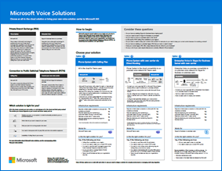

# Microsoft 365 produktivitet illustrationer

Microsoft 365 enterprise solution-serien ger vägledning för implementering av Microsoft 365-funktioner, särskilt där funktioner omfattar teknik över flera tekniker.

### Microsoft Teams och relaterade produktivitetstjänster i Microsoft 365 för IT-arkitekter
Produktivitetstjänsternas logiska arkitektur i Microsoft 365, som leder med Microsoft Teams.

|**Objekt**|**Beskrivning**|
|:-----|:-----|
|   [PDF](https://github.com/MicrosoftDocs/microsoft-365-docs/raw/public/microsoft-365/downloads/msft-m365-teams-logical-architecture.pdf) \| [Visio](https://github.com/MicrosoftDocs/OfficeDocs-Enterprise/raw/live/Enterprise/downloads/msft-m365-teams-logical-architecture.vsdx)   Uppdaterad april 2019   |Microsoft tillhandahåller en uppsättning produktivitetstjänster som arbetar tillsammans för att tillhandahålla samarbetsupplevelser med funktioner för datastyrning, säkerhet och efterlevnad.    Den här illustrationsserien ger en vy över produktivitetstjänsternas logiska arkitektur för företagsarkitekter, vilket leder med Microsoft Teams.|

### Grupper i Microsoft 365 för IT-arkitekter
Vad IT-arkitekter behöver veta om grupper i Microsoft 365

|**Objekt**|**Beskrivning**|
|:-----|:-----|
|   [PDF](https://github.com/MicrosoftDocs/microsoft-365-docs/raw/public/microsoft-365/downloads/msft-m365-groups.pdf) \| [Visio](https://github.com/MicrosoftDocs/OfficeDocs-Enterprise/raw/live/Enterprise/downloads/msft-m365-groups.vsdx)   Uppdaterad juni 2019|Dessa illustrationer beskriver de olika typerna av grupper, hur dessa skapas och hanteras och några styrningsrekommendationer.|

### Säkerhets- och informationsskydd för organisationer med flera regioner
Säkerhets- och informationsskydd för organisationer med flera regioner med en enda microsoft 365-klientorganisation

|**Objekt**|**Beskrivning**|
|:-----|:-----|
|   [PDF](https://github.com/MicrosoftDocs/microsoft-365-docs/raw/public/microsoft-365/downloads/msft-security-info-protect-multi-region.pdf) \| [Visio](https://github.com/MicrosoftDocs/microsoft-365-docs/raw/public/microsoft-365/downloads/msft-security-info-protect-multi-region.vsdx) Uppdaterad mars 2020 |Att använda en enda Microsoft 365-klient för din globala organisation är det bästa valet och upplevelsen av många skäl. Men många arkitekter brottas med hur man uppfyller säkerhets- och informationsskyddsmålen i olika regioner. Den här uppsättningen avsnitt innehåller rekommendationer. |

### Microsoft Defender ATP-distributionsstrategi

Beroende på din miljö är vissa verktyg bättre lämpade för vissa arkitekturer.

|**Objekt**|**Beskrivning**|
|:-----|:-----|
|  [PDF](https://github.com/MicrosoftDocs/windows-itpro-docs/raw/public/windows/security/threat-protection/microsoft-defender-atp/downloads/mdatp-deployment-strategy.pdf)  \| [Visio](https://github.com/MicrosoftDocs/windows-itpro-docs/raw/public/windows/security/threat-protection/microsoft-defender-atp/downloads/mdatp-deployment-strategy.vsdx)  Uppdaterad februari 2020| Det arkitektoniska materialet hjälper dig att planera distributionen för följande arkitekturer: <ul><li> Moln-native </li><li> Samledning </li><li> På plats</li><li>Utvärdering och lokal introduktion</li>

### Infrastruktur för Microsoft 365 Enterprise Foundation

Få en översikt över [grundinfrastrukturen](https://docs.microsoft.com/microsoft-365/enterprise/deploy-foundation-infrastructure) för Microsoft 365 Enterprise för att påbörja distributionen.
  
|**Objekt**|**Beskrivning**|
|:-----|:-----|
|   [Visa pdf-filer online](https://aka.ms/m365efoundinfraposter) \| [PDF](https://github.com/MicrosoftDocs/microsoft-365-docs/raw/public/microsoft-365/downloads/Microsoft365EnterpriseFoundInfra.pdf)   Uppdaterad december 2019| Den här affischen sammanfattar varje fas av grundinfrastrukturen i form av mål, funktioner och verktyg, designbeslut, konfigurationsresultat, introduktion och löpande övervakning och uppdateringar.  | 

   

### Identitets- och enhetsskydd för Office 365

Rekommenderade funktioner för att skydda identiteter och enheter som har åtkomst till Office 365, andra SaaS-tjänster och lokala program som publiceras med Azure AD Application Proxy.

|**Objekt**|**Beskrivning**|
|:-----|:-----|
|[          ](https://www.microsoft.com/download/details.aspx?id=55032)   [PDF](https://go.microsoft.com/fwlink/p/?linkid=841656) \| [Visio](https://go.microsoft.com/fwlink/p/?linkid=841657) \| [Fler språk](https://www.microsoft.com/download/details.aspx?id=55032)       Uppdaterad november 2018|Det är viktigt att använda konsekventa skyddsnivåer för data, identiteter och enheter. Det här dokumentet visar vilka funktioner som är jämförbara med mer information om funktioner för att skydda identiteter och enheter.    |
   
<!--

### File protection solutions in Office 365

Recommended capabilities for protecting files in Office 365 based on three different sensitivity levels.
  
|**Item**|**Description**|
|:-----|:-----|
|[          ](https://www.microsoft.com/download/details.aspx?id=55523)   [PDF](https://go.microsoft.com/fwlink/?linkid=2004320)  \| [Visio](https://download.microsoft.com/download/7/8/9/789645A5-BD10-4541-BC33-F8D1EFF5E911/MSFT_cloud_architecture_O365%20file%20protection.vsdx)   |It's important to use consistent levels of protection across your data, identities, and devices. This document shows you which capabilities are comparable with more information on capabilities to protect files in Office 365.    |
   

### Office 365 Information Protection for GDPR

Prescriptive recommendations for discovering, classifying, protecting, and monitoring personal data. This solution uses General Data Protection Regulation (GDPR) as an example, but you can apply the same process to achieve compliance with many other regulations.

|**Item**|**Description**|
|:-----|:-----|
|    [PDF](https://download.microsoft.com/download/E/C/D/ECD5A339-EF10-4420-B3A9-99098884D716/MSFT_Cloud_architecture_information%20protection%20for%20GDPR.pdf) \| [Visio](https://download.microsoft.com/download/E/C/D/ECD5A339-EF10-4420-B3A9-99098884D716/MSFT_Cloud_architecture_information%20protection%20for%20GDPR.vsdx)    |To see this content in article format, see [Office 365 Information Protection for GDPR](https://docs.microsoft.com/Office365/SecurityCompliance/office-365-information-protection-for-gdpr).      |

### Microsoft Security Guidance for Political Campaigns, Nonprofits, and Other Agile Organizations 

This guidance describes how to implement a secure cloud environment. The solution guidance can be used by any organization. It includes extra help for agile organizations with BYOD access and guest accounts. You can use this guidance as a starting-point for designing your own environment.

|**Item**|**Description**|
|:-----|:-----|
|**Microsoft Security Guidance for Political Campaigns**   [          ](https://download.microsoft.com/download/B/4/D/B4D520C3-4D0C-4B4D-BFB9-09F0651C2775/MSFT_Cloud_architecture_security%20for%20political%20campaigns.pdf)   [PDF](https://download.microsoft.com/download/B/4/D/B4D520C3-4D0C-4B4D-BFB9-09F0651C2775/MSFT_Cloud_architecture_security%20for%20political%20campaigns.pdf)  \| [Visio](https://download.microsoft.com/download/B/4/D/B4D520C3-4D0C-4B4D-BFB9-09F0651C2775/MSFT_Cloud_architecture_security%20for%20political%20campaigns.vsdx)   |This guidance uses a political campaign organization as an example. Use this guidance as a starting point for any environment.    |
|**Microsoft Security Guidance for Nonprofits**   [          ](https://download.microsoft.com/download/9/4/3/94389612-C679-4061-8DF2-D9A15D72B65F/Microsoft_Cloud%20Architecture_Security%20for%20Nonprofits.pdf)   [PDF](https://download.microsoft.com/download/9/4/3/94389612-C679-4061-8DF2-D9A15D72B65F/Microsoft_Cloud%20Architecture_Security%20for%20Nonprofits.pdf)  \| [Visio](https://download.microsoft.com/download/9/4/3/94389612-C679-4061-8DF2-D9A15D72B65F/Microsoft_Cloud%20Architecture_Security%20for%20Nonprofits.vsdx)   |This guide is slightly revised for nonprofit organizations. For example, it references Office 365 Nonprofit plans. The technical guidance is the same as the political campaign solution guide.    |

This guidance includes Test Lab Guides. For more information, see [Microsoft Security Guidance for Political Campaigns, Nonprofits, and Other Agile Organizations](https://docs.microsoft.com/Office365/SecurityCompliance/microsoft-security-guidance-for-political-campaigns-nonprofits-and-other-agile-o).

-->

### Lösningar för Microsoft-telefoni

Microsoft stöder flera alternativ när du börjar din resa till Teams i Microsoft-molnet. Den här affischen hjälper dig att avgöra vilken Microsoft-telefonlösning (Telefonsystem i molnet eller Enterprise Voice lokalt) som är rätt för användare i organisationen och hur din organisation kan ansluta till PSTN (Public Switched Telephone Network).

  
[PDF](https://github.com/MicrosoftDocs/OfficeDocs-SkypeForBusiness/raw/live/Teams/downloads/telephony-solutions/microsoft-telephony-solutions-12-19.pdf) | [Visio](https://github.com/MicrosoftDocs/OfficeDocs-SkypeForBusiness/raw/live/Teams/downloads/telephony-solutions/microsoft-telephony-solutions-12-18.vsdx)  
Uppdaterad januari 2019

Mer information finns i artikeln för den här affischen: [Microsoft Telephony Solutions](https://docs.microsoft.com/SkypeForBusiness/hybrid/msft-telephony-solutions).
  

### Distribuera ett modernt och säkert skrivbord med Microsoft

Vad IT-arkitekter behöver veta om att distribuera och hantera uppdateringar för Office 365 ProPlus på Windows 10.
  

|**Objekt**|**Beskrivning**|
|:-----|:-----|
|   [PDF](https://download.microsoft.com/download/4/E/9/4E90E227-770A-41D1-99FE-925A64D81A55/MSFT_modern_secure_desktop.pdf)  \| [Visio](https://download.microsoft.com/download/4/E/9/4E90E227-770A-41D1-99FE-925A64D81A55/MSFT_modern_secure_desktop.vsdx)  Uppdaterad september 2017 | Denna modell innehåller: <ul><li>  Distribuera Windows 10 och Office ProPlus från Microsoft-molnet </li><li>  Distribuera Windows 10 och Office ProPlus med Microsoft Endpoint Configuration Manager </li><li>  Hantera uppdateringar för Windows 10 och Office ProPlus från Microsoft-molnet </li><li>  Hantera uppdateringar för Windows 10 och Office ProPlus med Microsoft Endpoint Configuration Manager </li><li>  Färdiga och ytterligare skyddsfunktioner i Windows 10 </li></ul>  |
   
## Se även

[Arkitekturmodeller för SharePoint, Exchange, Skype för företag och Lync](https://docs.microsoft.com/office365/enterprise/architectural-models-for-sharepoint-exchange-skype-for-business-and-lync)
  
[Testlabbguider för integrering med molntjänster](https://docs.microsoft.com/office365/enterprise/cloud-adoption-test-lab-guides-tlgs)
