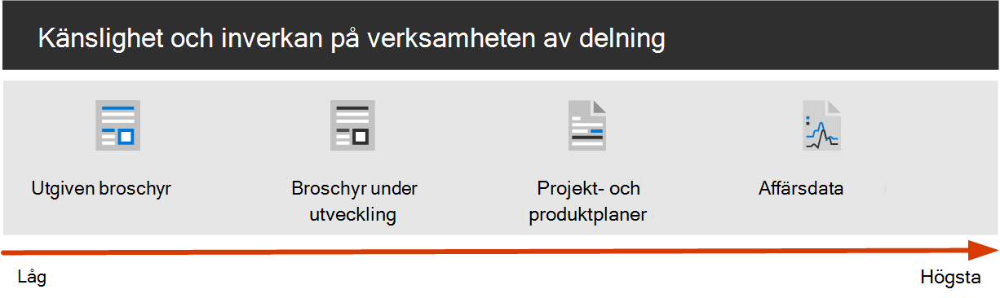
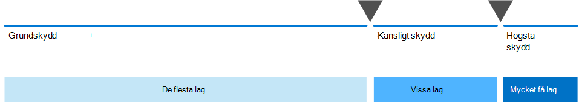

# Konfigurera säkert samarbete med Microsoft 365 och Microsoft TeamsSet up secure collaboration with Microsoft 365 and Microsoft Teams

Att enkelt kunna dela information med rätt personer och förhindra att det går över är avgörande för en organisations framgång.Being able to easily share information with the right people while preventing oversharing is key to an organization's success. Det handlar bland annat om att dela känsliga data på ett säkert sätt med bara de som ska ha tillgång till dem.This includes being able to share sensitive data safely with only those who should have access to it. Beroende på projektet kan det till exempel vara att dela känsliga data med personer utanför organisationen.Depending on the project, this might include sharing sensitive data with people outside your organization.

Vägledningen för samarbetslösningen består av två komponenter som hjälper dig:This collaboration solution guidance includes two components to help you:
- Distribuera Microsoft Teams med rätt skyddsnivå för varje projektDeploy Microsoft Teams with the right level of protection for each project
- Konfigurera extern delning med lämpliga säkerhetsinställningar för varje projektConfigure external sharing with appropriate security settings for each project

Om mångsidiga och lättanvända verktyg för innehållssamarbete inte finns tillgängliga kan användarna ofta samarbeta genom att skicka dokument via e-post.If versatile and easy-to-use content collaboration tools aren't available, users will often collaborate by emailing documents. Det här är en omedveten och felbeägen samarbetsmetod och kan öka risken för olämplig delning av information.This is a tedious and error-prone method of collaboration, and can increase the risk of inappropriate sharing of information. Om personer tycker att det är svårt att dela information kan de återgå till att använda konsumentprodukter som inte styrs av IT..If people find sharing information too difficult, they could revert to using consumer products that are not governed by IT. Det kan innebära en ännu större risk.This can pose an even greater risk.

> [!VIDEO https://www.microsoft.com/videoplayer/embed/RWxMmL?autoplay=false]

Med Microsoft 365 kan du distribuera Teams med en mängd olika konfigurationer som hjälper:With Microsoft 365, you can deploy Teams with a variety of configurations that help:

- Skydda din immateriella egendomProtect your intellectual property
- Möjliggör enkelt samarbeteEnable easy collaboration
- Skapa en balans mellan säkerhet och användbarhet som ökar användarnöjdheten och minskar risken för skuggad ITCreate a balance between security and usability that increases user satisfaction and reduces the risk of shadow IT

De flesta organisationer har en mängd information, med varierande känslighet och olika grader av påverkan på verksamheten om informationen delas olämpligt.Most organizations have a variety of information, with varying degrees of sensitivity and varying degrees of business impact if the information is inappropriately shared. Beroende på hur känslig en viss informationsbit är kanske du vill tillåta delning med:Depending on the sensitivity of a given piece of information, you may want to allow sharing with:

- Alla (oauthenticerade)Anyone (unauthenticated)
- Personer inom organisationenPeople inside the organization
- Vissa personer i organisationenSpecific people inside the organization
- Vissa personer inom och utanför organisationenSpecific people inside and outside the organization

Information som marknadsföringsbroschyrer är avsedda att delas brett utanför organisationen.Information such as marketing brochures are meant for sharing broadly outside the organization. Information som snabbmenyer är inte avsedda för extern delning, men skulle inte ha någon inverkan på verksamheten om de delades externt.Information such as cafeteria menus aren't meant for external sharing, but would have no business impact if they were shared externally. Den här typen av information behöver ett litet eller inget skydd.These types of information need little or no protection.

Samma marknadsföringsbroschyrer, under utveckling, kanske endast delas inom organisationen.Those same marketing brochures, while under development, might only be shared inside the organization. I så fall kan standardinställningarna för delning i Teams vara tillräckliga.In this case, the default sharing settings in Teams may be sufficient.

Information om en ny produkt som är under utveckling kan ses som känslig, även inom organisationen.Information about a new product that is under development might be considered sensitive, even within the organization. I det här fallet kan det vara lämpligt med ett bättre skydd.A greater degree of protection might be appropriate in this case. Du kan till exempel begränsa åtkomsten till den här informationen till medlemmar i ett visst team.You could restrict access to this information to members of a specific team, for example. Beroende på projektet kan du behöva samarbeta med personer utanför organisationen, till exempel en leverantörs- eller partnerorganisation.Depending on the project, you may need to collaborate with people outside your organization, such as a vendor or partner organization.

Information som är avgörande för organisationens framgång eller som har strikta säkerhets- eller efterlevnadskrav kan kräva ännu högre skyddsnivåer.Information that is critical to your organization's success, or has stringent security or compliance requirements might require even greater levels of protection.

För alla scenarier som anges ovan kan du använda grupper i Microsoft Teams för att lagra, dela och samarbeta med informationen.For all the scenarios noted above, you can use teams in Microsoft Teams to store, share, and collaborate on the information. 

Om du vill konfigurera säkert samarbete använder Microsoft 365 funktioner.To configure secure collaboration, you use these Microsoft 365 capabilities and features.

| Produkt eller komponentProduct or component | Resurs eller funktionCapability or feature | LicensieringLicensing |
|:-------|:-----|:-------|
| Microsoft Defender för Office 365Microsoft Defender for Office 365 | Valv Bifogade filer för SPO, OneDrive och Teams; Valv Dokument; Valv Länkar för TeamsSafe Attachments for SPO, OneDrive and Teams; Safe Documents; Safe Links for Teams    | Microsoft 365 E1, E3 och E5Microsoft 365 E1, E3 and E5 |
| SharePointSharePoint    | Principer för webbplats- och fildelning, webbplatsdelningsbehörigheter, delningslänkar, åtkomstförfrågningar, webbplats gästdelningsinställningarSite and file sharing policies, Site sharing permissions, Sharing links, Access requests, Site guest sharing settings | Microsoft 365 E1, E3 och E5Microsoft 365 E1, E3 and E5 |
| Microsoft TeamsMicrosoft Teams   | Gäståtkomst, privata team, privata kanalerGuest access, private teams, private channels | Microsoft 365 E1, E3 och E5Microsoft 365 E1, E3 and E5 |
| Microsoft 365 EfterlevnadMicrosoft 365 Compliance  | KänslighetsetiketterSensitivity labels    | Microsoft 365 E3 och E5Microsoft 365 E3 and E5 |

### SamarbetsstyrningCollaboration governance

Microsoft 365 finns många alternativ för att styra din samarbetslösning.Microsoft 365 provides many options for governing your collaboration solution. Vi rekommenderar att du använder det här distributionsinnehållet tillsammans med [innehållet med samarbetsstyrning](collaboration-governance-overview.md) för att skapa den bästa samarbetslösningen för din organisation.We recommend you use this deployment content alongside the [collaboration governance content](collaboration-governance-overview.md) to create the best collaboration solution for your organization.

### Använda Teams för alla typer av dataUsing Teams for all kinds of data

För att hantera åtkomst till information med olika känsligheter har vi utvecklat tre olika nivåer av [skydd för Teams.](configure-teams-three-tiers-protection.md)To manage access to information with different sensitivities, we've developed [three different tiers of protection for Teams](configure-teams-three-tiers-protection.md). Du kan anpassa någon av dessa nivåer för att bättre tillgodose behoven eller verksamheten.You can customize any of these tiers to better address the needs or your business. 

Dessa nivåer –  *baslinje,* känslig och mycket känslig *–* ökar gradvis skyddet för att förhindra att det uppstår för mycket och potentiellt informationsläckor, som visas i följande tabell.These tiers - *baseline*, *sensitive*, and *highly sensitive* - gradually increase the protections that help prevent oversharing and potential information leakage, as shown in the following table.

|-|**Baslinjenivå****Baseline tier**|**Känslig nivå****Sensitive tier**|**Högkänslig nivå****Highly sensitive tier**|
|:--|:-----------|:------------|:-------------------|
|Offentligt eller privat teamPublic or private team|AntingenEither|PrivatPrivate|PrivatPrivate|
|Oautentiserad delningUnauthenticated sharing|BlockerasBlocked|BlockerasBlocked|BlockerasBlocked|
|FildelningFile sharing|TillåtsAllowed|TillåtsAllowed|Endast teamägare kan dela.Only team owners can share.|
|TeammedlemskapTeam membership|Vem som helst kan gå med i offentliga team.Anyone can join public teams. Godkännande av teamägare krävs för att gå med i privata team.Team owner approval required to join private teams.|Godkännande av gruppägare krävs för att gå med.Team owner approval required to join.|Godkännande av gruppägare krävs för att gå med.Team owner approval required to join.|
|DokumentkrypteringDocument encryption|||Tillgänglig med känslighetsetikettAvailable with sensitivity label|
|GästdelningGuest sharing|TillåtsAllowed|Kan tillåtas eller blockerasCan be allowed or blocked|Kan tillåtas eller blockerasCan be allowed or blocked|
|Ohanterade enheterUnmanaged devices|Ingen begränsningNo restriction|Endast webbåtkomstWeb-only access|BlockerasBlocked|

Konfigurering av dessa nivåer omfattar:Configuring these tiers involves:

- Konfigurera inställningar i Teams för gäståtkomst och privata kanalerConfiguring settings in Teams for guest access and private channels
- Konfigurera inställningar i ett grupps associerade SharePoint för intern delning och gästdelning, åtkomstförfrågningar och delningslänkarConfiguring settings in a team's associated SharePoint site for internal and guest sharing, access requests, and sharing links
- För känsliga *och* *mycket känsliga nivåer,* konfigurera känslighetsetiketter för att klassificera teamen och kontrollera gästdelning och åtkomst från ohanterade enheterFor the *sensitive* and *highly sensitive* tiers, configuring sensitivity labels to classify the teams, and control guest sharing and access from unmanaged devices
- För den *mycket känsliga* nivån konfigurerar du en känslighetsetikett för att kryptera de dokument den tillämpas påFor the *highly sensitive* tier, configuring a sensitivity label to encrypt the documents to which it is applied

Börja med baslinjenivån och lägg sedan  till  team som använder känslig och mycket känslig nivå för att skydda informationen i organisationen.Start with the baseline tier, and then add teams that use the *sensitive* and *highly sensitive* tiers as needed to help protect the information in your organization. Se följande resurser för att komma igång:See these resources to get started:

- [Konfigurera teams med grundläggande skyddConfigure teams with baseline protection](configure-teams-baseline-protection.md)
- [Konfigurera team med skydd för känslig dataConfigure teams with protection for sensitive data](configure-teams-sensitive-protection.md)
- [Konfigurera team med skydd för mycket känslig dataConfigure teams with protection for highly sensitive data](configure-teams-highly-sensitive-protection.md)

Om du har ett mycket känsligt projekt som kräver ytterligare skydd mot delning även inom organisationen kan du konfigurera ett team som använder en egen känslighetsetikett för att kryptera filer så att bara teammedlemmar kan läsa dem.If you have a highly sensitive project that requires additional protection from sharing even within your organization, you can configure a team that uses its own sensitivity label to encrypt files so that only team members can read them. Mer [information finns i Konfigurera ett team med](secure-teams-security-isolation.md) säkerhetsisolering.See [Configure a team with security isolation](secure-teams-security-isolation.md) for details.

### Dela med personer utanför organisationenSharing with people outside your organization

Du kan behöva [dela information om känsligheten med personer utanför din organisation](collaborate-with-people-outside-your-organization.md).You may need to [share information of any sensitivity with people outside your organization](collaborate-with-people-outside-your-organization.md). Det kan vara allt från att dela ett dokument med en enskild person till att samarbeta i ett större projekt med en stor partnerorganisation eller med medarbetare från hela världen.This could range from sharing a single document with a single person to collaborating on a major project with a large partner organization or freelancers from around the world. I Microsoft 365 kan detta intervall av extern delning göras enkelt och med lämpliga säkerhetsåtgärder för att skydda känslig information.In Microsoft 365, this range of external sharing can be done easily and with the appropriate safeguards to help protect your sensitive information.

De här resurserna hjälper dig att komma igång med att konfigurera din miljö för samarbete med personer utanför organisationen:These resources will help you get started with setting up your environment for collaborating with people outside your organization:

- [Samarbeta i dokument](collaborate-on-documents.md) för att dela enskilda filer med mappar.[Collaborate on documents](collaborate-on-documents.md) for sharing individual files of folders.
- [Samarbeta på en webbplats](collaborate-in-site.md) för att samarbeta med gäster på en SharePoint webbplats.[Collaborate in a site](collaborate-in-site.md) for collaborating with guests in a SharePoint site.
- [Samarbeta som ett team](collaborate-as-team.md) för att samarbeta med gäster i ett team.[Collaborate as a team](collaborate-as-team.md) for collaborating with guests in a team.

Beroende på hur känslig informationen är kan du lägga till säkerhetsåtgärder för att förhindra att en för stor del delas.Depending on the sensitivity of the information being shared, you can add safeguards to help prevent oversharing. Med de här resurserna kan du konfigurera de skydd du behöver för organisationen:These resources will help you set up the protections that you need for your organization:

- [Metodtips för att dela filer och mappar med oautentiserade användareBest practices for sharing files and folders with unauthenticated users](best-practices-anonymous-sharing.md)
- [Begränsa oavsiktlig exponering för filer när de delas med personer utanför organisationenLimit accidental exposure to files when sharing with people outside your organization](share-limit-accidental-exposure.md)
- [Skapa en säker miljö för gästdelningCreate a secure guest sharing environment](create-secure-guest-sharing-environment.md)

Om du har ett större projekt med en partnerorganisation kan du använda hantering av Azure-berättigande till att hantera gäster från den organisationen i ett team som du har ställt in för projektet.If you have a major project with a partner organization, you can use Azure Entitlement Management to manage the guests from that organization in a team that you set up for the project. Mer [information finns i Skapa ett B2B-extranät med](b2b-extranet.md) hanterade gäster.See [Create a B2B extranet with managed guests](b2b-extranet.md) for details.

## Utbildning för administratörerTraining for administrators

Dessa utbildningsmoduler från Microsoft Learn kan hjälpa dig att lära dig funktionerna för samarbete, styrning och identitet i Teams och SharePoint.These training modules from Microsoft Learn can help you learn the collaboration, governance, and identity features in Teams and SharePoint.

#### TeamsTeams

|Utbildning:Training:|Hantera teamsamarbete med Microsoft TeamsManage team collaboration with Microsoft Teams|
|:---|:---|
||I Hantera teamsamarbete Microsoft Teams får du en ny funktion i Microsoft Teams, som är det centrala navet för samarbete i Microsoft 365.Manage team collaboration with Microsoft Teams introduces you to the features and capabilities of Microsoft Teams, the central hub for team collaboration in Microsoft 365. Du får lära dig hur du kan använda Teams för att underlätta samarbete och kommunikation inom organisationen, både lokalt och lokalt, på ett brett utbud av enheter – från datorer till surfplattor till telefoner – och samtidigt dra nytta av alla funktionerna i Office 365-programmen.You’ll learn how you can use Teams to facilitate teamwork and communication within your organization, both on and off premises, on a wide range of devices—from desktops to tablets to phones—while taking advantage of all the rich functionality of Office 365 applications. Du får en förståelse för hur Teams en omfattande och flexibel miljö för samarbete mellan program och enheter.You’ll gain an understanding of how Teams provides a comprehensive and flexible environment for collaboration across applications and devices. Den här utbildningsvägen kan hjälpa dig att förbereda för Microsoft 365 Certified: Teams Administrator Associate-certifiering.This learning path can help you prepare for the Microsoft 365 Certified: Teams Administrator Associate certification.  2 t 17 min - Utbildningsväg - 5 moduler2 hr 17 min - Learning Path - 5 Modules|

> [!div class="nextstepaction"]
> [Starta >Start >](/learn/modules/m365-teams-collab-prepare-deployment/introduction/)

#### SharePointSharePoint

|Utbildning:Training:|Samarbeta med SharePoint i Microsoft 365Collaborate with SharePoint in Microsoft 365|
|:---|:---|
||I Hantera delat innehåll med Microsoft SharePoint en artikel om funktioner i SharePoint och hur det fungerar med Microsoft 365.Manage shared content with Microsoft SharePoint introduces you to the features and capabilities of SharePoint, and how it works with Microsoft 365. Du får lära dig mer om de olika typerna SharePoint webbplatser, inklusive navplatser, samt informationsskydd, rapportering och övervakning.You'll learn about the different types of SharePoint sites, including hub sites, as well as information protection, reporting, and monitoring. Du får också lära dig hur du använder SharePoint-fil- och mappdelning för att optimera samarbete, hur du delar filer externt och hur du hanterar SharePoint-webbplatser i SharePoint administrationscenter.You'll also learn how to use SharePoint file and folder sharing to optimize collaboration, how to share files externally, and how to manage SharePoint sites in the SharePoint admin center. Den här utbildningsvägen kan hjälpa dig att förbereda för certifieringen Microsoft 365 Certified: Teamwork Administrator Associate.This learning path can help you prepare for the Microsoft 365 Certified: Teamwork Administrator Associate certification.  1 t 14 min - Utbildningsväg - 4 moduler1 hr 14 min - Learning Path - 4 Modules|

> [!div class="nextstepaction"]
> [Starta >Start >](/learn/modules/m365-teams-sharepoint-plan-sharepoint/introduction/)

#### InformationsskyddInformation protection

|Utbildning:Training:|Skydda företagsinformation med Microsoft 365Protect enterprise information with Microsoft 365|
|:---|:---|
||Det är svårare än någonsin att skydda och skydda organisationens information.Protecting and securing your organization's information is more challenging than ever. I utbildningsvägen Skydda företagsinformation med Microsoft 365 diskuteras hur du skyddar känslig information från att oavsiktligt skriva över eller felaktigt använda data, hur du identifierar och klassificerar data, hur du skyddar dem med känslighetsetiketter och hur du både övervakar och analyserar din känsliga information för att skydda mot förlust.The Protect enterprise information with Microsoft 365 learning path discusses how to protect your sensitive information from accidental oversharing or misuse, how to discover and classify data, how to protect it with sensitivity labels, and how to both monitor and analyze your sensitive information to protect against its loss. Den här utbildningsvägen kan hjälpa dig att förbereda för Microsoft 365 Certified: Security Administrator Associate och Microsoft 365 Certified: Enterprise Administration Expert-certifieringar.This learning path can help you prepare for the Microsoft 365 Certified: Security Administrator Associate and Microsoft 365 Certified: Enterprise Administration Expert certifications..  1 t - Utbildningsväg - 5 moduler1 hr - Learning Path - 5 Modules|

> [!div class="nextstepaction"]
> [Starta >Start >](/learn/modules/m365-security-info-overview/introduction/)

#### Identitet och åtkomstIdentity and access

|Utbildning:Training:|Skydda identitet och åtkomst med Azure Active DirectoryProtect identity and access with Azure Active Directory|
|:---|:---|
||Utbildningsvägen för identitet och åtkomst omfattar de senaste identitets- och åtkomsttekniker, verktyg för att förstärka autentisering och vägledning om identitetsskydd i organisationen.The Identity and Access learning path covers the latest identity and access technologies, tools for strengthening authentication, and guidance on identity protection within your organization. Med microsofts teknik för åtkomst och identitet kan du skydda organisationens identitet, oavsett om den är lokal eller i molnet, och ge dina användare möjlighet att arbeta säkert från valfri plats.Microsoft access and identity technologies enable you to secure your organization’s identity, whether it is on-premises or in the cloud, and empower your users to work securely from any location. Den här utbildningsvägen kan hjälpa dig att förbereda för Microsoft 365 Certified: Security Administrator Associate och Microsoft 365 Certified: Enterprise Administration Expert-certifieringar.This learning path can help you prepare for the Microsoft 365 Certified: Security Administrator Associate and Microsoft 365 Certified: Enterprise Administration Expert certifications.  2 t 52 min - Utbildningsväg - 6 moduler2 hr 52 min - Learning Path - 6 Modules|

> [!div class="nextstepaction"]
> [Starta >Start >](/learn/modules/m365-identity-overview/introduction/)

## Utbildning för slutanvändareTraining for end users

Dessa utbildningsmoduler kan hjälpa användarna att använda Teams, grupper och SharePoint för samarbete i Microsoft 365.These training modules can help your users use Teams, groups, and SharePoint for collaboration in Microsoft 365.

|TeamsTeams|SharePointSharePoint|
|:---|:---|
| **[Konfigurera och anpassa ditt team](https://support.microsoft.com/office/702a2977-e662-4038-bef5-bdf8ee47b17b)****[Set up and customize your team](https://support.microsoft.com/office/702a2977-e662-4038-bef5-bdf8ee47b17b)**| **[Dela och synkronisera](https://support.microsoft.com/office/98cb2ff2-c27e-42ea-b055-c2d895f8a5de)****[Share and sync](https://support.microsoft.com/office/98cb2ff2-c27e-42ea-b055-c2d895f8a5de)**|
| **[Upload och söka efter filer](https://support.microsoft.com/office/57b669db-678e-424e-b0a0-15d19215cb12)****[Upload and find files](https://support.microsoft.com/office/57b669db-678e-424e-b0a0-15d19215cb12)**||
| **[Samarbeta i team och kanaler](https://support.microsoft.com/office/c3d63c10-77d5-4204-a566-53ddcf723b46)****[Collaborate in teams and channels](https://support.microsoft.com/office/c3d63c10-77d5-4204-a566-53ddcf723b46)**|||

## IllustrationerIllustrations

De här illustrationerna hjälper dig att förstå hur grupper och team interagerar med andra tjänster i Microsoft 365 och vilka styrnings- och efterlevnadsfunktioner som är tillgängliga för att hjälpa dig att hantera de här tjänsterna i organisationen.These illustrations will help you understand how groups and teams interact with other services in Microsoft 365 and what governance and compliance features are available to help you manage these services in your organization.

### Grupper i Microsoft 365 för IT-arkitekterGroups in Microsoft 365 for IT Architects
Det IT-arkitekter behöver veta om grupper i Microsoft 365What IT architects need to know about groups in Microsoft 365

|**Objekt****Item**|**Beskrivning****Description**|
|:-----|:-----|
|   [PDF](https://github.com/MicrosoftDocs/microsoft-365-docs/raw/public/microsoft-365/downloads/msft-m365-groups.pdf) \| [Visio](https://github.com/MicrosoftDocs/OfficeDocs-Enterprise/raw/live/Enterprise/downloads/msft-m365-groups.vsdx)[PDF](https://github.com/MicrosoftDocs/microsoft-365-docs/raw/public/microsoft-365/downloads/msft-m365-groups.pdf) \| [Visio](https://github.com/MicrosoftDocs/OfficeDocs-Enterprise/raw/live/Enterprise/downloads/msft-m365-groups.vsdx)   Uppdaterad i juni 2019Updated June 2019|De här illustrationerna beskriver de olika typerna av grupper, hur de skapas och hanteras samt några rekommendationer för styrning.These illustrations detail the different types of groups, how these are created and managed, and a few governance recommendations.|

### Microsoft Teams och relaterade produktivitetstjänster i Microsoft 365 för IT-arkitekterMicrosoft Teams and related productivity services in Microsoft 365 for IT architects
Den logiska arkitekturen för produktivitetstjänster i Microsoft 365, med Microsoft Teams i spetsen.The logical architecture of productivity services in Microsoft 365, leading with Microsoft Teams.

|**Objekt****Item**|**Beskrivning****Description**|
|:-----|:-----|
|   [PDF](https://github.com/MicrosoftDocs/microsoft-365-docs/raw/public/microsoft-365/downloads/msft-m365-teams-logical-architecture.pdf) \| [Visio](https://github.com/MicrosoftDocs/OfficeDocs-Enterprise/raw/live/Enterprise/downloads/msft-m365-teams-logical-architecture.vsdx)[PDF](https://github.com/MicrosoftDocs/microsoft-365-docs/raw/public/microsoft-365/downloads/msft-m365-teams-logical-architecture.pdf) \| [Visio](https://github.com/MicrosoftDocs/OfficeDocs-Enterprise/raw/live/Enterprise/downloads/msft-m365-teams-logical-architecture.vsdx)   Uppdaterad i april 2019Updated April 2019   |Microsoft erbjuder ett utbud av produktivitetstjänster som samverkar för att tillhandahålla samarbetsupplevelser med funktioner för datastyrning, säkerhet och efterlevnad.Microsoft provides a suite of productivity services that work together to provide collaboration experiences with data governance, security, and compliance capabilities.    Den här serien med illustrationer ger en översikt över produktivitetstjänsternas logiska arkitektur för företagsarkitekter, med Microsoft Teams i spetsen.This series of illustrations provides a view into the logical architecture of productivity services for enterprise architects, leading with Microsoft Teams.|

## Distribuera en säker lösning för samarbeteDeploy the secure collaboration solution

När du är redo att distribuera den här lösningen fortsätter du med följande steg:When you're ready to deploy this solution, continue with these steps:
1. Konfigurera de [tre olika skyddsnivåerna för Teams](configure-teams-three-tiers-protection.md).Configure the [three different tiers of protection for Teams](configure-teams-three-tiers-protection.md).
2. Konfigurera inställningar för [att dela information om känsligheten med personer utanför organisationen](collaborate-with-people-outside-your-organization.md).Configure settings for [sharing information of any sensitivity with people outside your organization](collaborate-with-people-outside-your-organization.md).

## Se ävenSee also

[Dokumentation för Microsoft 365 SäkerhetscenterMicrosoft 365 security documentation](../security/index.yml)

[Dokumentation för Microsoft 365 EfterlevnadscenterMicrosoft 365 compliance documentation](../compliance/index.yml)

[Välkommen till Microsoft TeamsWelcome to Microsoft Teams](/MicrosoftTeams/Teams-overview)
