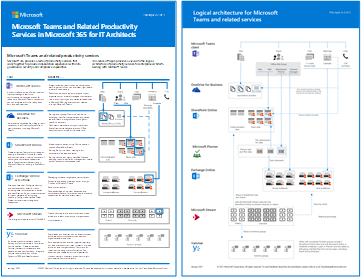

# Konfigurera säkerhet samarbete med hjälp av Microsoft 365

Att enkelt kunna dela information med rätt personer samtidigt som det förhindrar överformning är avgörande för en organisations framgång. Det omfattar att dela känsliga data på ett säkert sätt med bara de som ska ha tillgång till dem. Beroende på projektet kan det t.ex. vara att dela känsliga data med personer utanför organisationen.

> [!VIDEO https://www.microsoft.com/videoplayer/embed/RWxMmL?autoplay=false]

Vägledningen för samarbetslösningen innehåller två komponenter som kan hjälpa dig:
- Distribuera Microsoft Teams med rätt skyddsnivå för varje projekt
- Konfigurera extern delning med lämpliga säkerhetsinställningar för varje projekt

Om mångsidiga och lättanvända verktyg för innehållssamarbete inte är tillgängliga kan användarna ofta samarbeta genom att skicka dokument via e-post. Det här är en omedveten och felbeägen samarbetsmetod och kan öka risken för olämplig delning av information. Om personer tycker att det är för svårt att dela information kan de återgå till att använda konsumentprodukter som inte styrs av IT. Det kan innebära en ännu större risk.

Med Microsoft 365 kan du distribuera Teams med en mängd olika konfigurationer som hjälper:

- Skydda din immateriella egendom
- Möjliggör enkelt samarbete
- Skapa en balans mellan säkerhet och användbarhet som ökar användarnöjdheten och minskar risken för skuggad IT

De flesta organisationer har en mängd information, med olika känslighetsgrader och olika grader av påverkan på verksamheten, om informationen delas olämpligt. Beroende på hur känslig en viss informationsbit är kanske du vill tillåta delning med:

- Alla (oauthenticerade)
- Personer inom organisationen
- Specifika personer i organisationen
- Vissa personer inom och utanför organisationen

Information som marknadsföringsbroschyrer är avsedd att delas brett utanför organisationen. Information som menyer på menyer är inte avsedda för extern delning, men skulle inte ha någon inverkan på företaget om de delades externt. Den här typen av information behöver lite eller inget skydd.

Samma marknadsföringsbroschyrer, under utveckling, kanske bara delas inom organisationen. I det här fallet kan standardinställningarna för delning i Teams vara tillräckliga.

Information om en ny produkt som är under utveckling kan anses vara känslig, även inom organisationen. I det här fallet kan det vara lämpligt med ett högre skydd. Du kan till exempel begränsa åtkomsten till den här informationen till medlemmar i ett visst team. Beroende på projektet kan du behöva samarbeta med personer utanför organisationen, till exempel en leverantörs- eller partnerorganisation.

Information som är viktig för organisationens framgång eller som har strikta säkerhets- eller efterlevnadskrav kan kräva ännu högre skyddsnivåer.

För alla scenarier som anges ovan kan du använda team i Microsoft Teams för att lagra, dela och samarbeta med informationen. 

Om du vill konfigurera säkert samarbete använder du microsoft 365-funktionerna.

| Produkt eller komponent | Resurs eller funktion | Licensiering |
|:-------|:-----|:-------|
| Microsoft Defender för Office 365 | Säkra bifogade filer för SPO, OneDrive och Teams; Säkra dokument Säkra länkar för Teams    | Microsoft 365 E1, E3 och E5 |
| SharePoint    | Principer för webbplats- och fildelning, webbplatsdelningsbehörigheter, delningslänkar, åtkomstförfrågningar, inställningar för webbplatsgästdelning | Microsoft 365 E1, E3 och E5 |
| Microsoft Teams   | Gäståtkomst, privata team, privata kanaler | Microsoft 365 E1, E3 och E5 |
| Microsoft 365 Efterlevnad  | Känslighetsetiketter    | Microsoft 365 E3 och E5 |

### Samarbetsstyrning

Microsoft 365 har många alternativ för att styra din samarbetslösning. Vi rekommenderar att du använder det här distributionsinnehållet tillsammans [med innehållet för styrning](collaboration-governance-overview.md) av samarbete för att skapa den bästa samarbetslösningen för din organisation.

### Använda Teams för alla typer av data

För att hantera åtkomst till information med olika känsligheter har vi utvecklat [tre olika nivåer av skydd för Teams.](configure-teams-three-tiers-protection.md) Du kan anpassa någon av dessa nivåer för att bättre tillgodose behoven eller verksamheten. 

Dessa nivåer –  *baslinje,* känslig och mycket känslig *–* ökar gradvis skydden som förhindrar att det uppstår för mycket och potentiellt informationsläckage, vilket visas i följande tabell.

|-|**Baslinjenivå**|**Känslig nivå**|**Högkänslig nivå**|
|:--|:-----------|:------------|:-------------------|
|Offentligt eller privat team|Antingen|Privat|Privat|
|Oautentiserad delning|Blockerad|Blockerad|Blockerad|
|Fildelning|Tillåten|Tillåten|Endast teamägare kan dela.|
|Teammedlemskap|Alla kan ansluta till offentliga team. Godkännande av teamägare krävs för att gå med i privata team.|Godkännande av gruppägare krävs för att gå med.|Godkännande av gruppägare krävs för att gå med.|
|Dokumentkryptering|||Tillgänglig med känslighetsetikett|
|Gästdelning|Tillåten|Kan tillåtas eller blockeras|Kan tillåtas eller blockeras|
|Ohanterade enheter|Ingen begränsning|Endast webbåtkomst|Blockerad|

Konfigurering av dessa nivåer omfattar:

- Konfigurera inställningar i Teams för gäståtkomst och privata kanaler
- Konfigurera inställningar på en grupps associerade SharePoint-webbplats för intern delning och gästdelning, åtkomstförfrågningar och delningslänkar
- För de *känsliga* och *mycket känsliga* nivåerna konfigurerar du känslighetsetiketter för att klassificera teamen och styr gästdelning och åtkomst från ohanterade enheter
- För den *mycket känsliga* nivån konfigurerar du en känslighetsetikett för att kryptera de dokument som den används i

Börja med baslinjenivån och lägg sedan  till  team som använder de känsliga och mycket känsliga nivåerna för att skydda informationen i organisationen. Se följande resurser för att komma igång:

- [Konfigurera teams med grundläggande skydd](configure-teams-baseline-protection.md)
- [Konfigurera team med skydd för känslig data](configure-teams-sensitive-protection.md)
- [Konfigurera team med skydd för mycket känslig data](configure-teams-highly-sensitive-protection.md)

Om du har ett mycket känsligt projekt som kräver ytterligare skydd mot delning även inom organisationen kan du konfigurera ett team som använder sin egen känslighetsetikett för att kryptera filer så att bara gruppmedlemmar kan läsa dem. Mer [information finns i Konfigurera ett team med säkerhetsisolering.](secure-teams-security-isolation.md)

### Dela med personer utanför organisationen

Du kan behöva [dela känsligheten med personer utanför organisationen.](collaborate-with-people-outside-your-organization.md) Det kan vara allt från att dela ett dokument med en enskild person till att samarbeta i ett större projekt med en stor partnerorganisation eller med användare från hela världen. I Microsoft 365 kan detta intervall av extern delning göras enkelt och med lämpliga säkerhetsåtgärder för att skydda känslig information.

De här resurserna hjälper dig att komma igång med att konfigurera miljön för samarbete med personer utanför organisationen:

- [Samarbeta i dokument](collaborate-on-documents.md) för att dela enskilda filer med mappar.
- [Samarbeta på en webbplats](collaborate-in-site.md) för att samarbeta med gäster på en SharePoint-webbplats.
- [Samarbeta som ett team](collaborate-as-team.md) för att samarbeta med gäster i ett team.

Beroende på hur känslig informationen är kan du lägga till säkerhetsåtgärder för att förhindra att den delas. Med de här resurserna kan du konfigurera de skydd du behöver för organisationen:

- [Metodtips för att dela filer och mappar med oautentiserade användare](best-practices-anonymous-sharing.md)
- [Begränsa oavsiktlig exponering för filer när de delas med personer utanför organisationen](share-limit-accidental-exposure.md)
- [Skapa en säker miljö för gästdelning](create-secure-guest-sharing-environment.md)

Om du har ett större projekt med en partnerorganisation kan du använda hantering av Azure-berättigande till att hantera gäster från den organisationen i ett team som du har ställt in för projektet. Mer [information finns i Skapa ett B2B-extranät med hanterade](b2b-extranet.md) gäster.

## Utbildning för administratörer

Dessa utbildningsmoduler från Microsoft Learn kan hjälpa dig att lära dig funktionerna för samarbete, styrning och identitet i Teams och SharePoint.

#### Teams

|Utbildning:|Hantera teamsamarbete med Microsoft Teams|
|:---|:---|
||I Hantera teamsamarbete med Microsoft Teams får du en ny information om funktionerna i Microsoft Teams, det centrala navet för teamsamarbete i Microsoft 365. Du får lära dig hur du kan använda Teams för att underlätta samarbete och kommunikation inom din organisation, både lokalt och lokalt, på ett brett utbud av enheter – från stationära datorer till surfplattor till telefoner – samtidigt som du kan dra nytta av alla funktioner i Office 365-program. Du får en förståelse för hur Teams tillhandahåller en omfattande och flexibel miljö för samarbete mellan program och enheter. Den här utbildningsvägen kan hjälpa dig att förbereda för Certifiering av Microsoft 365 Certified: Teams Administrator Associate-certifiering.  2 t 17 min - Utbildningsväg - 5 moduler|

> [!div class="nextstepaction"]
> [Starta >](https://docs.microsoft.com/learn/modules/m365-teams-collab-prepare-deployment/introduction/)

#### SharePoint

|Utbildning:|Samarbeta med SharePoint i Microsoft 365|
|:---|:---|
||I Hantera delat innehåll med Microsoft SharePoint får du en ny funktion i SharePoint, och hur det fungerar med Microsoft 365. Du får lära dig mer om de olika typerna av SharePoint-webbplatser, inklusive navplatser, samt informationsskydd, rapportering och övervakning. Du får också lära dig hur du använder fil- och mappdelning i SharePoint för att optimera samarbete, hur du delar filer externt och hur du hanterar SharePoint-webbplatser i administrationscentret för SharePoint. Den här utbildningsvägen kan hjälpa dig att förbereda microsoft 365-certifieringen Certified: Teamwork Administrator Associate-certifiering.  1 t 14 min - Utbildningsväg - 4 moduler|

> [!div class="nextstepaction"]
> [Starta >](https://docs.microsoft.com/learn/modules/m365-teams-sharepoint-plan-sharepoint/introduction/)

#### Informationsskydd

|Utbildning:|Skydda företagsinformation med Microsoft 365|
|:---|:---|
||Det är svårare än någonsin att skydda och skydda organisationens information. I utbildningsvägen Skydda företagsinformation med Microsoft 365 lär du dig hur du skyddar känslig information från att oavsiktligt skriva över eller felaktigt, hur du identifierar och klassificerar data, hur du skyddar dem med känslighetsetiketter och hur du både övervakar och analyserar din känsliga information för att skydda mot förlust. Den här utbildningsvägen kan hjälpa dig att förbereda dig för Microsoft 365 Certified: Security Administrator Associate och Microsoft 365 Certified: Enterprise Administration Expert-certifieringar.  1 t - Utbildningsväg - 5 moduler|

> [!div class="nextstepaction"]
> [Starta >](https://docs.microsoft.com/learn/modules/m365-security-info-overview/introduction/)

#### Identitet och åtkomst

|Utbildning:|Skydda identitet och åtkomst med Azure Active Directory|
|:---|:---|
||Utbildningsvägen för identitet och åtkomst omfattar de senaste identitets- och åtkomsttekniker, verktyg för att förstärka autentisering och vägledning om identitetsskydd i organisationen. Med Microsofts teknik för åtkomst och identitet kan du skydda organisationens identitet, oavsett om den är lokal eller i molnet, och ge dina användare möjlighet att arbeta säkert från valfri plats. Den här utbildningsvägen kan hjälpa dig att förbereda dig för Microsoft 365 Certified: Security Administrator Associate och Microsoft 365 Certified: Enterprise Administration Expert-certifieringar.  2 t 52 min - Utbildningsväg - 6 moduler|

> [!div class="nextstepaction"]
> [Starta >](https://docs.microsoft.com/learn/modules/m365-identity-overview/introduction/)

## Utbildning för slutanvändare

Dessa utbildningsmoduler kan hjälpa dina användare att använda Teams, grupper och SharePoint för samarbete i Microsoft 365.

|Teams|SharePoint|
|:---|:---|
| **[Konfigurera och anpassa ditt team](https://support.microsoft.com/office/702a2977-e662-4038-bef5-bdf8ee47b17b)**| **[Dela och synkronisera](https://support.microsoft.com/office/98cb2ff2-c27e-42ea-b055-c2d895f8a5de)**|
| **[Ladda upp och hitta filer](https://support.microsoft.com/office/57b669db-678e-424e-b0a0-15d19215cb12)**||
| **[Samarbeta i team och kanaler](https://support.microsoft.com/office/c3d63c10-77d5-4204-a566-53ddcf723b46)**|||

## Illustrationer

De här illustrationerna hjälper dig att förstå hur grupper och team interagerar med andra tjänster i Microsoft 365 och vilka styrnings- och efterlevnadsfunktioner som är tillgängliga för att hjälpa dig att hantera de här tjänsterna i din organisation.

### Grupper i Microsoft 365 för IT-arkitekter
Det IT-arkitekter behöver veta om grupper i Microsoft 365

|**Objekt**|**Beskrivning**|
|:-----|:-----|
|   [PDF](https://github.com/MicrosoftDocs/microsoft-365-docs/raw/public/microsoft-365/downloads/msft-m365-groups.pdf) \| [Visio](https://github.com/MicrosoftDocs/OfficeDocs-Enterprise/raw/live/Enterprise/downloads/msft-m365-groups.vsdx)   Uppdaterad i juni 2019|De här illustrationerna beskriver de olika typerna av grupper, hur de skapas och hanteras samt några rekommendationer för styrning.|

### Microsoft Teams och relaterade produktivitetstjänster i Microsoft 365 för IT-arkitekter
Den logiska arkitekturen för produktivitetstjänster i Microsoft 365, med Microsoft Teams i spetsen.

|**Objekt**|**Beskrivning**|
|:-----|:-----|
|   [PDF](https://github.com/MicrosoftDocs/microsoft-365-docs/raw/public/microsoft-365/downloads/msft-m365-teams-logical-architecture.pdf) \| [Visio](https://github.com/MicrosoftDocs/OfficeDocs-Enterprise/raw/live/Enterprise/downloads/msft-m365-teams-logical-architecture.vsdx)   Uppdaterad i april 2019   |Microsoft erbjuder ett utbud av produktivitetstjänster som samverkar för att tillhandahålla samarbetsupplevelser med funktioner för datastyrning, säkerhet och efterlevnad.    Den här serien med illustrationer ger en översikt över produktivitetstjänsternas logiska arkitektur för företagsarkitekter, med Microsoft Teams i spetsen.|

## Distribuera en säker samarbetslösning

När du är redo att distribuera den här lösningen fortsätter du med följande steg:
1. Konfigurera de [tre olika skyddsnivåerna för Teams.](configure-teams-three-tiers-protection.md)
2. Konfigurera inställningar för [att dela information om känsligheten för personer utanför organisationen.](collaborate-with-people-outside-your-organization.md)

## Se även

[Dokumentation för Microsoft 365 Säkerhetscenter](https://docs.microsoft.com/microsoft-365/security)

[Dokumentation för Microsoft 365 Efterlevnadscenter](https://docs.microsoft.com/microsoft-365/compliance)

[Välkommen till Microsoft Teams](https://docs.microsoft.com/MicrosoftTeams/Teams-overview)
