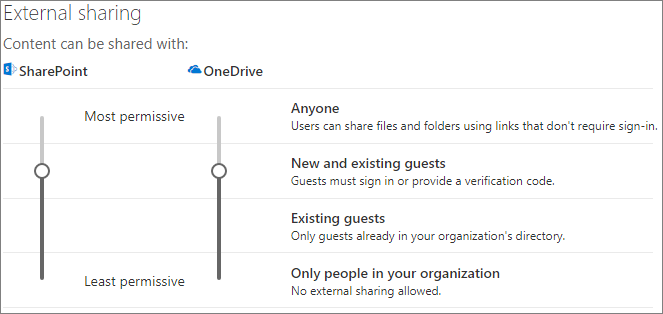

# Begränsa oavsiktlig exponering för filer när de delas med personer utanför organisationen

När du delar filer och mappar med personer utanför organisationen finns det en mängd olika alternativ som du kan använda för att minska risken för att någon oavsiktligt delar känslig information. Du kan välja bland alternativen i den här artikeln för att uppfylla organisationens behov på bästa sätt.

## Använda bästa metoder för Alla-länkar

Om personer i organisationen behöver göra oautentiserad delning, men du är bekymrad över att oautentiserade personer ska ändra innehållet, läser du [Metodtips för oautentiserad delning](best-practices-anonymous-sharing.md) för att få vägledning om hur du ska arbeta med oautentiserad delning i organisationen.

## Inaktivera Alla-länkar

Vi rekommenderar att du lämnar *Alla*-länkar aktiverade för lämpligt innehåll, eftersom det är det enklaste sättet att dela och hjälper till att minska risken för att användare tar till andra lösningar som ligger utanför IT-avdelningens kontroll. *Alla*-länkar kan vidarebefordras till andra, men filåtkomst är bara tillgänglig för dem som har länken.

Om du alltid vill att personer utanför organisationen ska autentiseras vid åtkomst till innehåll i SharePoint, Grupper eller Teams, kan du inaktivera *Alla*-delningen. Det hindrar användare från oautentiserad delning av innehåll.

Om du inaktiverar *Alla*-länkar kan användare trots det enkelt dela med gäster genom att använda *Specifika personer*-länkar. I det här fallet måste alla personer utanför organisationen autentiseras innan de kan få åtkomst till det delade innehållet.

Beroende på behoven kan du inaktivera *Alla*-länkar för specifika webbplatser eller för hela organisationen.

Inaktivera *Alla*-länkar för organisationen
1. I navigeringsfönstret till vänster i administrationscentret för SharePoint klickar du på **Delning**.
2. Sätt inställningen för extern delning för SharePoint på **Nya och befintliga gäster**. 
   
3. Klicka på **Spara**.

Inaktivera *Alla*-länkar för en webbplats
1. I navigeringsfönstret till vänster i administrationscentret för SharePoint expanderar du **Webbplatser** och klickar på **Aktiva webbplatser**.
2. Välj webbplatsen för det team som du just har skapat.
3. Klicka på **Delning** i menyfliksområdet.
4. Kontrollera att delning är inställt på **Nya och befintligt gäster**. 
   
5. Om du har gjort ändringar klickar du på **Spara**.

## Domänfiltrering

Du kan använda listor över tillåtna eller nekade domäner för att fastställa de domäner som dina användare kan dela med personer utanför organisationen.

Med en tillåt-lista kan du ange en lista över domäner där användarna i organisationen kan dela med personer utanför organisationen. Delning med andra domäner är blockerad. Om din organisation bara samarbetar med personer i en lista med specifika domäner kan du använda den här funktionen för att förhindra delning med andra domäner.

Med en neka-lista kan du ange en lista över domäner från vilken användarna i organisationen inte kan dela med personer utanför organisationen. Delning med angivna domäner är blockerad. Det här kan vara användbart om du exempelvis har konkurrenter som du vill hindra från att komma åt innehåll i din organisation.

Listorna över tillåtna och nekade domäner påverkar bara delning med gäster. Användare kan fortfarande dela med personer från förbjudna domäner genom att använda *Alla*-länkar om du inte har inaktiverat dem. Om du vill få bäst resultat med listor över tillåtna eller nekade domäner kan du inaktivera *Alla*-länkar enligt beskrivningen ovan.

Konfigurera en lista över tillåtna eller nekade domäner för personer utanför organisationen
1. I navigeringsfönstret till vänster i administrationscentret för SharePoint klickar du på **Delning**.
2. Under **Avancerade inställningar för extern delning** markerar du kryssrutan **Begränsa extern delning per domän**.
3. Klicka på **Lägg till domäner**.
4. Välj om du vill blockera domäner, ange domänerna och klicka på **OK**. 
   
5. Klicka på **Spara**.

Om du vill begränsa delningen per domän på en högre nivå än SharePoint och OneDrive kan du [tillåta eller blockera inbjudningar för B2B-användare från specifika organisationer](https://docs.microsoft.com/azure/active-directory/b2b/allow-deny-list) i Azure Active Directory. (Du måste konfigurera [SharePoint- och OneDrive-integreringen med Azure AD B2B förhandsversion](https://docs.microsoft.com/sharepoint/sharepoint-azureb2b-integration-preview) för att de här inställningarna ska påverka SharePoint och OneDrive.)

## Begränsa delning av filer, mappar och webbplatser med personer utanför organisationen till angivna säkerhetsgrupper

Du kan begränsa delning av filer, mappar och webbplatser med personer utanför organisationen till medlemmar i en specifik säkerhetsgrupp. Det här är användbart om du vill aktivera extern delning, men med ett arbetsflöde för godkännande eller en process för begäran.

Begränsa extern delning till medlemmar i en säkerhetsgrupp
1. I navigeringsfönstret till vänster i administrationscentret för SharePoint klickar du på **Delning**.
2. Under **Andra inställningar** följer du länken **Begränsa extern delning till specifika säkerhetsgrupper**.
3. Under **Vem kan dela utanför organisationen** markerar du en eller båda kryssrutorna: a. **Tillåt endast användare i valda säkerhetsgrupper att dela med autentiserade externa användare** för att ange en säkerhetsgrupp som kan dela med autentiserade användare b. **Tillåt endast användare i valda säkerhetsgrupper att dela med autentiserade externa användare och med hjälp av anonyma länkar** för att ange en säkerhetsgrupp som kan dela med autentiserade användare och genom att använda Alla-länkar
4. Klicka på **OK**.

Observera att det här påverkar filer, mappar och webbplatser, men inte Microsoft 365-grupper eller Teams. När medlemmar bjuder in gäster till en privat Microsoft 365-grupp eller ett privat team i Microsoft Teams skickas inbjudan till grupp- eller teamägaren för godkännande.

## Se även

[Skapa en säker miljö för gästdelning](create-secure-guest-sharing-environment.md)

[Metodtips för att dela filer och mappar med anonyma användare](best-practices-anonymous-sharing.md)