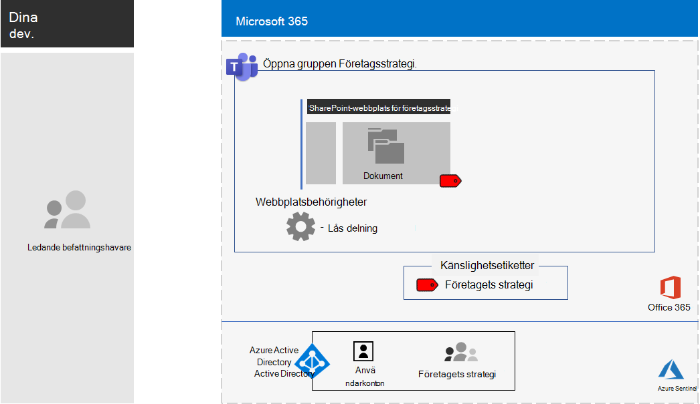

# <a name="configure-a-team-with-security-isolation-in-a-devtest-environment"></a><span data-ttu-id="ecf47-103">Konfigurera en grupp med säkerhetsisolering i en utvecklings-/testmiljö</span><span class="sxs-lookup"><span data-stu-id="ecf47-103">Configure a team with security isolation in a dev/test environment</span></span>

<span data-ttu-id="ecf47-104">I den här artikeln får du stegvisa instruktioner för hur du skapar en [grupp med säkerhetsisolering](secure-teams-security-isolation.md) i en utvecklings-/testmiljö.</span><span class="sxs-lookup"><span data-stu-id="ecf47-104">This article provides step-by-step instructions to create a [team with security isolation](secure-teams-security-isolation.md) in a dev/test environment.</span></span>



<span data-ttu-id="ecf47-106">Använd utvecklings-/testmiljön för att experimentera och finjustera inställningarna efter dina behov innan du distribuerar grupptyperna i produktion.</span><span class="sxs-lookup"><span data-stu-id="ecf47-106">Use this dev/test environment to experiment and fine-tune settings for your specific needs before deploying this type of team in production.</span></span>
  
## <a name="phase-1-build-out-your-microsoft-365-enterprise-test-environment"></a><span data-ttu-id="ecf47-107">Fas 1: Bygga ut testmiljön i Microsoft 365 Enterprise</span><span class="sxs-lookup"><span data-stu-id="ecf47-107">Phase 1: Build out your Microsoft 365 Enterprise test environment</span></span>

<span data-ttu-id="ecf47-108">Om du bara vill testa känsliga och strikt konfidentiella grupper på ett enkelt sätt med lägsta möjliga krav, följer du anvisningarna i [Enkel baskonfiguration](../enterprise/lightweight-base-configuration-microsoft-365-enterprise.md).</span><span class="sxs-lookup"><span data-stu-id="ecf47-108">If you just want to test sensitive and highly sensitive teams in a lightweight way with the minimum requirements, follow the instructions in [Lightweight base configuration](../enterprise/lightweight-base-configuration-microsoft-365-enterprise.md).</span></span>

<span data-ttu-id="ecf47-109">Om du vill testa känsliga och strikt konfidentiella grupper i ett simulerat företag, följer du anvisningarna i [Synkronisering av lösenordshash](../enterprise/password-hash-sync-m365-ent-test-environment.md).</span><span class="sxs-lookup"><span data-stu-id="ecf47-109">If you want to test sensitive and highly sensitive teams in a simulated enterprise, follow the instructions in [Password hash synchronization](../enterprise/password-hash-sync-m365-ent-test-environment.md).</span></span>

>[!Note]
><span data-ttu-id="ecf47-110">Att testa känsliga och strikt konfidentiella grupper kräver inte någon simulerad företagstestmiljö som innehåller ett simulerat intranät som är kopplat till Internet och katalogsynkronisering för en AD DS-skog (Active Directory Domain Services).</span><span class="sxs-lookup"><span data-stu-id="ecf47-110">Testing a team with security isolation does not require the simulated enterprise test environment, which includes a simulated intranet connected to the Internet and directory synchronization for an Active Directory Domain Services (AD DS) forest.</span></span> <span data-ttu-id="ecf47-111">Det här är ett alternativ där du kan testa känsliga och strikt konfidentiella grupper, samt experimentera i en miljö som motsvarar en vanlig organisation.</span><span class="sxs-lookup"><span data-stu-id="ecf47-111">It is provided here as an option so that you can test a team with security isolation and experiment with it in an environment that represents a typical organization.</span></span>
>
    
## <a name="phase-2-create-and-configure-your-azure-active-directory-azure-ad-group-and-users"></a><span data-ttu-id="ecf47-112">Fas 2: Skapa och konfigurera grupper och användare i Azure Active Directory (Azure AD)</span><span class="sxs-lookup"><span data-stu-id="ecf47-112">Phase 2: Create and configure your Azure Active Directory (Azure AD) group and users</span></span>

<span data-ttu-id="ecf47-113">I den här fasen skapar och konfigurerar du Azure Active Directory-grupper och användare för din fiktiva organisation.</span><span class="sxs-lookup"><span data-stu-id="ecf47-113">In this phase, you create and configure an Azure AD group and users for your fictional organization.</span></span>
  
<span data-ttu-id="ecf47-114">Börja med att skapa en säkerhetsgrupp med Microsoft Azure-portalen.</span><span class="sxs-lookup"><span data-stu-id="ecf47-114">First, create a security group with the Azure portal.</span></span>
  
1. <span data-ttu-id="ecf47-115">Gå till Azure-portalen på [https://portal.azure.com](https://portal.azure.com) från en separat flik i webbläsaren.</span><span class="sxs-lookup"><span data-stu-id="ecf47-115">Create a separate tab in your browser, and then go to the Azure portal at [https://portal.azure.com](https://portal.azure.com).</span></span> <span data-ttu-id="ecf47-116">Om det behövs loggar du in med autentiseringsuppgifterna för det globala administratörskontot för din utvärderingsprenumeration eller betalda prenumeration för Microsoft 365 E5.</span><span class="sxs-lookup"><span data-stu-id="ecf47-116">If needed, sign in with the credentials of the global administrator account for your Microsoft 365 E5 trial or paid subscription.</span></span>
    
2. <span data-ttu-id="ecf47-117">I Azure-portalen klickar du på **Azure Active Directory > Grupper**.</span><span class="sxs-lookup"><span data-stu-id="ecf47-117">In the Azure portal, click **Azure Active Directory > Groups**.</span></span>
    
3. <span data-ttu-id="ecf47-118">Gå till bladet **Grupper – Alla grupper** och klicka på **+ Ny grupp**.</span><span class="sxs-lookup"><span data-stu-id="ecf47-118">On the **Groups - All groups** blade, click **+ New group**.</span></span>
    
4. <span data-ttu-id="ecf47-119">På bladet **Grupp**:</span><span class="sxs-lookup"><span data-stu-id="ecf47-119">On the **Group** blade:</span></span>
    
  - <span data-ttu-id="ecf47-120">Välj **Säkerhet** i **Grupptyp**.</span><span class="sxs-lookup"><span data-stu-id="ecf47-120">Select **Security** in **Group type**.</span></span>
    
  - <span data-ttu-id="ecf47-121">Skriv **C-Suite** i **Namn**.</span><span class="sxs-lookup"><span data-stu-id="ecf47-121">Type **C-Suite** in **Name**.</span></span>
    
  - <span data-ttu-id="ecf47-122">Välj **Tilldelad** i **Typ av medlemskap**.</span><span class="sxs-lookup"><span data-stu-id="ecf47-122">Select **Assigned** in **Membership type**.</span></span>
      
5. <span data-ttu-id="ecf47-123">Klicka på **Skapa** och stäng sedan bladet **Grupp**.</span><span class="sxs-lookup"><span data-stu-id="ecf47-123">Click **Create**, and then close the **Group** blade.</span></span>
    
<span data-ttu-id="ecf47-124">Konfigurera automatiskt licensiering så att medlemmar i den nya gruppen **C-Suite** automatiskt tilldelas en licens för Microsoft 365 E5.</span><span class="sxs-lookup"><span data-stu-id="ecf47-124">Next, configure automatic licensing so that members of the new **C-Suite** group are automatically assigned a Microsoft 365 E5 license.</span></span>
  
1. <span data-ttu-id="ecf47-125">Klicka på **Azure Active Directory > Licenser > Alla produkter** i Azure-portalen.</span><span class="sxs-lookup"><span data-stu-id="ecf47-125">In the Azure portal, click **Azure Active Directory > Licenses > All products**.</span></span>
    
2. <span data-ttu-id="ecf47-126">Välj **Microsoft 365 Enterprise E5** i listan och klicka sedan på **Tilldela**.</span><span class="sxs-lookup"><span data-stu-id="ecf47-126">In the list, select **Microsoft 365 Enterprise E5**, and then click **Assign**.</span></span>
    
3. <span data-ttu-id="ecf47-127">På bladet **Tilldela licens** klickar du på **Användare och grupper**.</span><span class="sxs-lookup"><span data-stu-id="ecf47-127">In the **Assign license** blade, click **Users and groups**.</span></span>
    
4. <span data-ttu-id="ecf47-128">I listan med grupper väljer du gruppen **C-Suite**.</span><span class="sxs-lookup"><span data-stu-id="ecf47-128">In the list of groups, select the **C-Suite** group.</span></span>
    
5. <span data-ttu-id="ecf47-129">Klicka på **Välj** och sedan på **Tilldela**.</span><span class="sxs-lookup"><span data-stu-id="ecf47-129">Click **Select**, and then click **Assign**.</span></span>
    
6. <span data-ttu-id="ecf47-130">Stäng fliken för Azure-portalen i webbläsaren.</span><span class="sxs-lookup"><span data-stu-id="ecf47-130">Close the Azure portal tab in your browser.</span></span>
    
<span data-ttu-id="ecf47-131">Därefter [ansluter du med Azure Active Directory Windows PowerShell för Graph-modulen](../enterprise/connect-to-microsoft-365-powershell.md#connect-with-the-azure-active-directory-powershell-for-graph-module).</span><span class="sxs-lookup"><span data-stu-id="ecf47-131">Next, [connect with the Azure Active Directory PowerShell for Graph module](../enterprise/connect-to-microsoft-365-powershell.md#connect-with-the-azure-active-directory-powershell-for-graph-module).</span></span>
  
<span data-ttu-id="ecf47-132">Fyll i organisationsnamn, plats och lösenord samt kör dessa kommandon från Windows PowerShell-kommandotolken eller en ISE (Integrated Script Environment) för att skapa användarkonton och lägga till dem i gruppen C-Suite:</span><span class="sxs-lookup"><span data-stu-id="ecf47-132">Fill in your organization name, your location, and a common password, and then run these commands from the PowerShell command prompt or Integrated Script Environment (ISE) to create new user accounts and add them to the C-Suite group:</span></span>
  
```powershell
$orgName="<organization name, such as contoso-test for the contoso-test.onmicrosoft.com trial subscription domain name>"
$location="<the ISO ALPHA2 country code, such as US for the United States>"
$commonPassword="<common password for all the new accounts>"

$PasswordProfile=New-Object -TypeName Microsoft.Open.AzureAD.Model.PasswordProfile
$PasswordProfile.Password=$commonPassword

$groupName="C-Suite"
$userNames=@("CEO","CFO","CIO") 
$groupID=(Get-AzureADGroup | Where { $_.DisplayName -eq $groupName }).ObjectID
ForEach ($element in $userNames){ 
New-AzureADUser -DisplayName $element -PasswordProfile $PasswordProfile -UserPrincipalName ($element + "@" + $orgName + ".onmicrosoft.com") -AccountEnabled $true -MailNickName $element -UsageLocation $location 
Add-AzureADGroupMember -RefObjectId (Get-AzureADUser | Where { $_.DisplayName -eq $element }).ObjectID -ObjectId $groupID
}
```

> [!NOTE]
> <span data-ttu-id="ecf47-133">Ett gemensamt lösenord används för automatisering och enklare konfiguration i utvecklings-/testmiljön.</span><span class="sxs-lookup"><span data-stu-id="ecf47-133">The use of a common password here is for automation and ease of configuration for a dev/test environment.</span></span> <span data-ttu-id="ecf47-134">Självklart rekommenderas detta inte för produktionsprenumerationer.</span><span class="sxs-lookup"><span data-stu-id="ecf47-134">Obviously, this is highly discouraged for production subscriptions.</span></span> 
  
<span data-ttu-id="ecf47-135">Använd stegen för att kontrollera att gruppbaserad licensiering fungerar som den ska.</span><span class="sxs-lookup"><span data-stu-id="ecf47-135">Use these steps to verify that group-based licensing is working correctly.</span></span>
  
1. <span data-ttu-id="ecf47-136">Logga in på [Administrationscenter för Microsoft 365](https://admin.microsoft.com).</span><span class="sxs-lookup"><span data-stu-id="ecf47-136">Sign in to the [Microsoft 365 admin center](https://admin.microsoft.com).</span></span>
    
2. <span data-ttu-id="ecf47-137">Klicka på **Användare**under den nya fliken **Administrationscenter för Microsoft 365** i webbläsaren.</span><span class="sxs-lookup"><span data-stu-id="ecf47-137">From the new **Microsoft 365 admin center** tab of your browser, click **Users**.</span></span>
    
3. <span data-ttu-id="ecf47-138">I listan med användare klickar du på **CEO**.</span><span class="sxs-lookup"><span data-stu-id="ecf47-138">In the list of users, click **CEO**.</span></span>
    
4. <span data-ttu-id="ecf47-139">I fönstret med egenskaperna för användarkontot **CEO** kontrollerar du att det har tilldelats licensen **Microsoft 365 Enterprise E5** i **Produktlicenser**.</span><span class="sxs-lookup"><span data-stu-id="ecf47-139">In the pane that lists the properties of the **CEO** user account, verify that it has been assigned the **Microsoft 365 Enterprise E5** license in **Product licenses**.</span></span>
    
## <a name="phase-3-create-your-team"></a><span data-ttu-id="ecf47-140">Fas 3: Skapa din grupp</span><span class="sxs-lookup"><span data-stu-id="ecf47-140">Phase 3: Create your team</span></span>

<span data-ttu-id="ecf47-141">I den här fasen skapar och konfigurerar du en grupp med säkerhetsisolering för medlemmar i chefsledarskap för att samarbeta med företagsstrategi.</span><span class="sxs-lookup"><span data-stu-id="ecf47-141">In this phase, you create and configure a team with security isolation for members of the senior leadership team to collaborate on company strategy.</span></span>

<span data-ttu-id="ecf47-142">Kontrollera att du har aktiverat känslighetsetiketter för att skydda innehåll i Microsoft Teams, Office 365-grupper och SharePoint-webbplatser innan du fortsätter med stegen i [den här artikeln](../compliance/sensitivity-labels-teams-groups-sites.md).</span><span class="sxs-lookup"><span data-stu-id="ecf47-142">First, enable sensitivity labels to protect content in Microsoft Teams, Office 365 groups, and SharePoint sites before you proceed with the steps in [this article](../compliance/sensitivity-labels-teams-groups-sites.md).</span></span>

<span data-ttu-id="ecf47-143">Skapa sedan gruppen:</span><span class="sxs-lookup"><span data-stu-id="ecf47-143">Next, create the team:</span></span>

1. <span data-ttu-id="ecf47-144">I Teams klickar du på **Teams** till vänster i programmet och sedan på **gå med i eller skapa ett team** längst ned i grupplistan.</span><span class="sxs-lookup"><span data-stu-id="ecf47-144">In Teams, click **Teams** on the left side of the app, then click **Join or create a team** at the bottom of the teams list.</span></span>
2. <span data-ttu-id="ecf47-145">Klicka på **Skapa team** (första kortet, övre vänstra hörnet).</span><span class="sxs-lookup"><span data-stu-id="ecf47-145">Click **Create team** (first card, top left corner).</span></span>
3. <span data-ttu-id="ecf47-146">Välj **Skapa ett team från början**.</span><span class="sxs-lookup"><span data-stu-id="ecf47-146">Choose **Build a team from scratch**.</span></span>
4. <span data-ttu-id="ecf47-147">Behåll standardinställningen i listan **Känslighet**.</span><span class="sxs-lookup"><span data-stu-id="ecf47-147">In the **Sensitivity** list, keep the default.</span></span>
5. <span data-ttu-id="ecf47-148">Under **Sekretess**klickar du på **Privat**.</span><span class="sxs-lookup"><span data-stu-id="ecf47-148">Under **Privacy**, click **Private**.</span></span>
6. <span data-ttu-id="ecf47-149">Skriv **Företagsstrategi**och klicka sedan på **Skapa** > **Stäng**.</span><span class="sxs-lookup"><span data-stu-id="ecf47-149">Type **Company Strategy**, and then click **Create** > **Close**.</span></span>

<span data-ttu-id="ecf47-150">Härnäst ska du begränsa skapandet av privata kanaler till ägare av gruppen företags strategi.</span><span class="sxs-lookup"><span data-stu-id="ecf47-150">Next, restrict the creation of private channels to owners of the Company Strategy group.</span></span>

1. <span data-ttu-id="ecf47-151">Klicka på **Fler alternativ**i teamet och klicka sedan på **Hantera team**.</span><span class="sxs-lookup"><span data-stu-id="ecf47-151">In the team, click **More options**, and then click **Manage team**.</span></span>
2. <span data-ttu-id="ecf47-152">På fliken **Inställningar**, expandera **medlemsbehörigheter**.</span><span class="sxs-lookup"><span data-stu-id="ecf47-152">On the **Settings** tab, expand **Member permissions**.</span></span>
3. <span data-ttu-id="ecf47-153">Avmarkera kryssrutan **Tillåt att medlemmar skapar privata kanaler**.</span><span class="sxs-lookup"><span data-stu-id="ecf47-153">Clear the **Allow members to create private channels** check box.</span></span>

<span data-ttu-id="ecf47-154">Sedan behöver du konfigurera en känslighetsetikett med följande inställningar:</span><span class="sxs-lookup"><span data-stu-id="ecf47-154">Next, you need to configure a sensitivity label with the following settings:</span></span>

- <span data-ttu-id="ecf47-155">Namnet är företags strategin</span><span class="sxs-lookup"><span data-stu-id="ecf47-155">The name is Company Strategy</span></span>
- <span data-ttu-id="ecf47-156">Kryptering är aktiverat</span><span class="sxs-lookup"><span data-stu-id="ecf47-156">Encryption is enabled</span></span>
- <span data-ttu-id="ecf47-157">Gruppen Företagsstrategi har samredigeringsbehörighet</span><span class="sxs-lookup"><span data-stu-id="ecf47-157">The Company Strategy group has Co-Author permissions</span></span>

<span data-ttu-id="ecf47-158">Gör så här:</span><span class="sxs-lookup"><span data-stu-id="ecf47-158">Follow these steps:</span></span>

1. <span data-ttu-id="ecf47-159">Öppna [Microsoft 365 Efterlevnadscenter](https://compliance.microsoft.com).</span><span class="sxs-lookup"><span data-stu-id="ecf47-159">Open the [Microsoft 365 compliance center](https://compliance.microsoft.com).</span></span>
2. <span data-ttu-id="ecf47-160">Under **Lösningar**klickar du på **Informationsskydd**.</span><span class="sxs-lookup"><span data-stu-id="ecf47-160">Under **Solutions**, click **Information protection**.</span></span>
3. <span data-ttu-id="ecf47-161">Klicka på **Skapa en etikett**.</span><span class="sxs-lookup"><span data-stu-id="ecf47-161">Click **Create a label**.</span></span>
4. <span data-ttu-id="ecf47-162">Skriv **Företagsstrategi** som etikettnamn.</span><span class="sxs-lookup"><span data-stu-id="ecf47-162">Type **Company Strategy** for the label name.</span></span>
5. <span data-ttu-id="ecf47-163">Skriv **Dokument för chefsledarskapets företagsstrategi** som tips för verktyget och klicka sedan **Nästa**.</span><span class="sxs-lookup"><span data-stu-id="ecf47-163">Type **Senior leadership company strategy documents** as the tool tip, and then click **Next**.</span></span>
6. <span data-ttu-id="ecf47-164">I listrutan **Kryptering** på sidan **Kryptering** väljer du **Använd**. </span><span class="sxs-lookup"><span data-stu-id="ecf47-164">On the **Encryption** page, in the **Encryption** dropdown, choose **Apply**.</span></span>
7. <span data-ttu-id="ecf47-165">Så här lägger du till teambehörigheter:</span><span class="sxs-lookup"><span data-stu-id="ecf47-165">To add the team permissions:</span></span><br>
  <span data-ttu-id="ecf47-166">a.</span><span class="sxs-lookup"><span data-stu-id="ecf47-166">a.</span></span> <span data-ttu-id="ecf47-167">Klicka på **Tilldela behörigheter**.</span><span class="sxs-lookup"><span data-stu-id="ecf47-167">Click **Assign permissions**.</span></span><br>
  <span data-ttu-id="ecf47-168">b.</span><span class="sxs-lookup"><span data-stu-id="ecf47-168">b.</span></span> <span data-ttu-id="ecf47-169">Klicka på **Lägg till användare eller grupper**, välj **Företagsstrategi**och klicka sedan på **Lägg till**.</span><span class="sxs-lookup"><span data-stu-id="ecf47-169">Click **Add users or groups**, select **Company Strategy**, and then click **Add**.</span></span><br>
  <span data-ttu-id="ecf47-170">c.</span><span class="sxs-lookup"><span data-stu-id="ecf47-170">c.</span></span> <span data-ttu-id="ecf47-171">Klicka **Välj behörigheter**.</span><span class="sxs-lookup"><span data-stu-id="ecf47-171">Click **Choose permissions**.</span></span><br>
  <span data-ttu-id="ecf47-172">d.</span><span class="sxs-lookup"><span data-stu-id="ecf47-172">d.</span></span> <span data-ttu-id="ecf47-173">Välj **Samtidig redigering** från listrutan och klicka sedan på **Spara**.</span><span class="sxs-lookup"><span data-stu-id="ecf47-173">Choose **Co-Author** from the dropdown list, and then click **Save**.</span></span><br>
8. <span data-ttu-id="ecf47-174">Klicka på **Nästa**.</span><span class="sxs-lookup"><span data-stu-id="ecf47-174">Click **Next**.</span></span>
9. <span data-ttu-id="ecf47-175">På sidan **Märkning av innehåll** klickar du på **Nästa**.</span><span class="sxs-lookup"><span data-stu-id="ecf47-175">On the **Content marking** page, click **Next**.</span></span>
10. <span data-ttu-id="ecf47-176">På sidan **Inställningar för webbplatser och grupper** ställer du **inställningar för webbplatser och grupper** till **På**.</span><span class="sxs-lookup"><span data-stu-id="ecf47-176">On the **Site and group settings** page, set **Site and group settings** to **On**.</span></span>
11. <span data-ttu-id="ecf47-177">I listrutan **Sekretess för gruppanslutna teamwebbplatser i Office 365** väljer du **Privat – endast användare kan komma åt webbplatsen**.</span><span class="sxs-lookup"><span data-stu-id="ecf47-177">In the **Privacy of Office 365 group-connected team sites** dropdown, choose **Private - only members can access the site**.</span></span>
12. <span data-ttu-id="ecf47-178">Under **Ohanterade enheter**väljer du **Blockera åtkomst**.</span><span class="sxs-lookup"><span data-stu-id="ecf47-178">Under **Unmanaged devices**, choose **Block access**.</span></span>
13. <span data-ttu-id="ecf47-179">Klicka på **Nästa**.</span><span class="sxs-lookup"><span data-stu-id="ecf47-179">Click **Next**.</span></span>
14. <span data-ttu-id="ecf47-180">På sidan **Auto-etiketting för Office-program** klickar du på **Nästa**.</span><span class="sxs-lookup"><span data-stu-id="ecf47-180">On the **Auto-labeling for Office apps** page, click **Next**.</span></span>
15. <span data-ttu-id="ecf47-181">Klicka på **Skicka** och klicka sedan **Klart**.</span><span class="sxs-lookup"><span data-stu-id="ecf47-181">Click **Submit**, and then click **Done**.</span></span>

<span data-ttu-id="ecf47-182">Publicera sedan den nya etiketten med följande steg:</span><span class="sxs-lookup"><span data-stu-id="ecf47-182">Next, publish the new label with these steps:</span></span> 

1. <span data-ttu-id="ecf47-183">I Microsoft 365 Efterlevnadscenter väljer du fliken **Etikettprinciper** på sidan **Informationsskydd**.</span><span class="sxs-lookup"><span data-stu-id="ecf47-183">In the Microsoft 365 compliance center, on the **Information protection** page, choose the **Label policies** tab.</span></span>
2. <span data-ttu-id="ecf47-184">Klicka på **Publicera etiketter**.</span><span class="sxs-lookup"><span data-stu-id="ecf47-184">Click **Publish labels**.</span></span>
3. <span data-ttu-id="ecf47-185">På sidan **Välj känslighetsetiketter att publicera** klickar du på **Välj känslighetsetiketter att publicera**.</span><span class="sxs-lookup"><span data-stu-id="ecf47-185">On the **Choose sensitivity labels to publish** page, click **Choose sensitivity labels to publish**.</span></span>
4. <span data-ttu-id="ecf47-186">Välj **Företagsstrategi** och klicka sedan på **Lägg till**.</span><span class="sxs-lookup"><span data-stu-id="ecf47-186">Select **Company Strategy**, and then click **Add**.</span></span>
5. <span data-ttu-id="ecf47-187">Klicka på **Nästa**.</span><span class="sxs-lookup"><span data-stu-id="ecf47-187">Click **Next**.</span></span>
6. <span data-ttu-id="ecf47-188">På sidan **Publicera till användare och grupper** klickar du på **välja användare och grupper**.</span><span class="sxs-lookup"><span data-stu-id="ecf47-188">On the **Publish to users and groups** page, click **Choose users and groups**.</span></span>
7. <span data-ttu-id="ecf47-189">Klicka på **Lägg till** och välj sedan **Företagsstrategi**.</span><span class="sxs-lookup"><span data-stu-id="ecf47-189">Click **Add**, and then select **Company Strategy**.</span></span>
8. <span data-ttu-id="ecf47-190">Klicka på **Lägg till** och sedan på **Klart**.</span><span class="sxs-lookup"><span data-stu-id="ecf47-190">Click **Add**, and then click **Done**.</span></span>
9. <span data-ttu-id="ecf47-191">Klicka på **Nästa**.</span><span class="sxs-lookup"><span data-stu-id="ecf47-191">Click **Next**.</span></span>
10. <span data-ttu-id="ecf47-192">På sidan Principinställningar väljer du kryssrutan **Användare måste ge anledning till att ta bort en etikett eller lägre klassificeringsetikett** och klickar sedan på **Nästa**.</span><span class="sxs-lookup"><span data-stu-id="ecf47-192">On the Policy settings page, select the **Users must provide justification to remove a label or lower classification label** check box, and then click **Next**.</span></span>
11. <span data-ttu-id="ecf47-193">Skriv **Företagsstrategi** som principens namn och klicka sedan på **Nästa**.</span><span class="sxs-lookup"><span data-stu-id="ecf47-193">Type **Company Strategy** for the policy name, and then click **Next**.</span></span>
12. <span data-ttu-id="ecf47-194">Klicka på **Skicka** och klicka sedan på **Klart**.</span><span class="sxs-lookup"><span data-stu-id="ecf47-194">Click **Submit** and then click **Done**.</span></span>

<span data-ttu-id="ecf47-195">Obs! Det kan ta lite tid innan etiketten **Företagsstrategi** blir tillgänglig när den har publicerats.</span><span class="sxs-lookup"><span data-stu-id="ecf47-195">It may take some time for the **Company Strategy** label to become available after it's been published.</span></span>

<span data-ttu-id="ecf47-196">Använd sedan den nya etiketten i gruppen **Företagsstrategi** och uppdatera den standardtypen av delningslänk för att minska risken för att filer och mappar delas av misstag.</span><span class="sxs-lookup"><span data-stu-id="ecf47-196">Next, apply your new label to the **Company Strategy** team and update the default sharing link type to reduce the risk of accidentally sharing files and folders to a wider audience than intended.</span></span> 

1. <span data-ttu-id="ecf47-197">Öppna [SharePoint Online Administrationscenter](https://admin.microsoft.com/sharepoint).</span><span class="sxs-lookup"><span data-stu-id="ecf47-197">Open the [SharePoint admin center](https://admin.microsoft.com/sharepoint).</span></span>
2. <span data-ttu-id="ecf47-198">Under **Webbplatser**klickar du på **Aktiva webbplatser**.</span><span class="sxs-lookup"><span data-stu-id="ecf47-198">Under **Sites**, click **Active sites**.</span></span>
3. <span data-ttu-id="ecf47-199">Klicka på webbplatsen **Företagsstrategi**.</span><span class="sxs-lookup"><span data-stu-id="ecf47-199">Click the **Company Strategy** site.</span></span>
4. <span data-ttu-id="ecf47-200">På fliken **Principer** klickar du på **Redigera** under **Känslighet**.</span><span class="sxs-lookup"><span data-stu-id="ecf47-200">On the **Policies** tab, under **Sensitivity**, click **Edit**.</span></span>
5. <span data-ttu-id="ecf47-201">Välj etiketten **Företagsstrategi** och klicka sedan på **Spara**.</span><span class="sxs-lookup"><span data-stu-id="ecf47-201">Select the **Company Strategy** label, and then click **Save**.</span></span>
6. <span data-ttu-id="ecf47-202">Klicka på **Redigera** under **Extern delning** på fliken **Principer**.</span><span class="sxs-lookup"><span data-stu-id="ecf47-202">On the **Policies** tab, under **External sharing**, click **Edit**.</span></span>
5. <span data-ttu-id="ecf47-203">Välj **Endast personer i organisationen**.</span><span class="sxs-lookup"><span data-stu-id="ecf47-203">Choose **Only people in your organization**.</span></span>
6. <span data-ttu-id="ecf47-204">Avmarkera kryssrutan **Samma som organisationsnivå** under länktypen **Standarddelning** och välj **Personer med befintlig åtkomst**.</span><span class="sxs-lookup"><span data-stu-id="ecf47-204">Under **Default sharing** link type, clear the **Same as organization-level setting** check box, and select **People with existing access**.</span></span>
7. <span data-ttu-id="ecf47-205">Klicka på **Spara**.</span><span class="sxs-lookup"><span data-stu-id="ecf47-205">Click **Save**.</span></span>

<span data-ttu-id="ecf47-206">Konfigurera sedan endast webbplatsdelning för ägare för gruppen **Företagsstrategi**.</span><span class="sxs-lookup"><span data-stu-id="ecf47-206">Next, configure owners-only site sharing for the **Company Strategy** team.</span></span>

1. <span data-ttu-id="ecf47-207">I team går du till fliken **Allmänt** i gruppen **Företagsstrategi**.</span><span class="sxs-lookup"><span data-stu-id="ecf47-207">In Teams, navigate to the **General** tab of the **Company Strategy** team.</span></span>
2. <span data-ttu-id="ecf47-208">I verktygsfältet för teamet klickar du på **Filer**.</span><span class="sxs-lookup"><span data-stu-id="ecf47-208">In the tool bar for the team, click **Files**.</span></span>
3. <span data-ttu-id="ecf47-209">Klicka på ellipsen och sedan på **Öppna i SharePoint**.</span><span class="sxs-lookup"><span data-stu-id="ecf47-209">Click the ellipsis, and then click **Open in SharePoint**.</span></span>
4. <span data-ttu-id="ecf47-210">Klicka på inställningsikonen i verktygsfältet på den underliggande SharePoint-webbplatsen och klicka sedan på **Webbplatsbehörigheter**.</span><span class="sxs-lookup"><span data-stu-id="ecf47-210">In the tool bar of the underlying SharePoint site, click the settings icon, and then click **Site permissions**.</span></span>
5. <span data-ttu-id="ecf47-211">I fönstret webbplatsbehörigheter under **Webbplatsdelning**klickar du på **Ändra hur medlemmar kan dela**.</span><span class="sxs-lookup"><span data-stu-id="ecf47-211">In the Site permissions pane, under **Site Sharing**, click **Change how members can share**.</span></span>
6. <span data-ttu-id="ecf47-212">Under **Delningsbehörigheter** väljer du **Endast webbplatsens ägare kan dela filer, mappar och webbplatsen**. Klicka sedan på **Spara**.</span><span class="sxs-lookup"><span data-stu-id="ecf47-212">Under **Sharing permissions**, choose **Only site owners can share files, folders, and the site**, and then click **Save**.</span></span>
7. <span data-ttu-id="ecf47-213">Stäng fönstren **Behörigheter** och **Inställningar**.</span><span class="sxs-lookup"><span data-stu-id="ecf47-213">Close the **Permissions** and **Settings** panes.</span></span>

<span data-ttu-id="ecf47-214">Om du loggar in som medlem i gruppen Företagsstrategi, kommer du att se **Företagsstrategi** i alternativet **Känslighet** i verktygsfältet Start i Word, Excel och PowerPoint.</span><span class="sxs-lookup"><span data-stu-id="ecf47-214">If you sign in as a member of the Company Strategy group, you will see **Company Strategy** in the **Sensitivity** option in the Home toolbar of Word, Excel, and PowerPoint.</span></span> <span data-ttu-id="ecf47-215">Välj etiketten **Företagsstrategi** från alternativet **Känslighet** om du vill tilldela etiketten till en fil.</span><span class="sxs-lookup"><span data-stu-id="ecf47-215">Select the **Company Strategy** label from the **Sensitivity** option to assign the label to a file.</span></span>

<span data-ttu-id="ecf47-216">Här är den resulterande konfigurationen för gruppen Företagsstrategi.</span><span class="sxs-lookup"><span data-stu-id="ecf47-216">Here is the resulting configuration for the Company Strategy team.</span></span>


## <a name="next-step"></a><span data-ttu-id="ecf47-218">Nästa steg</span><span class="sxs-lookup"><span data-stu-id="ecf47-218">Next step</span></span>

<span data-ttu-id="ecf47-219">När du är redo för distribution kan du läsa de här [konfigurations anvisningar](secure-teams-security-isolation.md).</span><span class="sxs-lookup"><span data-stu-id="ecf47-219">When you're ready for production deployment, see these [configuration instructions](secure-teams-security-isolation.md).</span></span>
