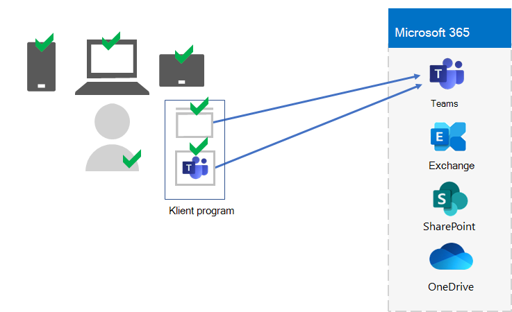
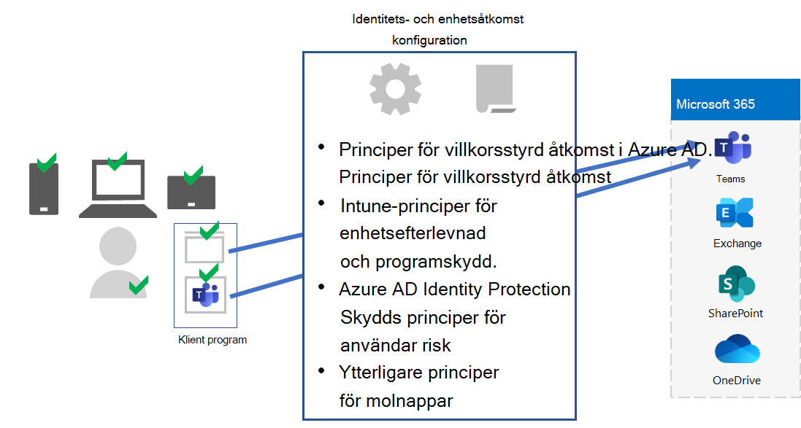
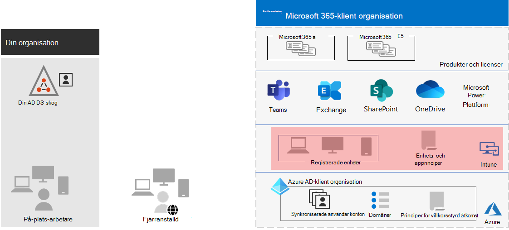

# Steg 5: Enhet- och apphantering för Microsoft 365 för företag-klientorganisation

Microsoft 365 för företag innehåller funktioner som hjälper dig att hantera enheter och användning av appar på de enheterna i organisationen med hantering av mobila enheter (MDM) och hantering av mobilprogram (MAM). Du kan hantera iOS-, Android-, macOS- och Windows-enheter för att skydda åtkomsten till organisationens resurser, inklusive dina data. Du kan till exempel förhindra att e-postmeddelanden skickas till personer utanför organisationen eller isolera organisationsdata från personliga data på en anställds personliga enheter.

Här är ett exempel på validering och hantering av användare, deras enheter och deras användning av lokala appar och produktivitetsappar i molnet, till exempel Microsoft Teams.

För att hjälpa dig att skydda organisationens resurser innehåller Microsoft 365 för företag funktioner som hjälper dig att hantera enheter och deras åtkomst till appar. Det finns två alternativ för enhetshantering:

- Microsoft Intune är en omfattande enhets- och apphanteringslösning för företag.
- Basic Mobility and Security, som är en delmängd av Intune-tjänsterna som ingår i alla Microsoft 365-produkter för hantering av enheter i organisationen. Mer information finns i [Funktioner för grundläggande rörlighet och säkerhet.](../admin/basic-mobility-security/capabilities.md)

Om du har Microsoft 365 E3 eller E5 ska du använda Intune.

## Microsoft Intune

Du använder [Microsoft Intune för](/mem/intune/fundamentals/planning-guide) att hantera åtkomsten till organisationen med MDM eller MAM. MDM är när användarna "registrerar" sina enheter i Intune. När en enhet har registrerats är det en hanterad enhet och kan få organisationens principer, regler och inställningar. Du kan till exempel installera specifika appar, skapa en lösenordsprincip, installera en VPN-anslutning med mera.

Användare med sina egna personliga enheter kanske inte vill registrera sina enheter eller hanteras av Intune och organisationens principer. Men du måste fortfarande skydda organisationens resurser och data. I det här scenariot kan du skydda dina program med hjälp av MAM. Du kan till exempel använda en MAM-princip som kräver att användaren anger en PIN-kod när han eller hon öppnar SharePoint på enheten.

Du får också bestämma hur du ska hantera personliga enheter och organisationsägda enheter. Du kanske vill behandla enheter olika beroende på hur de används.

## Konfigurationer av identiteter och enhetsåtkomst

Microsoft tillhandahåller en uppsättning konfigurationer för identiteter [och enhetsåtkomst för](../security/defender-365-security/microsoft-365-policies-configurations.md) att säkerställa en säker och produktiv arbetsstyrka. De här konfigurationerna omfattar användning av:

- Principer för villkorsstyrd åtkomst i Azure AD
- Microsoft Intune-policyer för enhetsefterlevnad och appskydd
- Användarriskprinciper för Azure AD Identity Protection
- Ytterligare principer för molnappar

Här är ett exempel på hur de här inställningarna och principerna används för att verifiera och begränsa användare, deras enheter och användning av lokala appar och produktivitetsappar i molnet, till exempel Microsoft Teams.

För enhetsåtkomst och apphantering använder du konfigurationerna i följande artiklar:

- [Krav](../security/defender-365-security/identity-access-prerequisites.md)
- [Vanliga principer för identitets- och enhetsåtkomst](../security/defender-365-security/identity-access-policies.md)

## Resultat av steg 5

För enhet- och apphantering för Microsoft 365-klienten har du fastställt inställningar och principer för Intune för att verifiera och begränsa användare, deras enheter och deras användning av lokala appar och moln produktivitetsappar.

Här är ett exempel på en klientorganisation med Intune enhet och apphantering med de nya elementen markerade.

I den här illustrationen har klientorganisationen:

- Organisationsägda enheter registrerade i Intune.
- Intune-enhet och appprinciper för registrerade och personliga enheter.

## Löpande underhåll för enhet och apphantering

Du kan behöva: 

- Hantera enhetsregistrering.
- Ändra dina inställningar och principer för ytterligare appar, enheter och säkerhetskrav.