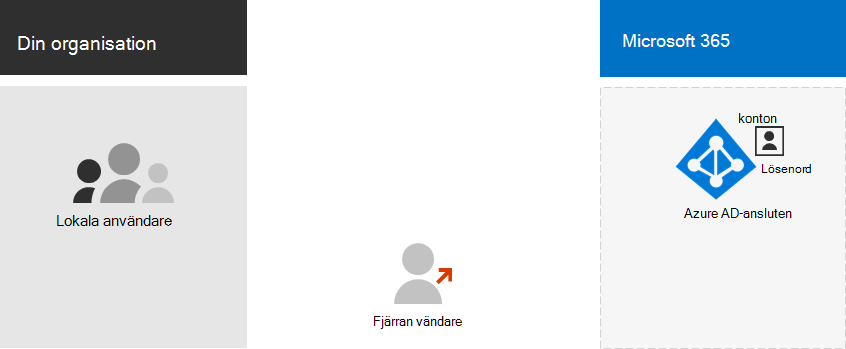
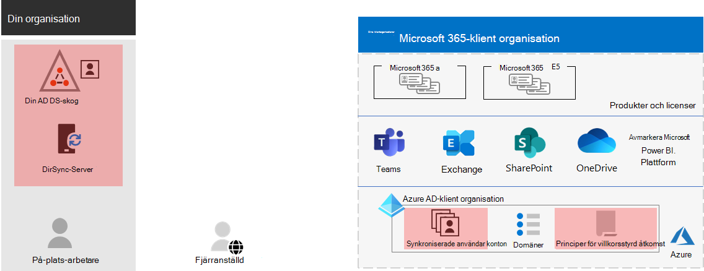
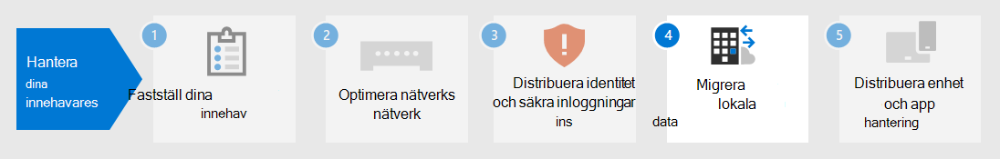

# Steg 3.Step 3. Identitet för Microsoft 365 för företag-klientorganisationenIdentity for your Microsoft 365 for enterprise tenants

Din Microsoft 365-klientorganisation inkluderar en Azure Active Directory-klientorganisation (Azure AD) för att hantera identiteter och autentisering för inloggningar. Att konfigurera identitetsinfrastrukturen på rätt sätt är viktigt för att hantera Microsoft 365-användares åtkomst och behörigheter för din organisation.Your Microsoft 365 tenant includes an Azure Active Directory (Azure AD) tenant to manage identities and authentication for sign-ins. Getting your identity infrastructure configured correctly is vital to managing Microsoft 365 user access and permissions for your organization.

## Endast molnet jämfört med hybridCloud-only vs. hybrid

Här är de två typerna av identitetsmodeller och deras bästa form och fördelar.Here are the two types of identity models and their best fit and benefits.

| ModellModel | BeskrivningDescription | Så här autentiserar Microsoft 365 användarautentiseringsuppgifterHow Microsoft 365 authenticates user credentials | Bäst förBest for | Största förmånenGreatest benefit |
|:-------|:-----|:-----|:-----|:-----|
| Endast molnetCloud-only | Användarkontot finns bara i Azure AD-klientorganisationen för Microsoft 365-klienten.User account only exists in the Azure AD tenant for your Microsoft 365 tenant. | Azure AD-klientorganisationen för Microsoft 365-klienten utför autentiseringen med molnidentitetskontot.The Azure AD tenant for your Microsoft 365 tenant performs the authentication with the cloud identity account. | Organisationer som inte har eller behöver en lokal AD DS.Organizations that do not have or need an on-premises AD DS. | Enkel att använda.Simple to use. Inga extra katalogverktyg eller servrar krävs.No extra directory tools or servers required. |
| HybridHybrid |  Användarkontot finns i din lokala ACTIVE Directory Domain Services (AD DS) och en kopia finns också i Azure AD-klienten för Microsoft 365-klienten.User account exists in your on-premises Active Directory Domain Services (AD DS) and a copy is also in the Azure AD tenant for your Microsoft 365 tenant. Azure AD Connect körs på en lokal server för att synkronisera AD DS-ändringar i Din Azure AD-klient.Azure AD Connect runs on an on-premises server to synchronize AD DS changes to your Azure AD tenant. Användarkontot i Azure AD kan också innehålla en hashtaggad version av det redan hashtaggade lösenordet för AD DS-användarkontot.The user account in Azure AD might also include a hashed version of the already hashed AD DS user account password. | Azure AD-klientorganisationen för Microsoft 365-klienten hanterar antingen autentiseringsprocessen eller omdirigerar användaren till en annan identitetsleverantör.The Azure AD tenant for your Microsoft 365 tenant either handles the authentication process or redirects the user to another identity provider. | Organisationer som använder AD DS eller en annan identitetsleverantör.Organizations using AD DS or another identity provider. | Användarna kan använda samma autentiseringsuppgifter när de använder lokala eller molnbaserade resurser.Users can use the same credentials when accessing on-premises or cloud-based resources. |
||||||

Här är de grundläggande komponenterna i identiteter som bara är molnbaserade.Here are the basic components of cloud-only identity.
 

I den här illustrationen loggar lokala användare och fjärranvändare in med konton i Azure AD-klientorganisationen för Sin Microsoft 365-klientorganisation.In this illustration, on-premises and remote users sign in with accounts in the Azure AD tenant of their Microsoft 365 tenant.

Här är de grundläggande komponenterna i hybrididentitet.Here are the basic components of hybrid identity.

I den här illustrationen loggar lokala användare och fjärranvändare in på sin Microsoft 365-klientorganisation med konton i Azure AD-klientorganisationen som har kopierats från deras lokala AD DS.In this illustration, on-premises and remote users sign in to their Microsoft 365 tenant with accounts in the Azure AD tenant that have been copied from their on-premises AD DS.

## Synkronisera din lokala AD DSSynchronizing your on-premises AD DS

Beroende på dina affärsbehov och tekniska krav är hybrididentitetsmodellen och katalogsynkroniseringen det vanligaste valet för företagskunder som inför Microsoft 365.Depending on your business needs and technical requirements, the hybrid identity model and directory synchronization is the most common choice for enterprise customers who are adopting Microsoft 365. Med katalogsynkronisering kan du hantera identiteter i AD DS och alla uppdateringar av användarkonton, grupper och kontakter synkroniseras till Azure AD-klientorganisationen i Microsoft 365-klienten.Directory synchronization allows you to manage identities in your AD DS and all updates to user accounts, groups, and contacts are synchronized to the Azure AD tenant of your Microsoft 365 tenant.

>[!Note]
>När AD DS-användarkonton synkroniseras för första gången tilldelas de inte automatiskt en Microsoft 365-licens och kan inte komma åt Microsoft 365-tjänster, till exempel e-post.When AD DS user accounts are synchronized for the first time, they are not automatically assigned a Microsoft 365 license and cannot access Microsoft 365 services, such as email. Du måste först tilldela dem en användningsplats.You must first assign them a usage location. Tilldela sedan en licens till dessa användarkonton, antingen individuellt eller dynamiskt genom gruppmedlemskap.Then, assign a license to these user accounts, either individually or dynamically through group membership.
>

Här är de två typerna av autentisering när du använder hybrididentitetsmodellen.Here are the two types of authentication when using the hybrid identity model.

| AutentiseringstypAuthentication type | BeskrivningDescription |
|:-------|:-----|
| Hanterad autentiseringManaged authentication | Azure AD hanterar autentiseringsprocessen med hjälp av en lokalt lagrad hash-version av lösenordet eller skickar autentiseringsuppgifterna till en lokal programvaruagent som ska autentiseras av den lokala AD DS.Azure AD handles the authentication process by using a locally-stored hashed version of the password or sends the credentials to an on-premises software agent to be authenticated by the on-premises AD DS.      Det finns två typer av hanterad autentisering: synkronisering av lösenordshashar (PHS) och direktautentisering (PTA).There are two types of managed authentication: Password hash synchronization (PHS) and Pass-through authentication (PTA). Med PHS utför Azure AD själva autentiseringen.With PHS, Azure AD performs the authentication itself. Med PTA har Azure AD AD DS för att utföra autentiseringen.With PTA, Azure AD has AD DS perform the authentication. |
| Federerad autentiseringFederated authentication | Azure AD omdirigerar klientdatorn och begär autentisering till en annan identitetsleverantör.Azure AD redirects the client computer requesting authentication to another identity provider. |
|  |  |

Mer [information finns i Välja rätt autentiseringsmetod.](/azure/active-directory/hybrid/choose-ad-authn)See [choosing the right authentication method](/azure/active-directory/hybrid/choose-ad-authn) to learn more.

## Framtvinga starka inloggningarEnforcing strong sign-ins

För att öka säkerheten för användarens inloggningar använder du funktionerna i följande tabell.To increase the security of user sign-ins, use the features and capabilities in the following table.

| FunktionCapability | BeskrivningDescription | Mer informationMore information | LicenskravLicensing requirements |
|:-------|:-----|:-----|:-----|:-----|
| Windows Hello för företagWindows Hello for Business | Ersätter lösenord med stark tvåfaktorautentisering när du loggar in på en Windows-enhet.Replaces passwords with strong two-factor authentication when signing on a Windows device. De två faktorerna är en ny typ av användaruppgifter som är kopplade till en enhet och ett biometriskt attribut eller en PIN-kod.The two factors are a new type of user credential that is tied to a device and a biometric or PIN. | [Översikt över Windows Hello för företagWindows Hello for Business Overview](/windows/security/identity-protection/hello-for-business/hello-overview) | Microsoft 365 E3 eller E5Microsoft 365 E3 or E5 |
| Azure AD-lösenordsskyddAzure AD Password Protection | Identifierar och blockerar kända svaga lösenord och deras varianter och kan även blockera ytterligare svaga termer som är specifika för din organisation.Detects and blocks known weak passwords and their variants and can also block additional weak terms that are specific to your organization. | [Konfigurera lösenordsskydd i Azure ADConfigure Azure AD password protection](/azure/active-directory/authentication/concept-password-ban-bad) | Microsoft 365 E3 eller E5Microsoft 365 E3 or E5 |
| Använd multifaktorautentisering (MFA)Use multi-factor authentication (MFA) | MFA kräver att användarens inloggningar måste verifieras mer än lösenordet för användarkontot, till exempel verifiering med en smartphone-app eller ett SMS som skickas till en smartphone.MFA requires that user sign-ins be subject to an additional verification beyond the user account password, such as verification with a smartphone app or a text message sent to a smartphone. I [den här videon](https://support.microsoft.com/office/set-up-multi-factor-authentication-in-microsoft-365-business-a32541df-079c-420d-9395-9d59354f7225) finns instruktioner om hur användarna ställer in MFA.See [this video](https://support.microsoft.com/office/set-up-multi-factor-authentication-in-microsoft-365-business-a32541df-079c-420d-9395-9d59354f7225) for instructions on how users set up MFA. | [MFA för Microsoft 365 för företagMFA for Microsoft 365 for enterprise](../enterprise/microsoft-365-secure-sign-in.md#mfa) | Microsoft 365 E3 eller E5Microsoft 365 E3 or E5 |
| Konfigurationer av identiteter och enhetsåtkomstIdentity and device access configurations | Inställningar och principer som består av rekommenderade nödvändiga funktioner och deras inställningar i kombination med villkorsstyrd åtkomst, Intune och Azure AD Identity Protection-principer som bestämmer om en viss åtkomstbegäran ska beviljas och under vilka villkor.Settings and policies that consist of recommended prerequisite features and their settings combined with Conditional Access, Intune, and Azure AD Identity Protection policies that determine whether a given access request should be granted and under what conditions.  | [Konfigurationer för identitets- och enhetsåtkomstIdentity and device access configurations](../security/office-365-security/microsoft-365-policies-configurations.md) | Microsoft 365 E3 eller E5Microsoft 365 E3 or E5 |
| Azure AD Identity ProtectionAzure AD Identity Protection | Skydda mot autentiseringsuppgifter, där en attack avgör en användares kontonamn och lösenord för att få åtkomst till en organisations molntjänster och data.Protect against credential compromise, where an attacker determines a user’s account name and password to gain access to an organization’s cloud services and data. | [Azure AD Identity ProtectionAzure AD Identity Protection](/azure/active-directory/active-directory-identityprotection) | Microsoft 365 E5 eller Microsoft 365 E3 med tillägget & Identity & Threat ProtectionMicrosoft 365 E5 or Microsoft 365 E3 with the Identity & Threat Protection add-on |
|  |  |  |

## Resultat av steg 3Results of Step 3

För identitet för Microsoft 365-klientorganisationen har du fastställt:For identity for your Microsoft 365 tenant, you have determined:

- Vilken identitetsmodell som ska användas.Which identity model to use.
- Hur du framtvingar stark användar- och enhetsåtkomst.How you will enforce strong user and device access.

Här är ett exempel på en klientorganisation med de nya hybrididentitetselementen markerade.Here is an example a tenant with the new hybrid identity elements highlighted.

I den här illustrationen har klientorganisationen:In this illustration, the tenant has:

- En AD DS-skog som synkroniseras med Azure AD-klientorganisationen med en DirSync-server och Azure AD Connect.An AD DS forest that is being synchronized with the Azure AD tenant using a DirSync server and Azure AD Connect.
- En kopia av AD DS-användarkontona och andra objekt från AD DS-skogen.A copy of the AD DS user accounts and other objects from the AD DS forest.
- En uppsättning principer för villkorsstyrd åtkomst för att framtvinga säkra användar inloggningar och åtkomst baserat på användarkontot.A set of Conditional Access policies to enforce secure user sign-ins and access based on the user account. 

## Löpande underhåll för identitetOngoing maintenance for identity

Du kan behöva:On an ongoing basis, you might need to:

- Lägga till eller ändra användarkonton och grupper.Add or modify user accounts and groups. När det gäller molnbaserad identitet behåller du dina molnbaserade användare och grupper med Azure AD-verktyg som administrationscentret för Microsoft 365 eller PowerShell.For cloud-only identity, you maintain your cloud-based users and groups with Azure AD tools such as the Microsoft 365 admin center or PowerShell. För hybrididentitet behåller du lokala användare och grupper med AD DS-verktyg.For hybrid identity, you maintain your on-premises users and groups with AD DS tools.
- Lägg till eller ändra konfigurationen av identitets- och enhetsåtkomst för att tillämpa säkerhetskraven för inloggning.Add or modify your identity and device access configuration to enforce sign-in security requirements.

## Nästa stegNext step

Fortsätt med [migrering](tenant-management-migration.md) för att migrera dina lokala Office-servrar och deras data till Microsoft 365.Continue with [migration](tenant-management-migration.md) to migrate your on-premises Office servers and their data to Microsoft 365.