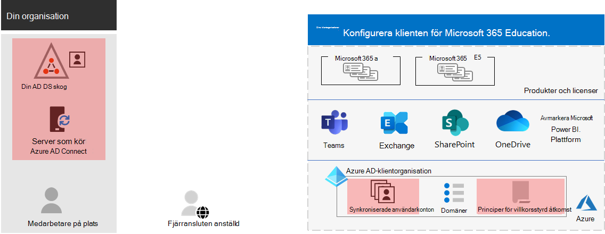

# Steg 3. Identitet för din Microsoft 365 för företags innehavare

Din Microsoft 365-klient organisation inkluderar en Azure Active Directory (Azure AD)-klient organisation för att hantera identiteter och inloggningsautentisering för inloggningar. Att få din identitets infrastruktur konfigurerad korrekt är viktig för att hantera Microsoft 365-användarnas åtkomst och behörigheter för din organisation.

## Endast molnbaserade kontra hybrid

Här är de två typerna av identitets modeller och deras bästa passning och fördelar.

| Modell | Beskrivning | Hur Microsoft 365 verifierar användarautentiseringsuppgifter | Bäst för | Största fördelen |
|:-------|:-----|:-----|:-----|:-----|
| Endast molnet | Användar kontot finns bara i Azure AD-innehavaren för din Microsoft 365-klient organisation. | Azure AD-innehavaren för din Microsoft 365-klient organisation utför autentiseringsprocessen med moln identitets kontot. | Organisationer som inte har eller behöver en lokal AD DS. | Lätt att använda. Inga extra katalog verktyg eller servrar behövs. |
| Hybrid |  Användar kontot finns i din lokala Active Directory Domain Services (AD DS) och en kopia finns också i Azure AD-innehavaren för din Microsoft 365-klient. Azure AD Connect körs på en lokal server för att synkronisera AD DS-ändringar till din Azure AD-klient. Användar kontot i Azure AD kan också innehålla en hash-version av det redan hashade lösen ordet för AD DS-användarkontot. | Azure AD-innehavaren för din Microsoft 365-klient hanterar autentiseringsprocessen eller omdirigerar användaren till en annan identitets leverantör. | Organisationer som använder AD DS eller en annan identitets leverantör. | Användare kan använda samma inloggnings uppgifter när de använder lokala eller molnbaserade resurser. |
||||||

Här är de grundläggande komponenterna i moln-Only-identitet.
 

I den här bilden loggar lokala och fjärranslutna användare in med konton i Azure AD-innehavaren av sin Microsoft 365-klient organisation.

Här är de grundläggande komponenterna i hybrid identitet.

I den här bilden loggar lokala och fjärranslutna användare in i sin Microsoft 365-klient organisation med konton i Azure AD-klient organisationen som har kopierats från sin lokala AD DS.

## Synkronisera din lokala AD DS

Beroende på företagets behov och tekniska krav är hybrid Identity Model och katalog synkronisering det vanligaste alternativet för företags kunder som använder Microsoft 365. Med katalog-synkronisering kan du hantera identiteter i din AD DS och alla uppdateringar av användar konton, grupper och kontakter synkroniseras till din Microsoft 365-klientens Azure-klient organisation.

>[!Note]
>När AD DS-användarkonton synkroniseras för första gången är de inte automatiskt kopplade till en Microsoft 365-licens och kan inte använda Microsoft 365-tjänster, till exempel e-post. Du måste först tilldela dem en användnings plats. Tilldela sedan en licens till dessa användar konton antingen individuellt eller dynamiskt via grupp medlemskap.
>

Här är de två typerna av autentiseringsmetoder när du använder hybrid identitets modellen.

| Autentiseringstyp | Beskrivning |
|:-------|:-----|
| Hanterad verifikation | Azure AD hanterar autentiseringsprocessen med en lokalt lagrad hash-version av lösen ordet eller skickar autentiseringsuppgifterna till en lokal program agent för att autentiseras av den lokala AD DS-tjänsten.      Det finns två typer av hanterad inloggningsautentisering: Lösenordssynkronisering (PHS) och vidarekoppling (PTA). Med PHS utför Azure AD själva autentiseringsprocessen. Med PTA sköter Azure AD DS-verifikationen. |
| Federerad autentisering | Azure AD dirigerar om klient datorn till en annan identitets leverantör. |
|  |  |

Se [välja rätt autentiseringsmetod](https://docs.microsoft.com/azure/active-directory/hybrid/choose-ad-authn) för att få mer information.

## Tvinga starka inloggningar

Om du vill öka säkerheten för användarnas inloggnings program använder du funktionerna och funktionerna i följande tabell.

| Funktion | Beskrivning | Mer information | Licens krav |
|:-------|:-----|:-----|:-----|:-----|
| Windows Hello för företag | Ersätter lösen ord med stark tvåfaktorautentisering när du loggar in på en Windows-enhet. De två faktorerna är en ny typ av användaruppgifter som är kopplade till en enhet och ett biometriskt attribut eller en PIN-kod. | [Översikt över Windows Hello för företag](https://docs.microsoft.com/windows/security/identity-protection/hello-for-business/hello-overview) | Microsoft 365 E3 eller E5 |
| Azure AD-lösenordsskydd | Identifierar och blockerar kända svaga lösen ord och deras varianter och kan även blockera ytterligare svaga termer som är specifika för din organisation. | [Konfigurera lösen ords skydd för Azure AD](https://docs.microsoft.com/azure/active-directory/authentication/concept-password-ban-bad) | Microsoft 365 E3 eller E5 |
| Använd multifaktorautentisering (MFA) | MFA kräver att användarnas inloggnings program måste kontrol leras utöver lösen ordet för användar kontot, till exempel verifiering med en smartphone-app eller ett SMS som skickas till en smartphone. Se [den här videon](https://support.microsoft.com/office/set-up-multi-factor-authentication-in-microsoft-365-business-a32541df-079c-420d-9395-9d59354f7225) för instruktioner om hur användare konfigurerar MFA. | [MFA för Microsoft 365 för företag](../enterprise/microsoft-365-secure-sign-in.md#mfa) | Microsoft 365 E3 eller E5 |
| Konfigurationer av identiteter och enhetsåtkomst | Inställningar och principer som består av rekommenderade nödvändiga funktioner och tillhör ande inställningar kombinerat med principer för villkorlig åtkomst, Intune och Azure AD Identity för att avgöra om en viss åtkomstbegäran ska beviljas och under vilka omständigheter.  | [Konfigurationer för identitets- och enhetsåtkomst](../security/office-365-security/microsoft-365-policies-configurations.md) | Microsoft 365 E3 eller E5 |
| Azure AD Identity Protection | Skydda mot obehöriga intrång, där en angripare bestämmer en användares konto namn och lösen ord för att få åtkomst till organisationens moln tjänster och data. | [Azure AD Identity Protection](https://docs.microsoft.com/azure/active-directory/active-directory-identityprotection) | Microsoft 365 E5 eller Microsoft 365 E3 med tillägget identitets & hot Protection |
|  |  |  |

## Resultat av steg 3

Du har fastställt för identiteten för din Microsoft 365-klient.

- Vilken identitets modell som ska användas.
- Så här får du åtkomst via starka användare och enheter.

Här är ett exempel på en klient organisation med de nya hybrid Identity-elementen markerade.

I den här bilden har klient organisationen:

- En AD DS-skog som synkroniseras med Azure AD-innehavaren med en DirSync-Server och Azure AD Connect.
- En kopia av AD DS-användarkonton och andra objekt från AD DS-skogen.
- En uppsättning villkorsstyrda åtkomst principer för att påtvinga säkra användar-och åtkomst funktioner baserat på användar kontot. 

## Löpande underhåll för identitet

Kontinuerligt måste du kanske:

- Lägga till eller ändra användar konton och grupper. För moln-Only-identitet upprätthåller du dina molnbaserade användare och grupper med Azure AD-verktyg, till exempel Microsoft 365 Admin Center eller PowerShell. För Hybrid identitet upprätthåller du dina lokala användare och grupper med AD DS-verktyg.
- Lägga till eller ändra din konfiguration av identitet och enheter för att påtvinga säkerhets krav för inloggning.

## Nästa steg

Fortsätt med [migreringen](tenant-management-migration.md) för att migrera dina lokala Office-servrar och deras data till Microsoft 365.
