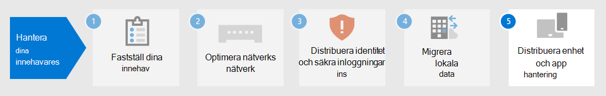

# Steg 4. Migrering av Microsoft 365 för företag-klientorganisation

De flesta företagsorganisationer har en heterogen miljö som omfattar flera versioner av operativsystem, klientprogramvara och serverprogramvara. Microsoft 365 för företag innehåller de säkraste versionerna av de viktigaste komponenterna i IT-infrastrukturen. Den innehåller även produktivitetsfunktioner som är utformade för att dra nytta av molntekniker.

Om du vill maximera affärsvärdet för Microsoft 365 för företag-integrerade produktpaket börjar du planera och implementera en strategi för att migrera dessa versioner:

| Från | Till |
|:-------|:-----|
| Windows 7 och Windows 8.1 | Windows 10 Enterprise |
| Office-klientprodukter installerade på användarens enheter |  Microsoft 365 Apps för företag |
| Office-serverprodukter installerade på lokala servrar | Motsvarande molnbaserade tjänster i Microsoft 365 |
|  |  |

## Migrera till Windows 10

Alla Microsoft 365 för företag-licenser innehåller en licens för Windows 10 Enterprise. Om du vill migrera dina enheter som kör Windows 7 eller Windows 8.1 kan du göra en uppgradering på plats. Supporten för Windows 7 *upphörde 14 januari 2020.* 

Fler metoder för installation av Windows 10 Enterprise utöver en på plats-uppgradering finns i windows [10-distributionsscenarier.](https://docs.microsoft.com/windows/deployment/windows-10-deployment-scenarios) Du kan också [planera för distribution av Windows 10](https://aka.ms/planforwin10deployment) på egen hand.

## Migrera till Microsoft 365-appar för företag

Microsoft 365 för företag innehåller Microsoft 365-appar för företag, en version av Office-klientprodukterna (Word, PowerPoint, Excel och Outlook) som installeras och uppdateras från Microsoft-molnet. Mer information finns i Om [Microsoft 365-appar för företag.](https://docs.microsoft.com/deployoffice/about-microsoft-365-apps)

I stället för att hålla datorerna aktuella för Office 2019 eller äldre versioner gör du följande:

1. Skaffa och tilldela en Microsoft 365-licens för dina användare.
2. Avinstallera Office 2013 eller Office 2016 på deras datorer.
3. Installera Microsoft 365-program för företag, antingen enskilt eller vid en IT-utrullning. Mer information finns i [distributionsguiden för Microsoft 365-program.](https://docs.microsoft.com/deployoffice/deployment-guide-microsoft-365-apps)

Microsoft 365 Apps för företag installerar både säkerhetsuppdateringar och nya funktionsuppdateringar automatiskt och kan dra nytta av molnbaserade tjänster i Microsoft 365 för bättre säkerhet och produktivitet.

## Migrera lokala servrar och data till Microsoft 365

Microsoft 365 for enterprise innehåller molnbaserade versioner av Office servertjänster som använder vissa av de verktyg som finns i lokala versioner av Office Server-programvara, till exempel webbläsare och Outlook-klienten. De här molnbaserade tjänsterna uppdateras automatiskt för säkerhet och nya funktioner. Efter migreringen kan IT-avdelningen spara den tid det tar att underhålla och uppdatera lokala servrar.

Använd följande resurser för information om hur du migrerar användare och data för specifika Microsoft 365-arbetsbelastningar:

- [Flytta postlådor från en lokal Exchange Server till Exchange Online](https://docs.microsoft.com/exchange/hybrid-deployment/move-mailboxes)
- [Migrera SharePoint-data från SharePoint Server till SharePoint Online](https://docs.microsoft.com/sharepointmigration/migrate-to-sharepoint-online)
- [Migrera Skype för företag – Online till Microsoft Teams](https://docs.microsoft.com/microsoftteams/migration-interop-guidance-for-teams-with-skype)

## En övergång för hela organisationen

För att få en bättre bild av hur du flyttar över hela organisationen till produkter och tjänster i Microsoft 365 för företag kan du ladda ned den här övergångsaffischen:

Med den här affischen på två sidor kan du snabbt inventera din befintliga infrastruktur. Använd den för att få vägledning för att flytta över till en produkt eller tjänst i Microsoft 365 för företag. Den visar Windows- och Office-produkter och andra infrastruktur- och säkerhetselement, till exempel enhetshantering, identitets- och hotskydd samt informationsskydd och efterlevnad.

## Resultat i steg 4

För migrering av Microsoft 365-klientorganisationen har du fastställt:

- Vilka enheter som kör Windows 7 eller Windows 8.1 och planerar att uppdatera dem till Windows 10 Enterprise.
- Vilka enheter som kör Office-klientapparna och planerar att uppdatera dem till Microsoft 365-program för företag.
- Vilka lokala Office-servertjänster ska migreras till sina Microsoft 365-motsvarigheter och planera för att migrera dem och deras data.

Här är ett exempel på en klientorganisation med slutförd migrering av lokala servrar.

I den här illustrationen har organisationen:

- Migrerade postlådorna lokalt Exchange Server till Exchange Online.
- Migrerade sina lokala SharePoint Server-webbplatser och data till SharePoint i Microsoft 365.

## Pågående underhåll för migrering

Du kan kontinuerligt behöva:

- Beroende på statusen för din Exchange-postlådemigrering fortsätter du övergången till Exchange Online till din organisation.
- Beroende på statusen för din lokala migrering av SharePoint-webbplats fortsätter du övergången till SharePoint i Microsoft 365 till din organisation.

## Nästa steg

Fortsätt med [enhet- och programhantering för](tenant-management-device-management.md) att distribuera enhet- och programhantering.
