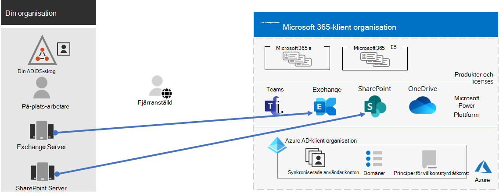

# Steg 4. Migrering för Microsoft 365 för företags innehavare

De flesta företags organisationer har en heterogen miljö som inkluderar flera versioner av operativ system, klient program vara och serverprogram vara. Microsoft 365 för Enterprise innehåller de säkraste versionerna av huvud komponenterna i din IT-infrastruktur. Det inkluderar också produktivitets funktioner som är avsedda att utnyttja moln teknologier.

Om du vill maximera företags värdet för Microsoft 365 för Enterprise-integrerad produkt serie kan du börja planera och implementera en strategi för att migrera dessa utgåvor:

| Från | Till |
|:-------|:-----|
| Windows 7 och Windows 8,1 | Windows 10 Enterprise |
| Office-klientprodukter installerade på din arbets tagares enheter |  Microsoft 365 Apps för företag |
| Office Server-produkter installerade på lokala servrar | Deras motsvarande molnbaserade tjänster i Microsoft 365 |
|  |  |

## Migrera till Windows 10

Alla Microsoft 365 för företags licenser inkluderar en licens för Windows 10 Enterprise. Om du vill migrera dina enheter som kör Windows 7 eller Windows 8,1 kan du göra en uppgradering på plats. Support upphörde för Windows 7 den *14 januari 2020*. 

Ytterligare metoder för att installera Windows 10 Enterprise efter en uppgradering på plats finns i [Windows 10: distributions scenarier](https://docs.microsoft.com/windows/deployment/windows-10-deployment-scenarios). Du kan också [planera för distribution av Windows 10](https://aka.ms/planforwin10deployment) på egen hand.

## Migrera till Microsoft 365-appar för företag

Microsoft 365 för Enterprise innehåller Microsoft 365-appar för företag, en version av Office-klientprodukter (Word, PowerPoint, Excel och Outlook) som installeras och uppdateras från Microsoft Cloud. Mer information finns i [om Microsoft 365-appar för företag](https://docs.microsoft.com/deployoffice/about-microsoft-365-apps).

I stället för att hålla datorerna aktuella för Office 2019 eller äldre versioner gör du så här:

1. Skaffa och tilldela en Microsoft 365-licens för dina användare.
2. Avinstallera Office 2013 eller Office 2016 på sina datorer.
3. Installera Microsoft 365-appar för företag, antingen individuellt eller under en IT-installation. Mer information finns i [distributions guide för Microsoft 365-appar](https://docs.microsoft.com/deployoffice/deployment-guide-microsoft-365-apps).

Microsoft 365-appar för Enterprise installerar både säkerhets uppdateringar och nya funktioner uppdateringar automatiskt och kan utnyttja molnbaserade tjänster i Microsoft 365 för ökad säkerhet och produktivitet.

## Migrera lokala servrar och data till Microsoft 365

Microsoft 365 för Enterprise innehåller molnbaserade versioner av Office Server-tjänster som använder vissa av de verktyg som lokala versioner av Office Server-program, till exempel webbläsare och Outlook-klienten. Dessa molnbaserade tjänster uppdateras automatiskt för säkerhets-och nya funktioner. Efter migrering kan din IT-avdelning Spara den tid det tar att underhålla och uppdatera lokala servrar.

Använd följande resurser för information om hur du migrerar användare och data för specifika Microsoft 365-arbets belastningar:

- [Flytta post lådor från lokal Exchange-Server till Exchange Online](https://docs.microsoft.com/exchange/hybrid-deployment/move-mailboxes)
- [Migrera SharePoint-data från SharePoint Server till SharePoint Online](https://docs.microsoft.com/sharepointmigration/migrate-to-sharepoint-online)
- [Migrera Skype för företag – Online till Microsoft Teams](https://docs.microsoft.com/microsoftteams/migration-interop-guidance-for-teams-with-skype)

## En övergång för hela organisationen

För att få en bättre bild av hur du flyttar hela organisationen till produkterna och tjänsterna i Microsoft 365 för företag kan du hämta denna över gångs affisch:

Med den här affischen på två sidor kan du snabbt inventera din befintliga infrastruktur. Använd den för att få vägledning för att flytta till en produkt eller tjänst i Microsoft 365 för företag. Det visar Windows-och Office-produkter och andra infrastruktur-och säkerhets element som enhets hantering, identitets-och hot skydd samt informations skydd och efterlevnad.

## Resultat i steg 4

Om du vill migrera din Microsoft 365-klient kan du bestämma:

- Vilka enheter som kör Windows 7 eller Windows 8,1 och abonnemanget för att uppdatera dem till Windows 10 Enterprise.
- Vilka enheter som kör Office-klientprogram och abonnemanget för att uppdatera dem till Microsoft 365-appar för företag.
- Vilka lokala Office Server-tjänster som bör migreras till deras Microsoft 365-motsvarighet och för att migrera dem och deras data.

Här är ett exempel på en klient organisation med en slutförd migrering av lokala servrar.

I den här bilden har organisationen:

- Migrerade sina lokala Exchange Server-postlådor till Exchange Online.
- Migrerade dess lokala SharePoint Server-webbplatser och data till SharePoint i Microsoft 365.

## Löpande underhåll för migrering

Kontinuerligt måste du kanske:

- Beroende på tillståndet för din Exchange-postmigrering fortsätter du att rulla över gången till Exchange Online till din organisation.
- Beroende på tillståndet för den lokala SharePoint-webbplatsens migrering fortsätter du att rulla över gången till SharePoint i Microsoft 365 till din organisation.

## Nästa steg

Fortsätt med [enhet och program hantering](tenant-management-device-management.md) för att distribuera enheter och program hantering.
