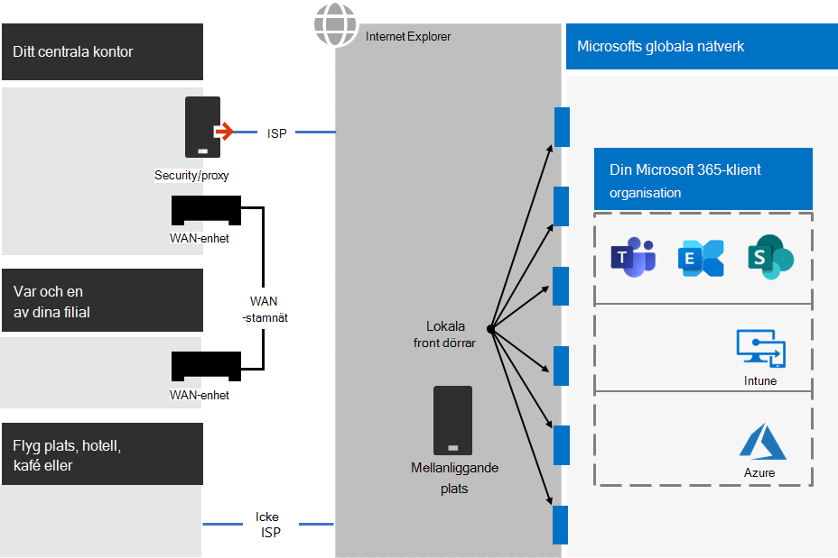
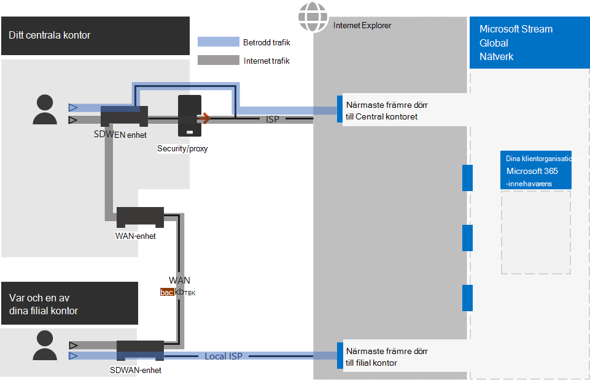
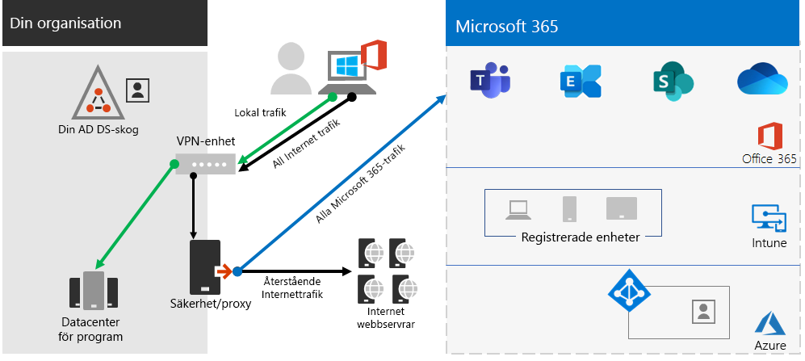
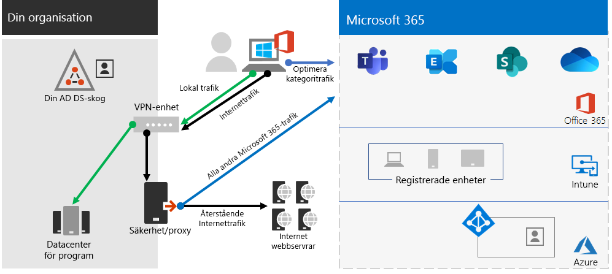
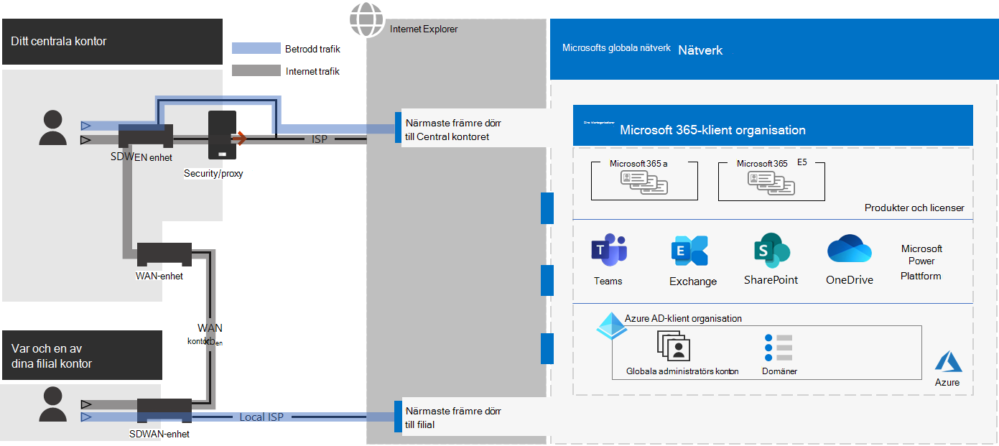
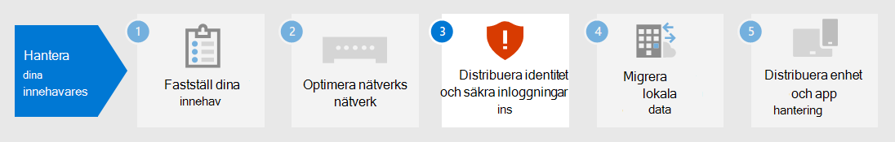

# Steg 2.Step 2. Optimalt nätverk för Microsoft 365 för företags klienterOptimal networking for your Microsoft 365 for enterprise tenants

Microsoft 365 för Enterprise inkluderar moln produktivitets program som team och Exchange Online och Microsoft Intune tillsammans med många identitets-och säkerhets tjänster i Microsoft Azure.Microsoft 365 for enterprise includes cloud productivity apps such as Teams and Exchange Online, and Microsoft Intune, along with many identity and security services of Microsoft Azure. Alla de här molnbaserade tjänsterna är beroende av säkerheten, prestandan och tillförlitligheten hos anslutningar från klient enheter i det lokala nätverket eller någon annan plats på Internet.All of these cloud-based services rely on the security, performance, and reliability of connections from client devices on your on-premises network or any location on the Internet. 

För att optimera nätverks åtkomst för din klient organisation måste du:To optimize network access for your tenant, you need to:

- Optimera vägen mellan lokala användare och den närmaste platsen till Microsofts globala nätverk.Optimize the path between your on-premises users and the closest location to the Microsoft Global Network.
- Optimera åtkomst till det globala Microsoft-nätverket för fjärran vändare som använder en VPN-lösning för fjärråtkomst.Optimize access to the Microsoft Global Network for your remote users that are using a remote access VPN solution.
- Använd Nätverks insikter för att utforma nätverks omkretsen för dina Office-platser.Use Network Insights to design the network perimeter for your office locations.
- Optimera åtkomsten till vissa till gångar som hanteras på SharePoint-webbplatser med Office 365 CDN.Optimize access to specific assets hosted on SharePoint sites with the Office 365 CDN.
- Konfigurera enheter för proxy och nätverks Edge för att förbigå behandling för betrodd trafik med Microsoft 365 med slut punkter och automatisk uppdatering av listan.Configure proxy and network edge devices to bypass processing for Microsoft 365 trusted traffic with the list of endpoints and automate the updating of the list as changes are made.

## Företags lokala arbetareEnterprise on-premises workers

För företags nätverk bör du optimera slutanvändarens upplevelse genom att aktivera nätverks åtkomst med högsta prestanda mellan klienter och de närmaste Microsoft 365-slutpunkterna.For enterprise networks, you should optimize the end user experience by enabling the highest-performing network access between clients and the closest Microsoft 365 endpoints. Slutanvändarens kvalitet är direkt relaterad till prestanda och svars tid för det program som användaren använder.The quality of end user experience is directly related to the performance and responsiveness of the application that the user is using. Till exempel är Microsoft Teams beroende av liten latens för att användarna ska kunna ringa samtal, konferenser och samarbeten med samarbete.For example, Microsoft Teams relies on low latency so that user phone calls, conferences and shared screen collaborations are glitch-free.

Det primära målet i nätverks utformningen bör vara att minimera fördröjningen genom att minska tiden för cirkulering från klient enheter till Microsoft globalt nätverk, Microsofts offentliga nätverks stamnät som sammankopplar alla Microsofts Data Center med låga svars tider, till exempel start punkter för högtillgänglig moln program, som kallas front dörrar, över hela världen.The primary goal in the network design should be to minimize latency by reducing the round-trip time (RTT) from client devices to the Microsoft Global Network, Microsoft's public network backbone that interconnects all of Microsoft's datacenters with low latency, high availability cloud application entry points, known as front doors, spread around the world.

Här är ett exempel på ett traditionellt företags nätverk.Here is an example of a traditional enterprise network.

I den här bilden ansluter filial kontor till ett centralt kontor via WAN-enheter och ett WAN-stamnät.In this illustration, branch offices connect to a central office through wide area network (WAN) devices and a WAN backbone. Internet åtkomst är via en säkerhets-eller proxyserver på nätverks kontoret och en Internet leverantör.Internet access is through a security or proxy device at the network edge of the central office and an Internet service provider (ISP). På Internet har Microsofts globala nätverk en serie front dörrar i regioner runt om i världen.On the Internet, the Microsoft Global Network has a series of front doors in regions around the world. Organisationer kan även använda mellanliggande platser för ytterligare paket bearbetning och säkerhet för trafik.Organizations can also use intermediate locations for additional packet processing and security for traffic. En organisations Microsoft 365-innehavare finns i Microsofts globala nätverk.An organization's Microsoft 365 tenant is located within the Microsoft Global Network.

Problem med den här konfigurationen för Microsoft 365-moln tjänster är:The problems with this configuration for Microsoft 365 cloud services are:

- För användare i filial kontor skickas trafiken till icke-lokala front dörrar, ökande svars tid.For users in branch offices, traffic gets sent to non-local front doors, increasing latency.
- Att skicka trafik till mellanliggande platser skapar nätverks-hairpins som utför dubbel paket bearbetning på betrodd trafik, ökande svars tid.Sending traffic to intermediate locations create network hairpins that perform duplicate packet processing on trusted traffic, increasing latency.
- Nätverks kant enheter utför onödiga och dubbla paket bearbetningar på betrodd trafik, ökande svars tid.Network edge devices perform unneeded and duplicate packet processing on trusted traffic, increasing latency.

Optimering av nätverks prestanda för Microsoft 365 behöver inte vara komplicerad.Optimizing Microsoft 365 network performance doesn't need to be complicated. Du får bästa möjliga prestanda genom att följa några viktiga principer:You can get the best possible performance by following a few key principles:

- Identifiera Microsoft 365 nätverks trafik, som är betrodd trafik till Microsofts moln tjänster.Identify Microsoft 365 network traffic, which is trusted traffic destined to Microsoft cloud services.
- Tillåt lokal branchning från Microsoft 365-nätverks trafik till Internet från varje plats där användarna ansluter till Microsoft 365.Allow local branch egress of Microsoft 365 network traffic to the internet from each location where users connect to Microsoft 365.
- Undvik nätverks hairpins.Avoid network hairpins.
- Tillåt att Microsoft 365-trafik kringgår enheter för att kontrol lera proxyservrar och paket.Allow Microsoft 365 traffic to bypass proxies and packet inspection devices.

Om du verkställer dessa principer får du ett företags nätverk optimerat för Microsoft 365.If you implement these principles, you get an enterprise network optimized for Microsoft 365.

I den här bilden har avdelnings kontor sin egen Internet anslutning via en programdefinierad WAN-enhet (SDWAN) som skickar betrodd Microsoft 365-trafik till den regionala närmaste främre dörren.In this illustration, branch offices have their own Internet connection through a software-defined WAN device (SDWAN) device, which sends trusted Microsoft 365 traffic to the regionally closest front door. På Central kontoret gäller inte tillförlitlig Microsoft 365-trafik säkerhets-eller proxyservern och mellanliggande enheter används inte längre.At the central office, trusted Microsoft 365 traffic bypasses the security or proxy device and intermediate devices are no longer used.

Så här löses en optimerad konfiguration för ett traditionellt företags nätverk:Here's are how the optimized configuration solves the latency issues of a traditional enterprise network:

- Den betrodda Microsoft 365-trafiken hoppar över WAN-stamnätet och skickas till lokala front dörrar för alla kontor, under tiden för minskad svars tid.Trusted Microsoft 365 traffic skips the WAN backbone and is sent to local front doors for all offices, decreasing latency.
- Nätverks hairpins som utför dubbel paket bearbetning hoppas över för betrodd trafik i Microsoft 365, och minskar svars tiden.Network hairpins that perform duplicate packet processing are skipped for Microsoft 365 trusted traffic, decreasing latency.
- Nätverks kant enheter som kräver onödiga och dubbel paket bearbetning hoppas över för Microsoft 365-betrodd trafik, vilket minskar svars tiden.Network edge devices that perform unneeded and duplicate packet processing are skipped for Microsoft 365 trusted traffic, decreasing latency.

Mer information finns i [Översikt över Microsoft 365-nätverk](../enterprise/microsoft-365-networking-overview.md).For more information, see [Microsoft 365 network connectivity overview](../enterprise/microsoft-365-networking-overview.md).

## DistansarbetareRemote workers

Om din distansarbetare använder en traditionell VPN-klient för att få fjärråtkomst till organisationens nätverk ska du kontrollera att VPN-klienten har stöd för delad tunnel.If your remote workers are using a traditional VPN client to obtain remote access to your organization network, verify that the VPN client has split tunneling support. Utan delad tunnel skickas all din fjärrtrafik över VPN-anslutningen, där den måste vidarebefordras till organisationens gränsenheter, bli processad och sedan skickas via Internet.Without split tunneling, all of your remote work traffic gets sent across the VPN connection, where it must be forwarded to your organization’s edge devices, get processed, and then sent on the Internet. Här är ett exempel.Here is an example.

I den här bilden måste Microsoft 365-trafik ta en indirekt väg genom organisationen, som kan vidarekopplas till en Microsoft Global Network-frontend-enhet långt bort från VPN-klientens fysiska plats.In this illustration, Microsoft 365 traffic must take an indirect route through your organization, which could be forwarded to a Microsoft Global Network front door far away from the VPN client’s physical location. Denna indirekta väg lägger till en fördröjning för nätverkstrafiken och minskar prestandan.This indirect path adds latency to the network traffic and decreases overall performance. 

Med delad tunnel kan du konfigurera VPN-klienten så att den exkluderar vissa typer av trafik som inte skickas via VPN-anslutningen till organisationens nätverk.With split tunneling, you can configure your VPN client to exclude specific types of traffic from being sent over the VPN connection to the organization network.

Om du vill optimera åtkomst till Microsoft 365 molnresurser konfigurerar du VPN-klienter för uppdelad tunnel för att undanta trafik till **optimera** kategori Microsoft 365-slutpunkter över VPN-anslutningen.To optimize access to Microsoft 365 cloud resources, configure your split tunneling VPN clients to exclude traffic to the **Optimize** category Microsoft 365 endpoints over the VPN connection. Mer information finns i avsnitten [Office 365-slutpunkter](../enterprise/microsoft-365-network-connectivity-principles.md#new-office-365-endpoint-categories) och [listorna](../enterprise/microsoft-365-vpn-implement-split-tunnel.md#implement-vpn-split-tunneling) över optimering av kategori slut punkter för delad tunnel.For more information, see [Office 365 endpoint categories](../enterprise/microsoft-365-network-connectivity-principles.md#new-office-365-endpoint-categories) and [the lists](../enterprise/microsoft-365-vpn-implement-split-tunnel.md#implement-vpn-split-tunneling) of Optimize category endpoints for split tunneling.

Här är det resulterande trafikflödet för delade tunnlar, i vilka de flesta trafik till Microsoft 365-molnappar kringgår VPN-anslutningen.Here is the resulting traffic flow for split tunneling, in which most of the traffic to Microsoft 365 cloud apps bypass the VPN connection.

I den här bilden skickar VPN-klienten och får viktig tjänst trafik för Microsoft 365-molnet direkt över Internet och till närmaste främre dörr i Microsofts globala nätverk.In this illustration, the VPN client sends and receives crucial Microsoft 365 cloud service traffic directly over the Internet and to the nearest front door into the Microsoft Global Network.

Detaljerad information finn i [Optimera Office 365-anslutning för fjärranvändare med delad VPN-tunnel](../enterprise/microsoft-365-vpn-split-tunnel.md).For more information and guidance, see [Optimize Office 365 connectivity for remote users using VPN split tunneling](../enterprise/microsoft-365-vpn-split-tunnel.md).

## Använda nätverks insikter (för hands version)Using Network Insights (preview)

Nätverks insikter är prestanda värden som samlas från din Microsoft 365-klient organisation som hjälper dig att utforma nätverks gränser för dina Office-platser.Network insights are performance metrics collected from your Microsoft 365 tenant that help you design network perimeters for your office locations. Varje Insight innehåller information om prestanda i ett angivet problem för varje geografisk plats där lokala användare kommer åt din klient organisation.Each insight provides live details about the performance characteristics for a specified issue for each geographic location where on-premises users are accessing your tenant.

Det finns två nätverks insikter för klient organisations nivå som kan visas för klient organisationen:There are two tenant level network insights that may be shown for the tenant:

- [Exchange-sampel som påverkas av anslutnings problemExchange sampled connections impacted by connectivity issues](../enterprise/office-365-network-mac-perf-insights.md#exchange-sampled-connections-impacted-by-connectivity-issues)
- [SharePoint-sampel som påverkas av anslutnings problemSharePoint sampled connections impacted by connectivity issues](../enterprise/office-365-network-mac-perf-insights.md#sharepoint-sampled-connections-impacted-by-connectivity-issues)

Det här är särskilda nätverks insikter för varje Office-plats:These are the specific network insights for each office location:

- [Utgående nätverks utgångarBackhauled network egress](../enterprise/office-365-network-mac-perf-insights.md#backhauled-network-egress)
- [Bättre prestanda upptäckt för kunder nära digBetter performance detected for customers near you](../enterprise/office-365-network-mac-perf-insights.md#better-performance-detected-for-customers-near-you)
- [Användning av en icke optimal Exchange Online-onlinetjänstUse of a non-optimal Exchange Online service front door](../enterprise/office-365-network-mac-perf-insights.md#use-of-a-non-optimal-exchange-online-service-front-door)
- [Användning av en icke-optimal SharePoint Online-onlinetjänstUse of a non-optimal SharePoint Online service front door](../enterprise/office-365-network-mac-perf-insights.md#use-of-a-non-optimal-sharepoint-online-service-front-door)
- [Liten nedladdnings hastighet från SharePoint-startdörrenLow download speed from SharePoint front door](../enterprise/office-365-network-mac-perf-insights.md#low-download-speed-from-sharepoint-front-door)
- [Kina-användarens optimala nätverks utgångChina user optimal network egress](../enterprise/office-365-network-mac-perf-insights.md#china-user-optimal-network-egress)

>[!IMPORTANT]
>Nätverks insikter, prestanda rekommendationer och utvärderingar i administrations centret för Microsoft 365 visas för närvarande.Network insights, performance recommendations and assessments in the Microsoft 365 Admin Center is currently in preview status. Det är endast tillgängligt för Microsoft 365-klient organisationer som har registrerats i funktionen för förhands granskning.It is only available for Microsoft 365 tenants that have been enrolled in the feature preview program.

Mer information finns i [Microsoft 365 nätverks insikter](../enterprise/office-365-network-mac-perf-insights.md).For more information, see [Microsoft 365 Network Insights](../enterprise/office-365-network-mac-perf-insights.md).

## SharePoint-prestanda med Office 365 CDNSharePoint performance with the Office 365 CDN

Med ett molnbaserade innehålls leverans nätverk (CDN) kan du minska inläsnings tid, spara bandbredd och snabba svar.A cloud-based Content Delivery Network (CDN) allows you to reduce load times, save bandwidth, and speed responsiveness. En CDN förbättrar prestandan genom att cachelagra statiska till gångar, till exempel grafik-eller videofiler, i webbläsare som begär dem, vilket gör det enklare att ladda ner nedladdningar och minska svars tiden.A CDN improves performance by caching static assets such as graphic or video files closer to the browsers requesting them, which helps to speed up downloads and reduce latency. Du kan använda det inbyggda Office 365 Content Delivery Network (CDN), som ingår i SharePoint i Microsoft 365 E3 och E5, för att hantera statiska till gångar för bättre prestanda för SharePoint-sidorna.You can use the built-in Office 365 Content Delivery Network (CDN), included with SharePoint in Microsoft 365 E3 and E5, to host static assets to provide better performance for your SharePoint pages.

Office 365 CDN består av flera CDN som låter dig hantera fasta till gångar på flera platser, eller _ursprung_, och betjäna dem från globala nätverk med snabb hastighet.The Office 365 CDN is composed of multiple CDNs that allow you to host static assets in multiple locations, or _origins_, and serve them from global high-speed networks. Beroende på vilken typ av innehåll du vill ha i Office 365 CDN kan du lägga till **offentliga** ursprung, **privata** ursprung eller både och.Depending on the kind of content you want to host in the Office 365 CDN, you can add **public** origins, **private** origins, or both.

När du distribuerat och konfigurerat laddar Office 365 CDN upp till gångar från offentliga och privata ursprung och gör dem tillgängliga för snabb åtkomst till användare som finns på Internet.When deployed and configured, the Office 365 CDN uploads assets from public and private origins and makes them available for fast access to users located across the Internet.

Mer information finns i [använda Office 365 CDN med SharePoint Online](../enterprise/use-microsoft-365-cdn-with-spo.md).For more information, see [Use the Office 365 CDN with SharePoint Online](../enterprise/use-microsoft-365-cdn-with-spo.md).

## Automatisk slut punkts listningAutomated endpoint listing

Om du vill att dina lokala klienter, kant enheter och molnbaserade paket analys tjänster ska hoppa över bearbetning av betrodd Microsoft 365-trafik måste du konfigurera dem med slut punkter (IP-adressintervall och DNS-namn) som motsvarar Microsoft 365-tjänsterna.To have your on-premises clients, edge devices, and cloud-based packet analysis services skip processing of trusted Microsoft 365 traffic, you must configure them with the set of endpoints (IP address ranges and DNS names) corresponding to Microsoft 365 services. Dessa slut punkter kan konfigureras manuellt i brand väggar och andra Edge-säkerhetsenheter, PAC-filer för klient datorer för att kringgå proxyservrar eller SD-WAN-enheter hos filialer.These endpoints can be manually configured in firewalls and other edge security devices, PAC files for client computers to bypass proxies, or SD-WAN devices at branch offices. Slut punkterna ändras emellertid med tiden och kräver kontinuerligt manuellt underhåll av slut punkts listorna på dessa platser.However, the endpoints change over time, requiring ongoing manual maintenance of the endpoint lists in these locations.

Om du vill automatisera visningen av list-och ändrings hantering för Microsoft 365-slutpunkter i klientens PAC-filer och nätverks enheter kan du använda [Office 365 IP-adress och övrig URL-baserad webb tjänst](../enterprise/microsoft-365-ip-web-service.md).To automate the listing and change management for Microsoft 365 endpoints in your client PAC files and network devices, use the [Office 365 IP Address and URL REST-based web service](../enterprise/microsoft-365-ip-web-service.md). Denna tjänst hjälper dig att bättre identifiera och skilja på Microsoft 365-nätverks trafik, vilket gör det lättare för dig att utvärdera, konfigurera och hålla sig uppdaterad med de senaste ändringarna.This service helps you better identify and differentiate Microsoft 365 network traffic, making it easier for you to evaluate, configure, and stay current with the latest changes.

Du kan använda PowerShell, python eller andra språk för att ta reda på ändringar av slut punkter över tiden och konfigurera dina PAC-filer och nätverks enheter för Edge.You can use PowerShell, Python, or other languages to determine the changes to endpoints over time and configure your PAC files and edge network devices.

Den grundläggande processen är:The basic process is:

1. Använd Office 365 IP Address and URL web service och konfigurations mekanismen för att konfigurera dina PAC-filer och nätverks enheter med den aktuella uppsättningen av Microsoft 365-slutpunkter.Use the Office 365 IP Address and URL web service and the configuration mechanism of your choice to configure your PAC files and network devices with the current set of Microsoft 365 endpoints.
2. Kör en daglig återkommande för att kontrol lera ändringar av slut punkterna eller Använd en meddelande metod.Run a daily recurring to check for changes in the endpoints or use a notification method.
3. När ändringar identifieras kan du återskapa och distribuera PAC-filen för klient datorer och göra ändringarna på dina nätverks enheter.When changes are detected, regenerate and redistribute the PAC file for client computers and make the changes to your network devices.

Mer information finns i [Office 365 IP Address and URL Web Service](../enterprise/microsoft-365-ip-web-service.md).For more information, see [Office 365 IP Address and URL web service](../enterprise/microsoft-365-ip-web-service.md).

## Resultat av steg 2Results of Step 2

För din Microsoft 365-klient med optimalt nätverk har du bestämt:For your Microsoft 365 tenant with optimal networking, you have determined:

- Hur du optimerar nätverks prestanda för lokala användare genom att lägga till Internet anslutningar till alla filial kontor och eliminera nätverks hairpins.How to optimize network performance for on-premises users by adding Internet connections to all branch offices and eliminating network hairpins.
- Implementera automatisk lista över betrodda slut punkter för klientbaserade PAC-filer och nätverks enheter och-tjänster, inklusive pågående uppdateringar (mest passande för företags nätverk).How to implement automated trusted endpoint listing for your client-based PAC files and your network devices and services, including ongoing updates (most suitable for enterprise networks).
- Så här kan du få åtkomst till fjärranslutna kollegor till lokala resurser.How to support the access of remote workers to on-premises resources.
- Använda nätverks insikterHow to use Network Insights
- Så här distribuerar du Office 365 CDN.How to deploy the Office 365 CDN.

Här är ett exempel på en företags organisation och dess innehavare med optimala nätverksfunktioner.Here is an example of an enterprise organization and its tenant with optimal networking.

[Visa en större version av bildenSee a larger version of this image](https://github.com/MicrosoftDocs/microsoft-365-docs/raw/public/microsoft-365/media/tenant-management-overview/tenant-management-tenant-build-step2.png)

I den här bilden har innehavaren för företags organisationen:In this illustration, the tenant for this enterprise organization has:

- Lokal Internet åtkomst för varje filial kontor med en SDWAN-enhet som vidarebefordrar betrodd Microsoft 365-trafik till en lokal front dörr.Local internet access for each branch office with an SDWAN device that forwards trusted Microsoft 365 traffic to a local front door.
- Inga nätverks hairpins.No network hairpins.
- Centrala Office-säkerhetsfunktioner och-nätenheter som vidarebefordrar Microsoft 365-tillförlitliga trafik till en lokal front dörr.Central office security and proxy edge devices that forward Microsoft 365 trusted traffic to a local front door.

## Kontinuerligt underhåll för optimala nätverkOngoing maintenance for optimal networking

Kontinuerligt måste du kanske:On an ongoing basis, you might need to:

- Uppdatera dina gräns enheter och distribuerade PAC-filer för ändringar i slut punkter eller kontrol lera att din automatiserade process fungerar korrekt.Update your edge devices and deployed PAC files for changes in endpoints or verify that your automated process works properly.
- Hantera dina till gångar i Office 365 CDN.Manage your assets in the Office 365 CDN.
- Uppdatera delnings konfigurationen för delade tunnlar på dina VPN-klienter för ändringar i slut punkter.Update the split tunneling configuration in your VPN clients for changes in endpoints.

## Nästa stegNext step

Fortsätt med [identiteten](tenant-management-identity.md) för att synkronisera dina lokala konton och grupper och påtvinga säkra användar inloggningar.Continue with [identity](tenant-management-identity.md) to synchronize your on-premises accounts and groups and enforce secure user sign-ins.
