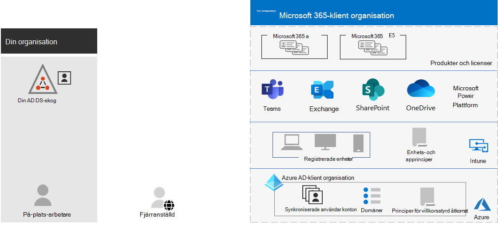
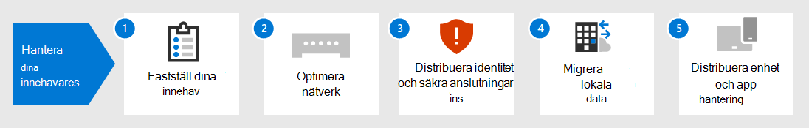

# Innehavaradministration för Microsoft 365 för företag

Att skapa en sökväg till organisationens digitala transformering med moln användning kräver en fast grund som dina arbetare kan använda för produktivitet, samarbete, prestanda, integritet, efterlevnad och säkerhet.

Korrekt konfigurering av dina Microsoft 365-klient organisationer tillhandahåller den grunden, så att dina arbetare kan fokuseras på att få sitt arbete gjort och IT-avdelningen att fokusera på heltäckande lösningar som ger ytterligare ett företags värde. 

Den här lösningen tar dig genom konfigureringen av den grunden i de här stegen:

1. Fastställ klient organisationer
2. Optimera nätverket
3. Synkronisera dina identiteter och påtvinga säkra inloggningar
4. Migrera Windows-enheter, Office-klienter och lokala Office-servrar och-data
5. Distribuera enhets-och program hantering

Låt oss först ta reda på vad en klient organisation är och vad en klient organisation som tillhandahåller en fast grund ser ut.

## En Microsoft 365-klient organisation definierad

En Microsoft 365-klient organisation är en dedikerad instans av tjänsterna i Microsoft 365 och organisations data som lagras på en specifik standard plats, till exempel Europa och Nord Amerika. Denna plats anges när du skapar innehavaren för organisationen. Varje Microsoft 365-klient organisation är distinkt, unikt och åtskilt från alla andra Microsoft 365-klient organisationer. Du kan skapa en Microsoft 365-klient organisation när du köper en eller flera produkter från Microsoft, till exempel Microsoft 365 E3 eller E5, och en uppsättning licenser för var och en.

Din Microsoft 365-klient organisation inkluderar också en Azure Active Directory (Azure AD)-klient organisation, som är en dedikerad instans av Azure AD för användar konton, grupper och andra objekt. Varje Azure AD-klient är distinkt, unikt och åtskilt från alla andra Azure AD-klient organisationer. Även om din organisation kan ha flera Azure AD-klient organisationer som du kan konfigurera med Azure-prenumerationer, kan Microsoft 365-klient organisationer bara använda en enda Azure AD-klient organisation, den som skapades när du skapade klient organisationen. 

Här är ett exempel:

*Innehavaradministration* är planering, distribution och pågående användning av Microsoft 365-klient organisationer. 

## Attribut för en väl utformad och verksam klient organisation

Utöver rätt namn och plats för klient organisationen finns det ytterligare element för att planera, distribuera och hantera för att säkerställa att dina användar upplevelser med moln produktivitets program &mdash; , till exempel Microsoft Teams och Exchange Online &mdash; , är effektiva, säkra och utförda.

Här är de här elementen:

- Du har rätt uppsättning produkter (abonnemang) och licenser.
  - Produkt uppsättningen stämmer överens med dina behov.
  - Det finns ett tillräckligt antal licenser för dina anställda och förväntade förändringar av personal.
- För nätverk:
  - Du har konfigurerat rätt DNS-domännamn.
  - För företags nätverk har du optimerat nätverks trafiken till Microsofts nätverk för arbets tagare på plats.
  - Du har optimerat nätverks trafiken för fjärranställda som använder en VPN-klient.
- Du har synkroniserat dina AD DS-konton (Active Directory Domain Services), grupper och andra objekt.
  - Dina Azure AD-användarkonton mappas till Exchange Online-postlådor med rätt DNS-domäner för e-postadresser.
  - Dina användar konton har tilldelats korrekta licenser från rätt inköpta produkter (till exempel Microsoft 365 E3 eller E5).
- Du har konfigurerat en stark identitets-och åtkomst hantering.
  - Du kräver säker inloggning med lösen ords skydd eller multifaktorautentisering (MFA).
  - Du har principer för villkorsstyrd åtkomst som kräver inloggnings krav och begränsningar för högre säkerhets nivåer.
- Lokala Office-servrar och deras data har migrerats till moln program eller används i en hybrid konfiguration.
- Du sköter enhets hanteringen med Intune eller grundläggande mobilitet och säkerhet som är inbyggd i Microsoft 365.
  - Dina företagsägda enheter är registrerade och hanteras.
  - Apparna för personliga enheter hanteras.

Här är ett exempel på en Microsoft 365-klient organisation där alla dessa element finns på plats.

I den här bilden inkluderar Microsoft 365-klient organisationen:

- Produkter och licenser för Microsoft 365 E3 och E5.
- Microsoft 365 Productivity-appar.
- Intune med registrerade enheter och enhets-och användnings principer.
- En Azure AD-klient som har synkroniserat användar konto (grupper och andra katalog objekt visas inte), domäner och villkorsstyrda åtkomst principer.

## Klient möjligheter för Microsoft 365 för företag

I följande avsnitt och tabell listas viktiga funktioner och licensiering för stegen i den här lösningen.

### Klientorganisation

| Resurs eller funktion | Beskrivning | Licensiering |
|:-------|:-----|:-------|
| Flera klientorganisationer | Varje Microsoft 365-klient organisation är distinkt, unikt och åtskilt från alla andra Microsoft 365-klient organisationer. Med flera klient organisationer finns det restriktioner och andra överväganden när de hanterar dem och tillhandahåller tjänster till användarna. | Microsoft 365 E3 eller E5 | 
| Migrering av postlådor mellan klientorganisationer | Klient organisationer kan flytta post lådor mellan innehavare med minsta möjliga infrastruktur beroenden i sina lokala system. Detta tar bort behovet av andra och andra-postlådor. | Microsoft 365 E3 eller E5 | 
| Multi-geo | Din klient organisation kan lagra data på andra platser i Data Center som du valt att uppfylla data de kraven. | Microsoft 365 E3 eller E5 | 
| Flytta grundläggande data till ett nytt Data Center geo | När Microsoft lägger till nya data Center-geos för ytterligare kapacitet och beräknings resurser kan du begära ett Data Center geo-flytt för in-Geo data de för dina grundläggande kund uppgifter. | Microsoft 365 E3 eller E5 | 
||||

### Nätverk

| Resurs eller funktion | Beskrivning | Licensiering |
|:-------|:-----|:-------|
| Nätverks insikter | Nätverks prestanda mått som samlas in från din Microsoft 365-klient organisation som hjälper dig att utforma nätverks gränser för dina Office-platser. | Microsoft 365 E3 eller E5 | 
| Automatisera slut punkts uppdateringar | Automatisera konfigurations-och pågående uppdateringar för Microsoft 365-slutpunkter i klientens PAC-filer och nätverks enheter och-tjänster. | Microsoft 365 E3 eller E5 | 
||||

### Identitet

| Resurs eller funktion | Beskrivning | Licensiering |
|:-------|:-----|:-------|
| Synkronisera lokala Active Directory Domain Services-tjänster med din Azure AD-klient organisation    | Använd din lokala identitetsprovider för användar konton, grupper och andra objekt. | Microsoft 365 E3 eller E5 |
| MFA som förstärks med säkerhetsstandarder   | Skydda er mot identitetsstölder och komprometterade enheter genom att kräva en andra form av autentisering vid inloggning. Säkerhetsstandarderna kräver MFA för alla användarkonton.   | Microsoft 365 E3 eller E5 |
| MFA som förstärks med villkorsstyrd åtkomst| Kräv MFA baserat på attributen för inloggningen med principer för villkorlig åtkomst.    | Microsoft 365 E3 eller E5 | 
| MFA som förstärks med riskbaserad villkorsstyrd åtkomst   | Använd Microsoft Defender for Identity för att kräva MFA baserat på risken som är kopplad till användarens inloggning. | Microsoft 365 E5 eller E3 med Azure AD Premium P2-licenser | 
| Självbetjäning för återställning av lösenord (SSPR)    | Låt användarna återställa eller låsa upp sina lösenord och konton.  | Microsoft 365 E3 eller E5 |
||||

### Migrering

| Resurs eller funktion | Beskrivning | Licensiering |
|:-------|:-----|:-------|
| Migrera till Windows 10 | Migrera dina enheter som kör Windows 7 eller Windows 8,1 till Windows 10 Enterprise. | Windows 10 Enterprise-licenser ingår i Microsoft 365 E3 eller E5 | 
| Migrera till Microsoft 365-appar för företag | Migrera dina Office-klientprogram, till exempel Word och PowerPoint, till de versioner som är installerade från molnet och som har uppdaterats med nya funktioner. | Microsoft 365 E3 eller E5 | 
| Migrera lokala servrar och data till Microsoft 365 | Migrera dina Exchange-postlådor, SharePoint-webbplatser och Skype för företag – Online till Microsoft 365-moln tjänster. | Microsoft 365 E3 eller E5 | 
||||

### Hantera enheter och appar

| Resurs eller funktion | Beskrivning | Licensiering |
|:-------|:-----|:-------|
| Microsoft Intune | En molnbaserad tjänst som tillhandahåller hantering av mobila enheter (MDM) och mobil program hantering (MAM) för att styra hur organisationens program och enheter används, inklusive mobil telefoner, surfplattor och bärbara datorer. | Microsoft 365 E3 eller E5 | 
| Grundläggande Mobility and Security | Skydda och hantera användarnas mobila enheter som iPhone, iPad, Android och Windows-telefoner med den här inbyggda tjänsten.  | Microsoft 365 E3 eller E5 | 
||||

## Nästa steg

Följ de här stegen för att konfigurera och hantera Microsoft 365-klient organisationer.

1. [Fastställ klient organisationer](tenant-management-tenants.md)
2. [Optimera nätverket](tenant-management-networking.md)
3. [Synkronisera dina identiteter och påtvinga säkra inloggningar](tenant-management-identity.md)
4. [Migrera dina lokala Office-servrar och-data](tenant-management-migration.md)
5. [Distribuera enhets-och program hantering](tenant-management-device-management.md)

Varje steg beskriver distributions alternativ, sammanfattar resultaten samt pågående underhålls uppgifter.

För att förstå hur en fiktiv men representativ organisation med flera nationella funktioner distribuerade elementen i Microsoft 365-klient organisationen, se fallstudien [contoso](../enterprise/contoso-case-study.md).
