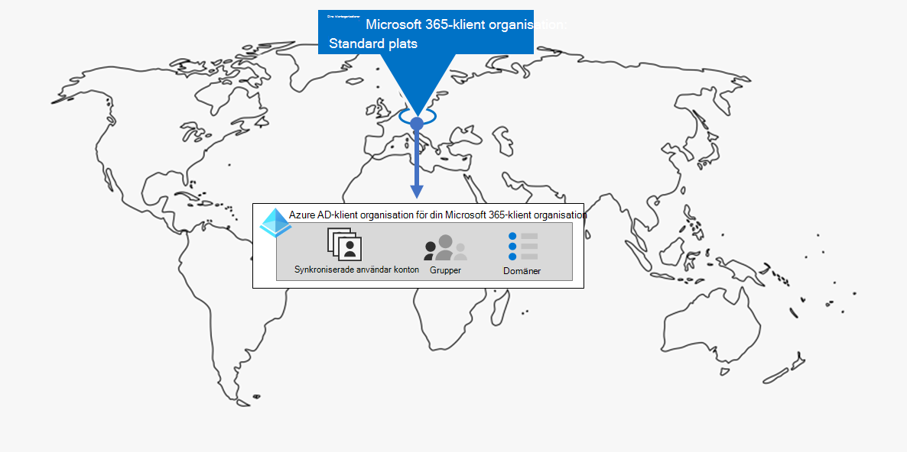

# Klienthantering för Microsoft 365 för företag

Att skapa en väg till organisationens digitala transformation med molntjänster kräver en fast grund som medarbetarna kan förlita sig på för produktivitet, samarbete, prestanda, sekretess, efterlevnad och säkerhet.

Rätt konfiguration av Microsoft 365-klientorganisationen ger grunden, så att medarbetarna kan fokusera på att få jobbet gjort och IT-avdelningen att fokusera på end-to-end-lösningar som ger ytterligare affärsvärde. 

Den här lösningen tar dig genom konfigurationen av den grunden i följande steg:

1. Fastställ dina klientorganisationar
2. Optimera dina nätverk
3. Synkronisera dina identiteter och tillämpa säkra inloggningar
4. Migrera Dina Windows-enheter, Office-klienter och lokala Office-servrar och -data
5. Distribuera enhet- och programhantering

Men först ska vi se hur en klientorganisation är och hur en klientorganisation som ger en fast grund ser ut.

## En definierad Microsoft 365-klientorganisation

En Microsoft 365-klient är en dedikerad instans av tjänsterna i Microsoft 365 och dina organisationsdata som lagras på en viss standardplats, till exempel Europa eller Nordamerika. Den här platsen anges när du skapar klientorganisationen för din organisation. Varje Microsoft 365-innehavare är distinkt, unik och separat från alla andra Microsoft 365-klientorganisationar. Du skapar en Microsoft 365-klientorganisation när du köper en eller flera produkter från Microsoft, till exempel Microsoft 365 E3 eller E5, och en uppsättning licenser för var och en.

Din Microsoft 365-klientorganisation innehåller också en Azure Active Directory-klientorganisation (Azure AD), som är en dedikerad instans av Azure AD för användarkonton, grupper och andra objekt. Varje Azure AD-klient är distinkt, unik och separat från alla andra Azure AD-klientorganisationen. Även om din organisation kan ha flera Azure AD-klientorganisationer som du kan konfigurera med Azure-prenumerationer, kan Microsoft 365-klientorganisationen bara använda en enda Azure AD-klient, den som skapades när du skapade klientorganisationen. 

Här är ett exempel:

*Klientorganisationens* hantering är planering, distribution och kontinuerlig drift av dina Microsoft 365-klientorganisationar. 

## Attribut för en väl utformad och fungerande klientorganisation

Förutom rätt namn och plats för din klientorganisation finns det ytterligare element att planera, distribuera och hantera för att säkerställa att dina användarupplevelser med molnproduktivitetsprogram som Microsoft Teams och Exchange Online är effektiva, säkra och mer &mdash; &mdash; effektiva.

Här är de olika elementen:

- Du har rätt uppsättning produkter (prenumerationer) och licenser.
  - Produktuppsättningen matchar dina affärs-, IT- och säkerhetsbehov.
  - Det finns ett lämpligt antal licenser för dina medarbetare och förväntade ändringar av personal.
- För nätverk:
  - Du har konfigurerat rätt DNS-domännamn.
  - För företagsnätverk har du optimerat nätverkstrafiken till Microsoft-nätverket för anställda på plats.
  - Du har optimerad nätverkstrafik för fjärranslutna medarbetare som använder en VPN-klient.
- Du har synkroniserat dina Active Directory DS (AD DS) konton, grupper och andra objekt.
  - Dina Azure AD-klientkonton mappas till Exchange Online-postlådor med rätt DNS-domäner för e-postadresser.
  - Dina användarkonton har tilldelats rätt licenser från rätt köpta produkter (till exempel Microsoft 365 E3 eller E5).
- Du har konfigurerat stark identitets- och åtkomsthantering.
  - Du kräver säker användar inloggning utan lösenord eller multifaktorautentisering (MFA).
  - Du har villkorsstyrda åtkomstprinciper som tillämpar inloggningskrav och begränsningar för högre säkerhetsnivåer.
- Lokala Office-servrar och deras data har migrerats till molnappar eller används i en hybridkonfiguration.
- Du utför enhetshantering med Intune eller Basic Mobility and Security inbyggt i Microsoft 365.
  - Enheterna som ägs av din organisation registreras och hanteras.
  - Apparna för personliga enheter hanteras.

Här är ett exempel på en Microsoft 365-klientorganisation med alla dessa element på plats.

I den här illustrationen innehåller Microsoft 365-klientorganisationen:

- Produkter och licenser för Microsoft 365 E3 och E5.
- Microsoft 365-produktivitetsprogram.
- Intune med registrerade enheter samt principer för enheter och program.
- En Azure AD-klient som har synkroniserat användarkonto (grupper och andra katalogobjekt visas inte), domäner och villkorsstyrda åtkomstprinciper.

## Klientorganisationsfunktioner för Microsoft 365 för företag

I följande avsnitt och tabell finns viktiga funktioner och licensiering för stegen i den här lösningen.

### Klientorganisation

| Resurs eller funktion | Beskrivning | Licensiering |
|:-------|:-----|:-------|
| Flera klientorganisationer | Varje Microsoft 365-innehavare är distinkt, unik och separat från alla andra Microsoft 365-klientorganisationar. Med flera klientorganisationar finns det begränsningar och ytterligare överväganden när du hanterar dem och tillhandahåller tjänster till användarna. | Microsoft 365 E3 eller E5 | 
| Migrering av postlådor mellan klientorganisationer | Innehavaradministratörer kan flytta postlådor mellan klientorganisationen med minimalt beroende av infrastruktur i sina lokala system. Det här tar bort behovet av postlådor för off-board och onboard. | Microsoft 365 E3 eller E5 | 
| Multi-Geo | Din klientorganisation kan lagra data i vila på andra datacenter geoplatser som du har valt att uppfylla krav för datalagring. | Microsoft 365 E3 eller E5 | 
| Flytta basdata till ett nytt datacenter geo | Eftersom Microsoft lägger till nya datacenter geos för ytterligare kapacitet och beräkna resurser kan du begära en geoflyttning av data i geodatalagring för dina kärndata. | Microsoft 365 E3 eller E5 | 
||||

### Nätverk

| Resurs eller funktion | Beskrivning | Licensiering |
|:-------|:-----|:-------|
| Nätverksinsikter | Nätverksprestandamätvärden som samlas in från Microsoft 365-klienten för att hjälpa dig att utforma nätverks perimeter för kontorsplatser. | Microsoft 365 E3 eller E5 | 
| Automatisera slutpunktsuppdateringar | Automatisera konfiguration och pågående uppdateringar för Microsoft 365-slutpunkter i dina pac-klientfiler och nätverksenheter och -tjänster. | Microsoft 365 E3 eller E5 | 
||||

### Identitet

| Resurs eller funktion | Beskrivning | Licensiering |
|:-------|:-----|:-------|
| Synkronisera lokal Active Directory DS (AD DS) med Din Azure AD-klient    | Utnyttja din lokala identitetsleverantör för användarkonton, grupper och andra objekt. | Microsoft 365 E3 eller E5 |
| MFA som förstärks med säkerhetsstandarder   | Skydda er mot identitetsstölder och komprometterade enheter genom att kräva en andra form av autentisering vid inloggning. Säkerhetsstandarderna kräver MFA för alla användarkonton.   | Microsoft 365 E3 eller E5 |
| MFA som förstärks med villkorsstyrd åtkomst| Kräv MFA baserat på attributen i inloggningen med villkorsstyrda åtkomstprinciper.    | Microsoft 365 E3 eller E5 | 
| MFA som förstärks med riskbaserad villkorsstyrd åtkomst   | Använd Microsoft Defender for Identity för att kräva MFA baserat på risken som är kopplad till användarens inloggning. | Microsoft 365 E5 eller E3 med Azure AD Premium P2-licenser | 
| Självbetjäning för återställning av lösenord (SSPR)    | Låt användarna återställa eller låsa upp sina lösenord och konton.  | Microsoft 365 E3 eller E5 |
||||

### Migrering

| Resurs eller funktion | Beskrivning | Licensiering |
|:-------|:-----|:-------|
| Migrera till Windows 10 | Migrera dina enheter som kör Windows 7 eller Windows 8.1 till Windows 10 Enterprise. | Windows 10 Enterprise-licenser som ingår i Microsoft 365 E3 eller E5 | 
| Migrera till Microsoft 365-program för företag | Migrera Office-klientapparna, till exempel Word och PowerPoint, till de versioner som är installerade från molnet och som uppdateras med nya funktioner. | Microsoft 365 E3 eller E5 | 
| Migrera lokala servrar och data till Microsoft 365 | Migrera Exchange-postlådor, SharePoint-webbplatser och Skype för företag – Online till Microsoft 365-molntjänster. | Microsoft 365 E3 eller E5 | 
||||

### Enhets- och apphantering

| Resurs eller funktion | Beskrivning | Licensiering |
|:-------|:-----|:-------|
| Microsoft Intune | En molnbaserad tjänst för hantering av mobila enheter (MDM) och hantering av mobilprogram (MAM) som styr hur organisationens program och enheter används, inklusive mobiltelefoner, surfplattor och bärbara datorer. | Microsoft 365 E3 eller E5 | 
| Grundläggande Mobility and Security | Med den här inbyggda tjänsten kan du skydda och hantera användarnas mobila enheter som iPhone, iPad, Android och Windows-telefoner.  | Microsoft 365 E3 eller E5 | 
||||

## Nästa steg

Använd de här anvisningarna för att konfigurera och hantera dina Microsoft 365-klientorganisationar.

1. [Fastställ dina klientorganisationar](tenant-management-tenants.md)
2. [Optimera dina nätverk](tenant-management-networking.md)
3. [Synkronisera dina identiteter och tillämpa säkra inloggningar](tenant-management-identity.md)
4. [Migrera dina lokala Office-servrar och data](tenant-management-migration.md)
5. [Distribuera enhet- och programhantering](tenant-management-device-management.md)

Varje steg beskriver distributionsalternativ, sammanfattar resultaten och löpande underhållsåtgärder.

Information om hur en fiktiv men representativ organisation med flera nationella organisationer distribuerade elementen i sin Microsoft 365-klientorganisation finns i [Contosos fallstudie.](../enterprise/contoso-case-study.md)
