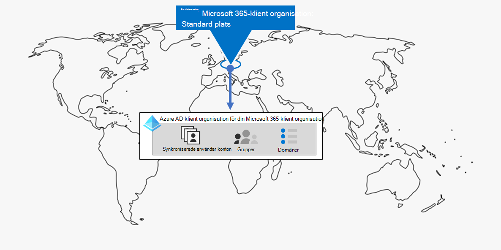
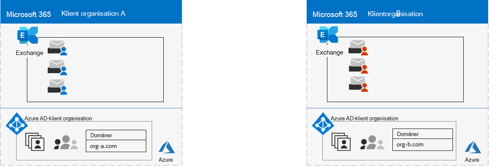
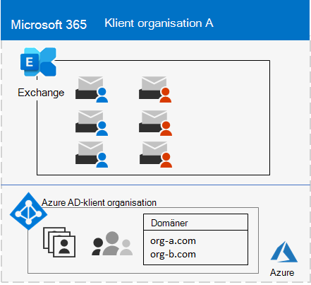
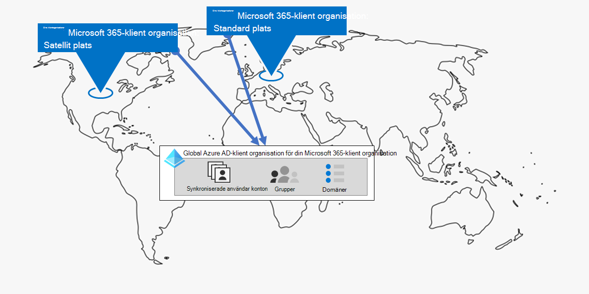
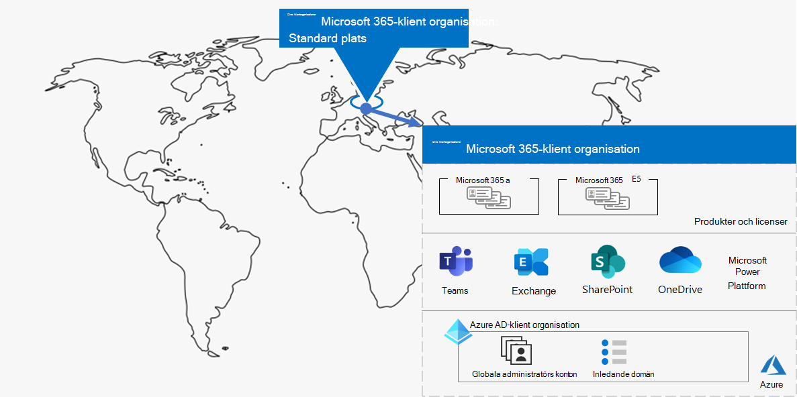
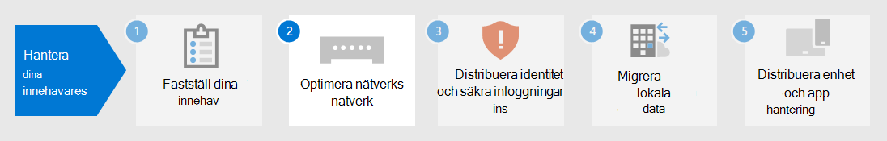

# Steg 1.Step 1. Din Microsoft 365 för företags innehavareYour Microsoft 365 for enterprise tenants

Ett av dina första besluts fattare är hur många som ska vara med.One of your first tenant decisions is how many to have. Varje Microsoft 365-klient organisation är distinkt, unikt och åtskilt från alla andra Microsoft 365-klient organisationer.Each Microsoft 365 tenant is distinct, unique, and separate from all other Microsoft 365 tenants. Det motsvarande Azure AD-klient organisationen är också distinkt, unikt och åtskilt från alla andra Microsoft 365-klient organisationer.It’s corresponding Azure AD tenant is also distinct, unique, and separate from all other Microsoft 365 tenants.

## En enda klient organisationSingle tenant
Om du har en enda klient organisation blir det enklare för många olika sätt att använda Microsoft 365.Having a single tenant simplifies many aspects of your organization’s use of Microsoft 365. En enskild klient organisation betyder en enda Azure AD-klient organisation med en enda uppsättning konton, grupper och principer.A single tenant means a single Azure AD tenant with a single set of accounts, groups, and policies. Behörigheter och delning av resurser i organisationen kan göras via den här centrala identitets leverantören.Permissions and sharing of resources across your organization can be done through this central identity provider.

En enda klient organisation tillhandahåller den mest omfattande och förenklade samarbets-och produktivitets upplevelsen för dina användare.A single tenant provides the most feature-rich and simplified collaboration and productivity experience for your users.

Här är ett exempel som visar standard platsen och Azure AD-klient organisationen för en Microsoft 365-klient organisation.Here is an example showing the default location and Azure AD tenant of a Microsoft 365 tenant.

## Flera klientorganisationerMultiple tenants

Det finns många anledningar till att organisationen kan ha flera klient organisationer:There are many reasons why your organization could have multiple tenants:

- Administratörs isoleringAdministrative isolation
- Decentralisera detDecentralized IT
- Historiska beslutHistorical decisions
- Fusioner, förvärv eller divestituresMergers, acquisitions, or divestitures
- Tydligt separering av varumärkes märkning för konglomerat organisationerClear separation of branding for conglomerate organizations
- För produktions-, test-eller sand lådorPre-production, test, or sandbox tenants

Här är ett exempel på en organisation med två klient organisationer (klient organisation A och Tenant B) i samma standard Data Center.Here is an example of an organization that has two tenants (Tenant A and Tenant B) in the same default datacenter geo. Varje klient organisation som en separat Azure AD-klient.Each tenant as a separate Azure AD tenant.

När du har flera klient organisationer finns det restriktioner och andra överväganden när du hanterar dem och tillhandahåller tjänster till användarna.When you have multiple tenants, there are restrictions and additional considerations when managing them and providing services to your users.

### Samarbete mellan klientorganisationerInter-tenant collaboration

Om du vill att användarna ska samar beta mer effektivt över olika Microsoft 365-klient organisationer på ett säkert sätt kan du använda en central plats för filer och konversationer, dela kalendrar med snabb meddelanden, ljud/video samtal och skydda åtkomsten till resurser och program.If you want your users to collaborate more effectively across different Microsoft 365 tenants in a secure manner, inter-tenant collaboration options include using a central location for files and conversations, sharing calendars, using IM, audio/video calls for communication, and securing access to resources and applications.

Mer information finns i [Microsoft 365 samarbete mellan innehavare](../enterprise/microsoft-365-inter-tenant-collaboration.md).For more information, see [Microsoft 365 inter-tenant collaboration](../enterprise/microsoft-365-inter-tenant-collaboration.md).

### Migrera mellan innehavare (för hands version)Cross-tenant mailbox migration (preview)

Innan migrering av post låda från flera innehavare (i för hands version), när Exchange Online-postlådor flyttas mellan klient organisationer måste du helt ta bort en användar post låda från den aktuella klient organisationen (käll klient organisationen) till lokalt och sedan till en ny klient organisation (mål klient organisationen).Prior to cross-tenant mailbox migration (in preview), when moving Exchange Online mailboxes between tenants, you have to completely offboard a user mailbox from their current tenant (the source tenant) to on-premises and then onboard them to a new tenant (the target tenant). Med den nya Överflyttnings funktionen för post lådor för flera innehavare kan klient organisationer i både käll-och mål klient organisationer flytta post lådor mellan klient organisationerna och deras lokala system.With the new cross-tenant mailbox migration feature, tenant administrators in both source and target tenants can move mailboxes between the tenants with minimal infrastructure dependencies in their on-premises systems. Detta tar bort behovet av andra och andra-postlådor.This removes the need to off-board and onboard mailboxes.

Här är två exempel klient organisationer och deras post lådor innan migrering mellan innehavare av post lådor.Here are two example tenants and their mailboxes before cross-tenant mailbox migration.

I den här bilden har två separata klient organisationer sina egna domäner och en uppsättning Exchange-postlådor.In this illustration, two separate tenants have their own domains and set of Exchange mailboxes.

Här är mål klient organisationen (klient organisation A) efter migrering av post låda mellan innehavare.Here is the target tenant (Tenant A) after cross-tenant mailbox migration.

I den här bilden har en enskild klient organisation både domäner och båda uppsättningarna med Exchange-postlådor.In this illustration, a single tenant has both domains and both sets of Exchange mailboxes.

Mer information finns i [migrering av post lådor mellan innehavare](../enterprise/cross-tenant-mailbox-migration.md).For more information, see [Cross-tenant mailbox migration](../enterprise/cross-tenant-mailbox-migration.md).

### Migrering mellan klientorganisationerTenant-to-tenant migrations

Det finns flera arkitektur metoder för fusioner, förvärv, divestitures och andra scenarier som kan leda till att du migrerar en befintlig Microsoft 365-klient organisation till en ny klient organisation.There are several architectural approaches for mergers, acquisitions, divestitures, and other scenarios that might lead you to migrate an existing Microsoft 365 tenant to a new tenant. 

Detaljerad information finns i [Microsoft 365-migreringar för klient organisationer](../enterprise/microsoft-365-tenant-to-tenant-migrations.md).For detailed guidance, see [Microsoft 365 tenant-to-tenant migrations](../enterprise/microsoft-365-tenant-to-tenant-migrations.md).

## Multi-geo för en innehavareMulti-Geo for a tenant

Med Microsoft 365 multi-geo kan du tillhandahålla och lagra data på andra platser i Data Center som du har valt att uppfylla data de kraven och samtidigt låsa upp din globala installation av moderna produktivitets upplevelser till dina anställda.With Microsoft 365 Multi-Geo, you can provision and store data at rest in the other datacenter geo locations that you've chosen to meet data residency requirements, and at the same time unlock your global rollout of modern productivity experiences to your workers.

I en multi-geo-miljö består din Microsoft 365-klient av en standard-eller central plats där ditt Microsoft 365-abonnemang ursprungligen skapades och en eller flera satellit platser.In a Multi-Geo environment, your Microsoft 365 tenant consists of a default or central location where your Microsoft 365 subscription was originally created and one or more satellite locations. I en multi-geo-klient organisation ska informationen om geo-platser, grupper och användar information hanteras i en global Azure AD-klient.In a multi-geo tenant, the information about geo locations, groups, and user information is mastered in a global Azure AD tenant. Eftersom klient informationen hanteras centralt och synkroniseras på varje Geo-plats delas samarbets upplevelser med alla från ditt företag på alla platser.Because your tenant information is mastered centrally and synchronized into each geo location, collaboration experiences involving anyone from your company are shared across the locations.

Här är ett exempel på en organisation med standard platsen i Europa och en satellit plats i Nord Amerika.Here is an example of an organization that has its default location in Europe and a satellite location in North America. Båda platserna delar samma globala Azure AD-klient organisation för den enda Microsoft 365-klienten.Both locations share the same global Azure AD tenant for the single Microsoft 365 tenant.

Mer information finns i [Microsoft 365 multi-geo](../enterprise/microsoft-365-multi-geo.md).For more information, see [Microsoft 365 Multi-Geo](../enterprise/microsoft-365-multi-geo.md).

## Flytta grundläggande data till ett nytt Data Center geoMoving core data to a new datacenter geo

Microsoft fortsätter att öppna nya data Center-geos för Microsoft 365-tjänster.Microsoft continues to open new datacenter geos for Microsoft 365 services. De här nya datacenter-geos lägga till kapacitet och beräkna resurser för att stödja vår pågående kund efter frågan och förbruknings tillväxt.These new datacenter geos add capacity and compute resources to support our ongoing customer demand and usage growth. Dessutom ger det nya data Center geos in-Geo data de för grundläggande kunddata.Additionally, the new datacenter geos offer in-geo data residency for core customer data.

Trots att en ny datacenter-geo inte påverkar dig och dina grundläggande data som lagras i ett befintligt Data Center, kan du använda Microsoft för att begära en tidig migrering av organisationens grundläggande kund data på en ny data Center-geo.Although opening a new datacenter geo does not impact you and your core data stored in an already existing datacenter geo, Microsoft allows you to request an early migration of your organization's core customer data at rest to a new datacenter geo.

Här är ett exempel där en Microsoft 365-klient har flyttats från Europeiska unionen (EU) Data Center till den som befinner sig i Storbritannien (UK).Here is an example in which a Microsoft 365 tenant was moved from the European Union (EU) datacenter geo to the one located in the United Kingdom (UK).

Mer information finns i [Flytta grundläggande data till nya Microsoft 365 Data Center-geos](../enterprise/moving-data-to-new-datacenter-geos.md).For more information, see [Moving core data to new Microsoft 365 datacenter geos](../enterprise/moving-data-to-new-datacenter-geos.md).

## Produkter och licenser för en klient organisationProducts and licenses for a tenant

Din Microsoft 365-klient organisation skapas när du köper din första produkt, till exempel Microsoft 365 E3.Your Microsoft 365 tenant gets created when you purchase your first product, such as Microsoft 365 E3. Tillsammans med produkten är licenser, som debiteras per månad eller årlig avgift.Along with the product are licenses, which are charged a monthly or annual fee. En administratör tilldelar sedan en tillgänglig licens från en av dina produkter till ett användar konto, antingen direkt eller via grupp medlemskap.An administrator then assigns an available license from one of your products to a user account, either directly or through group membership. Beroende på organisationens affärs behov kan du ha en uppsättning produkter, var och en med sina egna licenser.Depending on your organization's business needs, you might have a set of products, each with their own pool of licenses. 

Det krävs lite planering för att fastställa produkterna och antalet licenser för var och en av dem:Determining the set of products and the number of licenses for each requires some planning to:

- Se till att du har tillräckligt med licenser för de användar konton som behöver avancerade funktioner.Ensure you have enough licenses for the user accounts that need advanced features.
- Förhindra att licenser tar slut eller att du inte har till gång till för många otilldelade licenser, baserat på ändringar i Personalen på din organisation.Prevent you from running out of licenses or having too many unassigned licenses, based on changes in staffing at your organization.

## Resultat i steg 1Results of Step 1

För din Microsoft 365 för företags klient organisationer har du fastställt:For your Microsoft 365 for enterprise tenants, you have determined:

- Hur många klient organisationer du har eller behöver.How many tenants you have or need.
- Vilka produkter och licenser som måste köpas för varje klient organisation.For each tenant, which products and licenses must be purchased.
- Om en innehavare måste vara Multi-geo för att uppfylla data de kraven.Whether a tenant needs to be Multi-Geo to comply with data residency requirements.
- Om du behöver konfigurera samarbete mellan klienter.Whether you need to set up inter-tenant collaboration.
- Om du behöver migrera en klient organisation till en annan.Whether you need to migrate one tenant to another.
- Om du behöver flytta grundläggande data från ett Data Center geo till New.Whether you need to move core data from one datacenter geo to new one.

Här är ett exempel på en ny klient organisation.Here is an example of a new tenant.

I den här bilden har klient organisationen:In this illustration, the tenant has:

- En standard plats för ett Microsoft 365-datacenter geo.A default location corresponding to a Microsoft 365 datacenter geo.
- En uppsättning produkter och licenser.A set of products and licenses.
- Uppsättningen Cloud Productivity-appar, varav vissa är specifika för produkterna.The set of cloud productivity apps, some of which are specific to products.
- En Azure AD-klient som innehåller globala administratörs konton och ett ursprungligt DNS-domännamn.An Azure AD tenant that contains global administrator accounts and an initial DNS domain name.

När vi går igenom de ytterligare stegen i den här lösningen kommer vi att bygga upp den här uppgiften.As we move through the additional steps of this solution, we will build out this figure.

## Pågående underhåll för klient organisationerOngoing maintenance for tenants

Kontinuerligt måste du kanske:On an ongoing basis, you might need to:

- Lägg till en ny klient organisation.Add a new tenant.
- Lägg till nya produkter till en klient organisation med ett inledande antal licenser.Add new products to a tenant with an initial number of licenses.
- Ändra uppsättningen med licenser för en produkt i en klient organisation för att justera personal kraven.Change the set of licenses for a product in a tenant to adjust for changing staff requirements.
- Flytta dina grundläggande data från en klient organisation till en ny data Center Geo-plats.Move your core data from a tenant to a new datacenter geo location.
- Lägg till villkor för multi-geo för data de.Add Multi-Geo for data residency requirements.
- Konfigurera samarbete mellan innehavare.Set up inter-tenant collaboration.

## Nästa stegNext step

Fortsätt med [nätverk](tenant-management-networking.md) för att erbjuda optimala nätverksfunktioner från dina arbetare till Microsoft 365-moln tjänster.Continue with [networking](tenant-management-networking.md) to provide optimal networking from your workers to Microsoft 365 cloud services.
