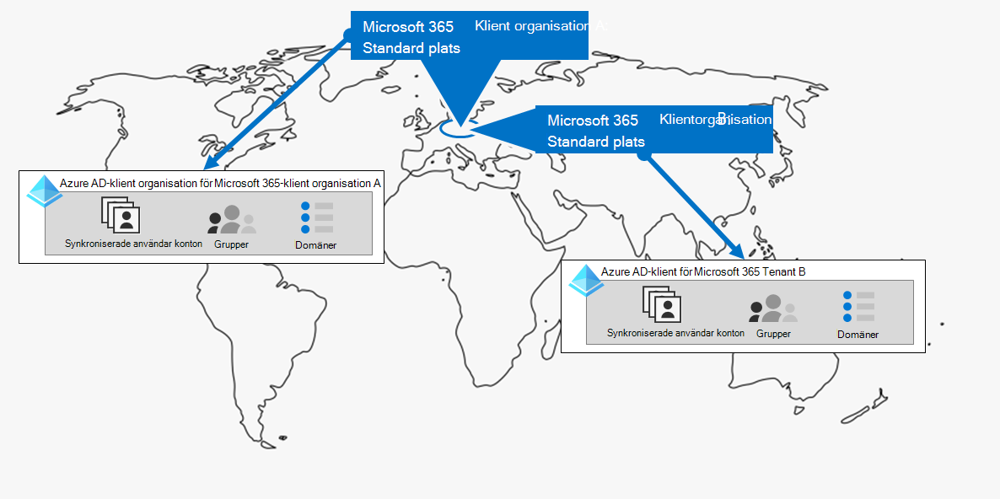

# Steg 1.Step 1. Din Microsoft 365 för företagsklienterYour Microsoft 365 for enterprise tenants

Ett av dina första klientbeslut är hur många du har.One of your first tenant decisions is how many to have. Varje Microsoft 365 är distinkt, unik och skiljer sig från alla Microsoft 365 klientorganisationen.Each Microsoft 365 tenant is distinct, unique, and separate from all other Microsoft 365 tenants. Den motsvarande Azure AD-klientorganisationen är också distinkt, unik och separat från alla Microsoft 365 klientorganisation.It’s corresponding Azure AD tenant is also distinct, unique, and separate from all other Microsoft 365 tenants.

## Enskild klientSingle tenant
Om du har en enda klientorganisation förenklas många aspekter av organisationens användning av Microsoft 365.Having a single tenant simplifies many aspects of your organization’s use of Microsoft 365. En enskild klient innebär en enda Azure AD-klientorganisation med en enda uppsättning konton, grupper och principer.A single tenant means a single Azure AD tenant with a single set of accounts, groups, and policies. Behörigheter och delning av resurser i organisationen kan göras via den här centrala identitetsleverantören.Permissions and sharing of resources across your organization can be done through this central identity provider.

En enskild klientorganisation erbjuder de mest funktionsrika och förenklade samarbets- och produktivitetsupplevelsen för användarna.A single tenant provides the most feature-rich and simplified collaboration and productivity experience for your users.

Här är ett exempel som visar standardplatsen och Azure AD-klientorganisationen för Microsoft 365 klientorganisation.Here is an example showing the default location and Azure AD tenant of a Microsoft 365 tenant.

## Flera klientorganisationerMultiple tenants

Det finns många anledningar till att organisationen kan ha flera klientorganisationar:There are many reasons why your organization could have multiple tenants:

- Administrativ avgränsningAdministrative isolation
- Decentraliserad ITDecentralized IT
- Historiska beslutHistorical decisions
- Sammanslagningar, förvärv eller företagMergers, acquisitions, or divestitures
- En tydlig åtskillnad mellan företags profilering för storkongruensClear separation of branding for conglomerate organizations
- Klientorganisationen före produktion, test eller sandbox-miljöPre-production, test, or sandbox tenants

Här är ett exempel på en organisation som har två klientorganisationar (klientorganisation A och klientorganisation B) i samma standarddatacenter geo.Here is an example of an organization that has two tenants (Tenant A and Tenant B) in the same default datacenter geo. Varje klientorganisation som en separat Azure AD-klientorganisation.Each tenant as a separate Azure AD tenant.

När du har flera klientorganisationen finns det restriktioner och ytterligare överväganden när du hanterar dem och tillhandahåller tjänster till användarna.When you have multiple tenants, there are restrictions and additional considerations when managing them and providing services to your users.

### Samarbete mellan klientorganisationerInter-tenant collaboration

Om du vill att användarna ska samarbeta mer effektivt i olika Microsoft 365-klientorganisationar på ett säkert sätt, kan du använda en central plats för filer och konversationer, dela kalendrar, använda snabbmeddelanden, ljud-/videosamtal för kommunikation och skydda åtkomst till resurser och program.If you want your users to collaborate more effectively across different Microsoft 365 tenants in a secure manner, inter-tenant collaboration options include using a central location for files and conversations, sharing calendars, using IM, audio/video calls for communication, and securing access to resources and applications.

Mer information finns i Microsoft 365 [samarbete mellan klientorganisationen.](../enterprise/microsoft-365-inter-tenant-collaboration.md)For more information, see [Microsoft 365 inter-tenant collaboration](../enterprise/microsoft-365-inter-tenant-collaboration.md).

### Postlådemigrering mellan klientorganisationen (förhandsversion)Cross-tenant mailbox migration (preview)

Innan postlådemigrering mellan klientorganisationen (i förhandsversion) måste du ta bort en användarpostlåda helt från den aktuella klientorganisationen (källklientorganisationen) till den lokala och sedan registrera dem i en ny klientorganisation (målklientorganisationen) när du flyttar Exchange Online postlådor mellan klientorganisationen.Prior to cross-tenant mailbox migration (in preview), when moving Exchange Online mailboxes between tenants, you have to completely offboard a user mailbox from their current tenant (the source tenant) to on-premises and then onboard them to a new tenant (the target tenant). Med den nya funktionen för postlådemigrering mellan klientorganisationen kan innehavaradministratörer i både käll- och målklientorganisationen flytta postlådor mellan klientorganisationen med minimala infrastrukturberoenden i sina lokala system.With the new cross-tenant mailbox migration feature, tenant administrators in both source and target tenants can move mailboxes between the tenants with minimal infrastructure dependencies in their on-premises systems. Det här tar bort behovet av postlådor för off-board och onboard.This removes the need to off-board and onboard mailboxes.

Här är två exempel på klientorganisationar och deras postlådor före postlådemigrering mellan klientorganisationen.Here are two example tenants and their mailboxes before cross-tenant mailbox migration.

I den här bilden har två separata klienter sina egna domäner och en uppsättning Exchange postlådor.In this illustration, two separate tenants have their own domains and set of Exchange mailboxes.

Här är målklientorganisationen (klientorganisation A) efter postlådemigrering mellan klientorganisationen.Here is the target tenant (Tenant A) after cross-tenant mailbox migration.

I den här illustrationen har en enda innehavare både domäner och båda uppsättningarna Exchange postlådor.In this illustration, a single tenant has both domains and both sets of Exchange mailboxes.

Mer information finns i Migrering av [postlådor i flera klientorganisationen.](../enterprise/cross-tenant-mailbox-migration.md)For more information, see [Cross-tenant mailbox migration](../enterprise/cross-tenant-mailbox-migration.md).

### Migrering mellan klientorganisationerTenant-to-tenant migrations

Det finns flera arkitekturscenarier för samgåenden, förvärv, företag och andra scenarier som kan leda till att du migrerar en befintlig Microsoft 365-klientorganisation till en ny klientorganisation.There are several architectural approaches for mergers, acquisitions, divestitures, and other scenarios that might lead you to migrate an existing Microsoft 365 tenant to a new tenant. 

Detaljerade instruktioner finns i [Microsoft 365 migreringar från klientorganisation till klientorganisation.](../enterprise/microsoft-365-tenant-to-tenant-migrations.md)For detailed guidance, see [Microsoft 365 tenant-to-tenant migrations](../enterprise/microsoft-365-tenant-to-tenant-migrations.md).

## Multi-Geo för en klientorganisationMulti-Geo for a tenant

Med Microsoft 365 Multi-Geo kan du tillhandahålla och lagra data i vila på andra datacenters geoplatser som du har valt att uppfylla datalagringskraven och samtidigt låsa upp din globala distribution av moderna produktivitetsupplevelser till dina medarbetare.With Microsoft 365 Multi-Geo, you can provision and store data at rest in the other datacenter geo locations that you've chosen to meet data residency requirements, and at the same time unlock your global rollout of modern productivity experiences to your workers.

I en Multi-Geo-miljö består Microsoft 365-klientorganisationen av en standardplats eller central plats där Microsoft 365-prenumerationen ursprungligen skapades och en eller flera satellitplatser.In a Multi-Geo environment, your Microsoft 365 tenant consists of a default or central location where your Microsoft 365 subscription was originally created and one or more satellite locations. I en flera geoklientorganisation hanteras information om geografiska platser, grupper och användarinformation i en global Azure AD-klient.In a multi-geo tenant, the information about geo locations, groups, and user information is mastered in a global Azure AD tenant. Eftersom din klientorganisationsinformation är centraliserad och synkroniserad till varje geoplats delas samarbetsupplevelser för alla från ditt företag över platserna.Because your tenant information is mastered centrally and synchronized into each geo location, collaboration experiences involving anyone from your company are shared across the locations.

Här är ett exempel på en organisation som har sin standardplats i Europa och en satellitplats i Nordamerika.Here is an example of an organization that has its default location in Europe and a satellite location in North America. Båda platserna har samma globala Azure AD-klientorganisation för den Microsoft 365 klientorganisationen.Both locations share the same global Azure AD tenant for the single Microsoft 365 tenant.

Mer information finns i [Microsoft 365 Multi-Geo](../enterprise/microsoft-365-multi-geo.md).For more information, see [Microsoft 365 Multi-Geo](../enterprise/microsoft-365-multi-geo.md).

## Flytta basdata till ett nytt datacenter geoMoving core data to a new datacenter geo

Microsoft fortsätter att öppna nya datacenter geos för Microsoft 365 tjänster.Microsoft continues to open new datacenter geos for Microsoft 365 services. Dessa nya datacenter geos lägger till kapacitet och beräknar resurser för att stödja vår pågående kundbehov och användningstillväxt.These new datacenter geos add capacity and compute resources to support our ongoing customer demand and usage growth. Det nya datacentret geos erbjuder dessutom geodata som används för basdata.Additionally, the new datacenter geos offer in-geo data residency for core customer data.

Även om en geoinvigering av ett nytt datacenter inte påverkar dig och dina basdata som lagras i ett befintligt datacenter geo kan du med Microsoft begära en tidig migrering av organisationens basdata för kunder i vila till ett nytt datacenter geo.Although opening a new datacenter geo does not impact you and your core data stored in an already existing datacenter geo, Microsoft allows you to request an early migration of your organization's core customer data at rest to a new datacenter geo.

Här är ett exempel där en Microsoft 365-klientorganisation har flyttats från EU-datacentret geo till det som finns i Storbritannien.Here is an example in which a Microsoft 365 tenant was moved from the European Union (EU) datacenter geo to the one located in the United Kingdom (UK).

Mer information finns i Flytta [basdata till det nya Microsoft 365 datacentrets geos.](../enterprise/moving-data-to-new-datacenter-geos.md)For more information, see [Moving core data to new Microsoft 365 datacenter geos](../enterprise/moving-data-to-new-datacenter-geos.md).

## Produkter och licenser för en klientorganisationProducts and licenses for a tenant

Din Microsoft 365 skapas när du köper din första produkt, till exempel Microsoft 365 E3.Your Microsoft 365 tenant gets created when you purchase your first product, such as Microsoft 365 E3. Tillsammans med produkten ingår licenser som debiteras en månatlig eller årlig avgift.Along with the product are licenses, which are charged a monthly or annual fee. En administratör tilldelar sedan en tillgänglig licens från en av dina produkter till ett användarkonto, antingen direkt eller via gruppmedlemskap.An administrator then assigns an available license from one of your products to a user account, either directly or through group membership. Beroende på organisationens affärsbehov kan du ha en uppsättning produkter, som var och en har sin egen licenspool.Depending on your organization's business needs, you might have a set of products, each with their own pool of licenses. 

För att fastställa produktuppsättningen och antalet licenser för var och en krävs en del planering för att:Determining the set of products and the number of licenses for each requires some planning to:

- Se till att du har tillräckligt med licenser för användarkonton som behöver avancerade funktioner.Ensure you have enough licenses for the user accounts that need advanced features.
- Förhindra att licenser tar slut eller att du har för många licenser som inte tilldelats, baserat på ändringar av personalen i din organisation.Prevent you from running out of licenses or having too many unassigned licenses, based on changes in staffing at your organization.

## Resultat i steg 1Results of Step 1

För din Microsoft 365 för företagsklienter har du beslutat följande:For your Microsoft 365 for enterprise tenants, you have determined:

- Hur många klientorganisationar du har eller behöver.How many tenants you have or need.
- Vilka produkter och licenser som måste köpas för varje klientorganisation.For each tenant, which products and licenses must be purchased.
- Om en klientorganisation måste vara en multi-geoklient för att uppfylla datalagringskraven.Whether a tenant needs to be Multi-Geo to comply with data residency requirements.
- Om du behöver konfigurera samarbete mellan klientorganisationen.Whether you need to set up inter-tenant collaboration.
- Om du behöver migrera en klientorganisation till en annan.Whether you need to migrate one tenant to another.
- Om du behöver flytta basdata från ett geodatadatacenter till ett nytt.Whether you need to move core data from one datacenter geo to new one.

Här är ett exempel på en ny klientorganisation.Here is an example of a new tenant.

I den här illustrationen har klientorganisationen:In this illustration, the tenant has:

- En standardplats som motsvarar en geoplats Microsoft 365 datacentret.A default location corresponding to a Microsoft 365 datacenter geo.
- En uppsättning produkter och licenser.A set of products and licenses.
- Uppsättningen molnproduktivitetsprogram, av vilka vissa är specifika för produkter.The set of cloud productivity apps, some of which are specific to products.
- En Azure AD-klient som innehåller globala administratörskonton och ett initialt DNS-domännamn.An Azure AD tenant that contains global administrator accounts and an initial DNS domain name.

När vi går igenom de ytterligare stegen i den här lösningen kommer vi att bygga ut den här siffran.As we move through the additional steps of this solution, we will build out this figure.

## Löpande underhåll för klientorganisationOngoing maintenance for tenants

Du kan behöva:On an ongoing basis, you might need to:

- Lägg till en ny klientorganisation.Add a new tenant.
- Lägg till nya produkter i en klientorganisation med ett första antal licenser.Add new products to a tenant with an initial number of licenses.
- Ändra licensuppsättningen för en produkt i en klientorganisation för att justera för att ändra personalkrav.Change the set of licenses for a product in a tenant to adjust for changing staff requirements.
- Flytta dina kärndata från en klientorganisation till en ny geoplats i datacentret.Move your core data from a tenant to a new datacenter geo location.
- Lägg till Krav för Multi-Geo för datalagring.Add Multi-Geo for data residency requirements.
- Konfigurera samarbete mellan klientorganisationen.Set up inter-tenant collaboration.

## Nästa stegNext step

Fortsätt med [nätverk för](tenant-management-networking.md) att tillhandahålla optimala nätverk från dina medarbetare till Microsoft 365 molntjänster.Continue with [networking](tenant-management-networking.md) to provide optimal networking from your workers to Microsoft 365 cloud services.
