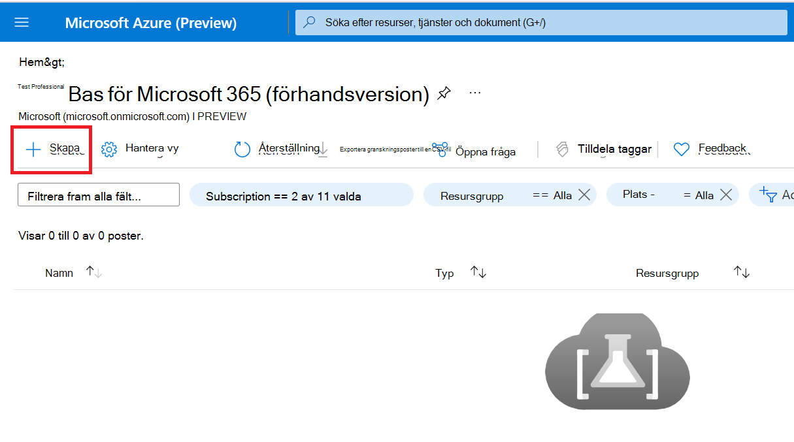

# <a name="step-1-create-a-test-base-account"></a>Steg 1: Skapa ett testbaskonto

Om du inte har en Azure-prenumeration skapar du ett [kostnadsfritt konto innan](https://azure.microsoft.com/en-us/free/) du börjar.

## <a name="enter-details-for-test-base-account"></a>Ange information om testbaskontot
 
1. Sök efter **"Test Base"** i Azure-portalen.


2. Klicka **på Lägg till för** att skapa ett testbaskonto.



3.  Läs igenom kryssrutan ```Terms of Use``` och bekräfta att du är nöjd med ```Terms of Use``` .


4.  Fyll i rätt information enligt följande krav: 
    -   Prenumeration: Resursgrupp
    -   Instansinformation: Namn.

**För närvarande har Test Base endast stöd för standardprisnivå.**


5.  Klicka slutligen på verifiera ```Review + Create``` och aktivera det nya kontot.

## <a name="next-steps"></a>Nästa steg

Gå vidare till nästa artikel för att komma igång med steg 2: Lär **dig hur du laddar upp paketet.**
> [!div class="nextstepaction"]
> [Nästa steg](uploadApplication.md)

<!---
Add button for next page
-->
