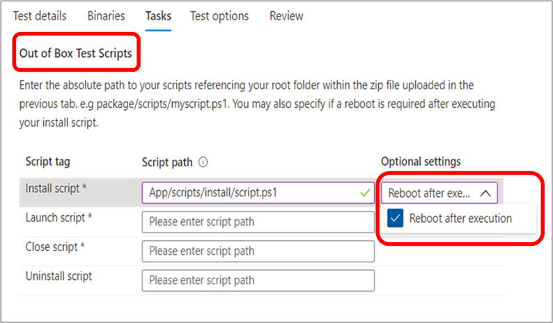

# Vanliga frågor och svar om testbasTest Base FAQ

**F: Hur skickar vi in våra paket till Test Base-teamet?****Q: How do we submit our packages to Test Base team?**

**S:** Skicka paketen direkt till Test Base-miljön med vår självbetjäningsportal.**A:** Submit your packages directly to the Test Base environment using our self-serve portal.

Skicka programpaketet genom att gå till [Azure-portalen](https://www.aka.ms/testbaseportal "Startsida för testbas") och ladda upp en zippad mapp som innehåller programmets binärfiler, beroenden och testskript via instrumentpanelen Test Base-självbetjäning för portalen.To submit your application package, navigate to the [Azure Portal](https://www.aka.ms/testbaseportal "Test Base Homepage") and upload a zipped folder containing your application's binaries, dependencies, and test scripts via the self-serve Test Base portal dashboard. 

Mer information finns i introduktionsguiden eller kontakta vårt team för <testbasepreview@microsoft.com> att få hjälp och mer information.Please see the onboarding user guide for more information or contact our team at <testbasepreview@microsoft.com> for assistance and more information.

**F: Vad är OOB-tester (in-box)****Q: What are Out-of-box (OOB) tests?**

**S:** OOB-tester (out-of-box) är standardiserade, standardtestet körs där programpaket installeras, startas och stängs trettio (30) gånger och avinstalleras sedan.**A:** Out-of-box (OOB) tests are standardized, default test runs where application packages are installed, launched and closed thirty (30) times, and then uninstalled. 

Paketen som skapas för Test Base har följande testskript: installera, starta, stäng och eventuellt avinstallationsskriptet.The packages created for Test Base will have the following test scripts: install, launch, close, and optionally the uninstall script. 

OOB-testerna (Out-box) ger dig standardiserade telemetri för programmet att jämföra mellan olika Windows byggen.The Out-of-box (OOB) tests provide you with standardized telemetry on your application to compare across Windows builds.

**F: Kan vi skicka in tester utanför de inramade testerna (installation, start, stängning, avinstallation av testskript)?****Q: Can we submit tests outside of the Out-of-box tests (install, launch, close, uninstall test scripts)?**

**S:** Ja, kunder kan även ladda upp programpaket för **funktionstester** via instrumentpanelen på portalen.**A:** Yes, customers can also upload application packages for **functional tests** via the self-serve portal dashboard.
**Funktionstester** är tester som gör att kunderna kan köra sina skript för att köra anpassade funktioner på programmet.**Functional tests** are tests that enable customers execute their scripts to run custom functionality on their application.

## TestningTesting

**F: Stöder ni funktionstester?****Q: Do you support functional tests?**

**S:** Ja, testbas har stöd för funktionstester.**A:** Yes, Test Base supports functional tests. Funktionstester är tester som gör att våra kunder kan köra sina skript för att köra anpassade funktioner i programmet.Functional tests are tests that enable our customers execute their scripts to run custom functionality on their application. 

Om du vill skicka in ditt programpaket för funktionstestning behöver du bara ladda upp den zippade mappen som innehåller programmets binärfiler, beroenden och testskript via vår självbetjäningsportalinstrumentpanel.To submit your application package for functional testing, simply upload the zipped folder containing your application's binaries, dependencies, and test scripts via our self-serve portal dashboard. 

Mer information finns i introduktionsguiden eller kontakta vårt team för <testbasepreview@microsoft.com> att få hjälp och mer information.Please see the onboarding user guide for more information or contact our team at <testbasepreview@microsoft.com> for assistance and more information.

**F: Hur hanterar Test Base våra testdata?****Q: How does Test Base handle our test data?**

**S:** Test Base samlar in och hanterar testdata på ett säkert sätt i Azure-miljön.**A:** Test Base securely collects and manages your test data on the Azure environment. 

**F: Kan testbasen stödja våra automatiska tester?****Q: Can Test Base support our automated tests?**

Ja, Test Base stöder automatiska tester men vi stöder inte manuella tester just nu på grund av tjänstefunktioner.Yes, Test Base supports automated tests however, we do not support manual tests at this time due to service capabilities.

**F: Vilka språk och ramverk för automatiska tester stöder du?****Q: What languages and frameworks of automated tests do you support?**

**S:** Vi stöder alla språk och ramverk.**A:** We support all languages and frameworks. Vi anropar alla skript via PowerShell.We invoke all scripts through PowerShell. 

Du måste också tillhandahålla (ladda upp) de beroende binärfilerna för det nödvändiga ramverket.You will also need to provide (upload) the dependent binaries of the required framework.

**F: Hur snart tillhandahåller Test Base testresultat?****Q: How soon does Test Base provide test results?**

**S:** För varje test vi kör mot förhands versionerna kommer vi att tillhandahålla resultat inom 48 timmar på din [Azure Portal-instrumentpanel.](https://www.aka.ms/testbaseportal "Startsida för testbas")**A:** For each test that we run against the pre-release builds, we will provide results within 48 hours on your [Azure Portal](https://www.aka.ms/testbaseportal "Test Base Homepage") dashboard.

**F: Kan du starta om efter installationen?****Q: Can you reboot after install?**

**S:** Ja, vår process har stöd för att starta om efter installationen.**A:** Yes, our process supports rebooting after installation. Se till att välja det här alternativet i listrutan "Valfria inställningar" när du anger **Dina** uppgifter på introduktionsportalen.Be sure to select this option from the “Optional settings” drop list when setting your **Tasks** on the onboarding portal.

För OOB-tester (Out-of-box) kan du ange om en omstart krävs för _installationsskriptet._For Out-of-box (OOB) tests, you can specify whether a reboot is needed for the _Install script._

När du ska köra funktionstester kan du ange om en omstart krävs för varje skript som läggs till.While for functional tests, you can specify whether a reboot is required for each script that is added.

**F: Vilka Windows versioner stöder du?****Q: What Windows versions do you support?**

**S:** Vi har för närvarande Windows 10 för klienter, Windows Server 2016, Windows Server 2016 Core-version, Windows Server 2019 och Windows Server 2019 Core-versionen.**A:** We currently support Windows 10 clients, Windows Server 2016, Windows Server 2016 Core version, Windows Server 2019, and Windows Server 2019 Core version.

**F: Vad är skillnaden mellan säkerhetsuppdateringstester och funktionsuppdateringstester?****Q: What is the difference between Security Update tests and Feature Update tests?**

**S:** För tester av säkerhetsuppdateringar **<ins></ins>** testar vi mot de månatliga säkerhetsuppdateringarna den Windows som fokuserar på att se till att våra användare alltid är skyddade och skyddade.**A:** For Security update tests, we test against the **<ins>monthly pre-release security updates</ins>** on Windows which are focused on keeping our users always secure and protected. För funktionsuppdateringstesterna testar vi mot de **<ins>bi-årliga</ins>** förhandsuppdateringarna som introducerar nya funktioner på Windows.For the Feature update tests, we test against the **<ins>bi-annual pre-release feature updates</ins>** which introduces new features and capabilities on Windows.

## FelsökningsalternativDebugging options

**F: Får vi tillgång till virtuella maskiner vid fel? Vad delar Testbas?****Q: Do we get access to the Virtual Machines (VMs) in case of failures? What does Test Base share?**

**S:** För att tjänsten ska vara kompatibel och förhandsuppdateringarna är säkra är det bara Microsoft som har åtkomst till de virtuella maskinerna.**A:** For the service to be compliant and the pre-release updates be secure, only Microsoft has access to the VMs. Kunderna kan dock visa testresultat och andra testmått på portalens instrumentpanel, inklusive krasch- och hang-signaler, tillförlitlighetsmått, minnes- och cpu-användning osv. Vi skapar och tillhandahåller även loggar av test som körs på instrumentpanelen för nedladdning och vidare analys.However, customers can view test results and other test metrics on their portal dashboard, including crash and hang signals, reliability metrics, memory and CPU utilization etc. We also generate and provide logs of test runs on the dashboard for download and further analysis. 

Vi kan också lägga till minnesdumpor för felsökning av kraschar vid behov.We can also provide memory dumps for crash debugging as needed.

**F: Om det finns problem under testningen, vilka är nästa steg för att lösa problemen?****Q: If there are issues found during the testing, what are the next steps to resolve these issues?**

**S:** Test Base-teamet utför en inledande triageprocess för att fastställa orsaken till felet, och sedan, beroende på våra resultat, kommer vi att dirigeras till kunden eller interna team i Microsoft för felsökning.**A:** The Test Base team will perform an initial triage process to determine the root cause of the error, and then depending on our findings, we will route to the customer or internal teams within Microsoft for debugging. 

Vi samarbetar alltid tillsammans med våra kunder för att lösa eventuella problem.We always work closely with our customers in joint remediation to resolve any issues. 

**F: Håller Microsoft kvar utgivningen av säkerhetskorrigeringen tills problemet är löst? Vilka alternativa upplösningar finns tillgängliga?****Q: Does Microsoft hold the release of the security patch until the issue is resolved? What alternate resolutions are available?**

**S:** Syftet med Test Base är att säkerställa att våra kunder inte har några problem.**A:** The goal of Test Base is to ensure our joint end customers do not face any issues. Vi arbetar hårt med programvaruleverantörer för att lösa eventuella problem före versionen, men om korrigeringen inte är möjlig har vi andra lösningar, till exempel shims och block.We will work hard with Software Vendors to address any issues before the release, but in case the fix is not feasible we have other resolutions such as shims and blocks.

## DiverseMiscellaneous

**F: Hur fungerar tjänsten med en on-prem-server?****Q: How will the service work with an on-prem server?**

**S:** Vi tillhandahåller för närvarande inte stöd för on-prem-servrar.**A:** We currently do not provide support for on-prem servers. Men om servern visar HTTP-slutpunkten kan vi ansluta till den via Internet.However, if the server is exposing HTTP endpoint, we can connect to it over the internet.

**F: Vem värd för virtuella maskinerna?****Q: Who hosts the VMs?**

**S:** Microsoft tillhandahåller den virtuella maskinerna för den här tjänsten och tar i så fall hand om detta från kunden.**A:** Microsoft provisions the VM for this service, taking the load of doing so from the customer.

**F: Stöder den här tjänsten webb-, mobil- eller skrivbordsappar?****Q: Does this service support web, mobile, or desktop applications?**

**S:** För närvarande fokuserar vi på skrivbordsprogram, men vi planerar att introducera webbappar i framtiden, men vi stöder inte mobila program för närvarande.**A:** Currently, our focus is on desktop applications, however, we have plans to onboard web applications in the future, but we do not support mobile applications at this time.

**F: Vad är skillnaden mellan Testbas och TIDP?****Q: What is the difference between Test Base and SUVP?**

**S:** Den största skillnaden mellan TestBas och SÅP är att våra partner för in deras program på Test base Azure-miljön för validering körs mot förhandsuppdateringar i stället för att själva utföra testerna.**A:** The biggest difference between Test Base and SUVP is that our partners onboard their applications onto the Test Base Azure environment for validation runs against pre-release updates instead of carrying out the tests themselves. 

Förutom förhandstestning av säkerhetsuppdateringar har vi stöd för förhandsuppdateringar av funktionsuppdateringar på vår plattform.In addition to pre-release security updates testing, we support pre-release feature updates testing on our platform. Vi har många andra typer av uppdateringar och OS-tester på vår översikt.We have many other types of updates and OS testing on our roadmap.

**F: Är det någon kostnad kopplad till tjänsten?****Q: Is there a cost associated with the service?**

**S:** Testbastjänsten kommer att vara tillgänglig för användarna fram till den allmänna tillgängligheten (GA).**A:** The Test Base service will be free to users until General Availability (GA). Då kommer vi att presentera en kostnadsstruktur som ska gälla för alla kunder.At that time, we will announce a cost structure that will be in effect for all customers. 

**F: Hur kan jag ge feedback om Test Base?****Q: How can I provide feedback about Test Base?**

**S:** Om du vill dela med dig av din feedback om Test Base väljer **du feedbackikonen** längst ned till vänster i portalen.**A:** To share your feedback about Test Base, select the **Feedback** icon at the bottom left of the portal. Ta med en skärmbild i ditt inskickade material så att Microsoft förstår din feedback bättre.Include a screenshot with your submission to help Microsoft better understand your feedback. 

Du kan också skicka produktförslag och hålla med andra idéer på <testbasepreview@microsoft.com> .You can also submit product suggestions and upvote other ideas at <testbasepreview@microsoft.com>.
