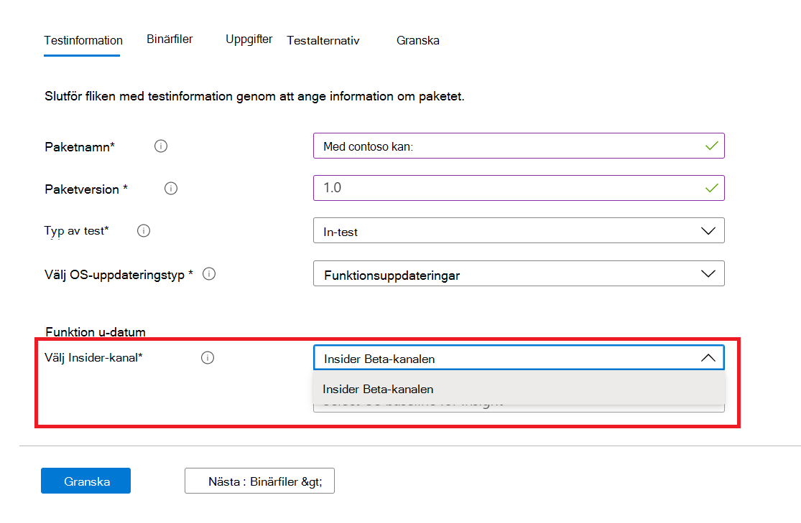
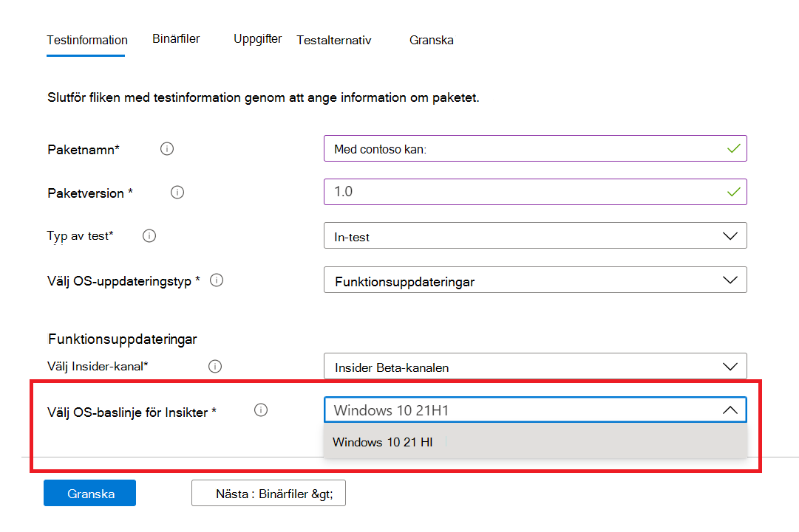

# <a name="windows-feature-update-validation"></a><span data-ttu-id="4b54e-103">Windows Validering av funktionsuppdatering</span><span class="sxs-lookup"><span data-stu-id="4b54e-103">Windows Feature update validation</span></span>

<span data-ttu-id="4b54e-104">Behöver du insikter om hur dina program fungerar med nästa version av Windows 10 eller Windows 11 – utan att du behöver underhålla en miljö för att verifiera nya Windows funktioner?</span><span class="sxs-lookup"><span data-stu-id="4b54e-104">Do you need insights on how your applications will perform with the next release of Windows 10 or Windows 11 - without you maintaining an environment to validate new Windows features?</span></span> 

<span data-ttu-id="4b54e-105">Vill du köra valideringstesterna mot Windows Insider Program-versionerna i vår Azure-miljö?</span><span class="sxs-lookup"><span data-stu-id="4b54e-105">Do you want to run your validation tests against Windows Insider Program builds in our Azure environment?</span></span>

<span data-ttu-id="4b54e-106">**Validering av** funktionsuppdateringen på testbas för M365 kan hjälpa dig att uppnå alla dessa och fler!</span><span class="sxs-lookup"><span data-stu-id="4b54e-106">**Feature update** validation on Test Base for M365 can help you achieve all these and more!</span></span>

<span data-ttu-id="4b54e-107">Ta en steg-för-steg-beskrivning nedan för att ta reda på hur du kommer åt den här nya funktionen i Testbas för M365-tjänsten.</span><span class="sxs-lookup"><span data-stu-id="4b54e-107">Check out the step-by-step outline below to find out how to access this new capability in Test Base for M365 service.</span></span>

<span data-ttu-id="4b54e-108">För att komma igång med Test Base för M365 laddar du upp dina program (och relaterade filer) via ```Feature update validation``` självbetjäningsportalen.</span><span class="sxs-lookup"><span data-stu-id="4b54e-108">To get started with ```Feature update validation``` in Test Base for M365, upload your applications (and related files) through the self-service onboarding portal.</span></span> 

<span data-ttu-id="4b54e-109">Nedan visas de åtgärder du kan vidta när du fyller i **testinformationen:**</span><span class="sxs-lookup"><span data-stu-id="4b54e-109">Highlighted below are the steps to take as you fill out the **Test details**:</span></span>

1. <span data-ttu-id="4b54e-110">Välj **Funktionsuppdatering** som OS-uppdateringstyp:</span><span class="sxs-lookup"><span data-stu-id="4b54e-110">Select **Feature Update** as your OS update type:</span></span>


2. <span data-ttu-id="4b54e-112">Välj den Windows Insider-kanal som du vill att programmet ska valideras mot.</span><span class="sxs-lookup"><span data-stu-id="4b54e-112">Choose the Windows Insider Channel against which you want your application validated.</span></span>  



3. <span data-ttu-id="4b54e-115">Välj en version på marknaden av Windows 10 eller Windows 11 som baslinje för testet (och resulterande insikter!) och ange annan information som krävs för att ditt paket ska kunna introduceras.</span><span class="sxs-lookup"><span data-stu-id="4b54e-115">Select an in-market release of Windows 10 or Windows 11 as the baseline for your test (and resulting insights!) and provide the other details required to onboard your package successfully.</span></span>



4. <span data-ttu-id="4b54e-117">Om du vill visa resultatet från valideringen av programmet mot förhandsutgivna Windows 10 kan du gå till ```Feature Updates Test Results``` .</span><span class="sxs-lookup"><span data-stu-id="4b54e-117">To view the results from the validation of your application against pre-released Windows 10 feature updates, visit the ```Feature Updates Test Results```.</span></span>


## <a name="next-steps"></a><span data-ttu-id="4b54e-119">Nästa steg</span><span class="sxs-lookup"><span data-stu-id="4b54e-119">Next steps</span></span>

<span data-ttu-id="4b54e-120">Gå vidare till nästa artikel för att komma igång med förståelsen av regressionsanalys av minne.</span><span class="sxs-lookup"><span data-stu-id="4b54e-120">Advance to the next article to get started with understanding Memory regression analysis.</span></span>
> [!div class="nextstepaction"]
> [<span data-ttu-id="4b54e-121">Nästa steg</span><span class="sxs-lookup"><span data-stu-id="4b54e-121">Next step</span></span>](memory.md)

<!---
Add button for next page
-->
