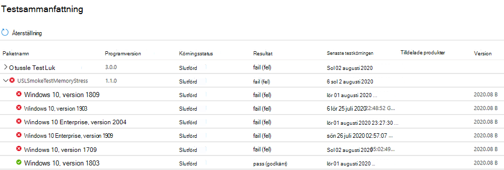

# <a name="memory-regression-analysis"></a><span data-ttu-id="98e14-103">Minnes regressionsanalys</span><span class="sxs-lookup"><span data-stu-id="98e14-103">Memory Regression Analysis</span></span>

<span data-ttu-id="98e14-104">Testbas hjälper dig att tydligare märka en betydande minnesanvändning ökar i test de virtuella maskinerna som kör dina appar.</span><span class="sxs-lookup"><span data-stu-id="98e14-104">Test Base helps you more clearly notice significant memory usage increases in the test VMs running your apps.</span></span> <span data-ttu-id="98e14-105">Prestandamätvärden, t.ex. minnesanvändning, kan samtidigt visa att programmet är allmänt hållet och vi tror att det här tillägget gör att apparna fungerar optimalt.</span><span class="sxs-lookup"><span data-stu-id="98e14-105">Performance metrics, such as memory usage, can be indicative of overall application health and we believe this addition will greatly help keep your apps performing optimally.</span></span>

<span data-ttu-id="98e14-106">Läs vidare för mer information eller titta på den här videon för en snabb genomgång av de senaste förbättringarna.</span><span class="sxs-lookup"><span data-stu-id="98e14-106">Read on for more details or watch this video for a quick walk through of the latest improvements.</span></span> 

<span data-ttu-id="98e14-107">Mer information om testbas för M365-möjligheten att bidra med regressionsanalys finns i Regressionsresultat baserat på processtillförlitlighet.</span><span class="sxs-lookup"><span data-stu-id="98e14-107">For more information on Test Base for M365's ability to help with regression analysis, see Regression results based on process reliability.</span></span>

<span data-ttu-id="98e14-108"><b>Titta närmare på minnes regressioner</b></span><span class="sxs-lookup"><span data-stu-id="98e14-108"><b>Looking closer at memory regressions</b></span></span>

<span data-ttu-id="98e14-109">Instrumentpanelen Testbas för M365 visar vilket minne som används av programmet i en ny förhandsuppdatering av Windows och jämför det med minnet som används av den senaste Windows uppdateringen.</span><span class="sxs-lookup"><span data-stu-id="98e14-109">The Test Base for M365 dashboard shows the memory consumed by your application on a new pre-released Windows update and compares it with the memory used by the last released Windows update.</span></span> 

<span data-ttu-id="98e14-110">Med den här månadens förbättringar visas nu minnes regressionsanalys i dina favoritprocesser.</span><span class="sxs-lookup"><span data-stu-id="98e14-110">With this month’s enhancements, memory regression analysis is now featured in your favorited processes.</span></span> <span data-ttu-id="98e14-111">Program kan innehålla flera processer och du kan manuellt välja dina favoritprocesser på fliken Tillförlitlighet. Vår tjänst identifierar sedan minnes regressioner i dessa favoritade processer samtidigt som testet jämförs körs över Windows uppdaterings versioner.</span><span class="sxs-lookup"><span data-stu-id="98e14-111">Applications can contain multiple processes and you can manually select your favorite processes through the Reliability tab. Our service will then identify memory regressions in these favorited processes while comparing test runs across different Windows update releases.</span></span> <span data-ttu-id="98e14-112">Om en regression identifieras är information om regressionen lätt tillgänglig.</span><span class="sxs-lookup"><span data-stu-id="98e14-112">If a regression is detected, details about the regression are easily available.</span></span>

<span data-ttu-id="98e14-113">Nu ska vi titta på den här funktionen i detalj och diskutera hur du kan felsöka minnes regressioner med hjälp Windows Analysera prestanda.</span><span class="sxs-lookup"><span data-stu-id="98e14-113">Now let's look at this feature in detail and discuss how you can troubleshoot memory regressions using Windows Performance Analyzer.</span></span>

<span data-ttu-id="98e14-114">Felsignalen som orsakas av minnes regression visas på instrumentpanelen Testbas för M365 på sidan Testresultat under Minnesutnyttjande:</span><span class="sxs-lookup"><span data-stu-id="98e14-114">The failure signal caused by a memory regression is shown in the Test Base for M365 dashboard on the Test results page under Memory Utilization:</span></span>


<span data-ttu-id="98e14-116">Fel i programmet på grund av högre minnesanvändning visas också som ```Fail``` på sidan Testsammanfattning:</span><span class="sxs-lookup"><span data-stu-id="98e14-116">Failure for the application due to higher memory consumption, will also be displayed as ```Fail``` on the Test Summary page:</span></span>



<span data-ttu-id="98e14-118">Genom att tillhandahålla dessa fel är vårt mål att tydligt flagga potentiella problem som kan störa och påverka slutanvändarupplevelsen för programmet.</span><span class="sxs-lookup"><span data-stu-id="98e14-118">By providing these failure signals upfront, our goal is to clearly flag potential issues that can disrupt and impact the end user experience for your application.</span></span> 

<span data-ttu-id="98e14-119">Du kan sedan ladda ned loggfilerna och använda Windows Performance Analyzer, eller det verktyg du föredrar, för att undersöka ytterligare.</span><span class="sxs-lookup"><span data-stu-id="98e14-119">You can then download the log files and use the Windows Performance Analyzer, or your preferred toolkit, to investigate further.</span></span> <span data-ttu-id="98e14-120">Du kan också samarbeta med M365-testgruppen för att åtgärda problemet och undvika problem som påverkar slutanvändarna.</span><span class="sxs-lookup"><span data-stu-id="98e14-120">You can also work jointly with the Test Base for M365 team on remediating the issue and help prevent issues impacting end users.</span></span>

<span data-ttu-id="98e14-121">Minnessignaler fångas på fliken Minnesutnyttjande i tjänsten Testbas för M365 för alla testkörningar.</span><span class="sxs-lookup"><span data-stu-id="98e14-121">Memory signals are captured in the Memory Utilization tab in the Test Base for M365 service for all test runs.</span></span> <span data-ttu-id="98e14-122">Exemplet nedan visar en testkörning med det onboarded-programmet "Test av minnesstress" mot säkerhetsuppdateringen i augusti 2020.</span><span class="sxs-lookup"><span data-stu-id="98e14-122">The example below shows a recent test run with the onboarded application “Smoke Test Memory Stress” against the pre-release August 2020 security update.</span></span> <span data-ttu-id="98e14-123">(Det här programmet har skrivits av vårt team för att illustrera minnes regressioner.)</span><span class="sxs-lookup"><span data-stu-id="98e14-123">(This application was written by our team to illustrate memory regressions.)</span></span>


<span data-ttu-id="98e14-125">I det här exemplet förbrukade favoritprocessen "USLTestMemoryStress.exe"-processen i genomsnitt cirka 100 MB vid förhandsuppdateringen av augusti jämfört med uppdateringen för juli, och därför identifieras en regression av testbasen för M365.</span><span class="sxs-lookup"><span data-stu-id="98e14-125">In this example, the favorite process “USLTestMemoryStress.exe” process consumed an average of approximately 100 MB on the pre-release August update compared to the released July update, hence the Test Base for M365 identified a regression.</span></span> 

<span data-ttu-id="98e14-126">De andra processerna – som visas här som "USLTestMemoryStress_Aux1.exe" och "USLTestMemoryStress_Aux2.exe" – hör också till samma program, men förbrukade ungefär samma mängd minne för de två versionerna så att de "passerat" och anses vara felfria.</span><span class="sxs-lookup"><span data-stu-id="98e14-126">The other processes—shown here as “USLTestMemoryStress_Aux1.exe” and “USLTestMemoryStress_Aux2.exe”—also belong to the same application, but consumed approximately the same amount of memory for the two releases so they "passed" and were considered healthy.</span></span>

<span data-ttu-id="98e14-127">Regressionen i huvudprocessen bestämdes vara "statistiskt signifikant" så att tjänsten kommunicerades och markerade den här skillnaden för användaren.</span><span class="sxs-lookup"><span data-stu-id="98e14-127">The regression on the main process was determined to be “statistically significant” so the service communicated and highlighted this difference to the user.</span></span> <span data-ttu-id="98e14-128">Om jämförelsen inte är statistiskt signifikant markeras den inte.</span><span class="sxs-lookup"><span data-stu-id="98e14-128">If the comparison was not statistically significant, it would not be highlighted.</span></span> <span data-ttu-id="98e14-129">Minnesutnyttjande kan vara bullrigt, så vi använder statistiska modeller för att skilja på versioner och versioner samt meningsfulla skillnader från inkonsekvenser.</span><span class="sxs-lookup"><span data-stu-id="98e14-129">Memory utilization can be noisy, so we use statistical models to distinguish, across builds and releases, meaningful differences from inconsequential differences.</span></span> 

<span data-ttu-id="98e14-130">En jämförelse kan sällan flaggas när det inte finns någon verklig skillnad (falsk positiv identifiering), men det är en nödvändig kompromiss för att förbättra sannolikheten för att korrekt identifiera regressioner (eller sant positiva identifieringar).)</span><span class="sxs-lookup"><span data-stu-id="98e14-130">A comparison may rarely be flagged when there is no true difference (a false positive), but this is a necessary tradeoff to improve the likelihood of correctly identifying regressions (or true positives.)</span></span>

<span data-ttu-id="98e14-131">Nästa steg är att förstå vad som orsakade minnes regressionen.</span><span class="sxs-lookup"><span data-stu-id="98e14-131">The next step is to understand what caused the memory regression.</span></span> <span data-ttu-id="98e14-132">Du kan ladda ned ZIP-filerna för båda körningarna med alternativet Ladda ned loggfiler, som du ser nedan.</span><span class="sxs-lookup"><span data-stu-id="98e14-132">You can download the zip files for both executions from the Download log files option, as shown below.</span></span> 

<span data-ttu-id="98e14-133">Zip-filerna innehåller resultatet av testkörningen, inklusive skriptresultat och minnes- och CPU-prestandadata som ingår i ETL-filen.</span><span class="sxs-lookup"><span data-stu-id="98e14-133">These zip files contain the results of your test run, including script results and memory and CPU performance data which is included in the ETL file.</span></span>


<span data-ttu-id="98e14-135">Du kan ladda ned och packa upp loggarna för de två testerna, leta upp ETL-filen i varje mapp och byta namn på dem som target.etl (för testkörningen kör på förhandsuppdateringen) och baseline.etl (för testkörningen som släpptes senast) för att förenkla utforskning och navigering.</span><span class="sxs-lookup"><span data-stu-id="98e14-135">You can download and unzip the logs for the two test runs, then locate the ETL file within each folder and rename them as target.etl (for the test run on the pre-release update) and baseline.etl (for the test run on last released update) to simplify exploration and navigation.</span></span>
 
## <a name="next-steps"></a><span data-ttu-id="98e14-136">Nästa steg</span><span class="sxs-lookup"><span data-stu-id="98e14-136">Next steps</span></span>

<span data-ttu-id="98e14-137">Gå vidare till nästa artikel för att komma igång med att förstå intelligent regressionsanalys av processorkraften.</span><span class="sxs-lookup"><span data-stu-id="98e14-137">Advance to the next article to get started with understanding intelligent CPU regression analysis.</span></span>
> [!div class="nextstepaction"]
> [<span data-ttu-id="98e14-138">Nästa steg</span><span class="sxs-lookup"><span data-stu-id="98e14-138">Next step</span></span>](cpu.md)

<!---
Add button for next page
-->
