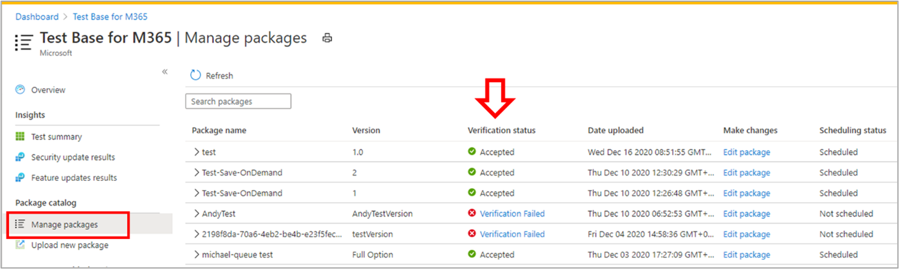

# <a name="step-6-review-your-selections-to-create-your-package"></a><span data-ttu-id="40a0a-103">Steg 6: Granska dina val för att skapa paketet.</span><span class="sxs-lookup"><span data-stu-id="40a0a-103">Step 6: Review your selections to create your package.</span></span>

1.  <span data-ttu-id="40a0a-104">På den här fliken visar tjänsten din testinformation och kör en snabb kompletthetskontroll.</span><span class="sxs-lookup"><span data-stu-id="40a0a-104">On this tab, the service displays your test details and runs a quick completeness check.</span></span> 

    <span data-ttu-id="40a0a-105">Ett ```Validation passed``` eller flera meddelanden visas om du kan fortsätta med nästa steg eller ```Validation failed``` inte.</span><span class="sxs-lookup"><span data-stu-id="40a0a-105">A ```Validation passed``` or ```Validation failed``` message shows whether you can proceed to next steps or not.</span></span>

2.  <span data-ttu-id="40a0a-106">Granska testinformationen och klicka på knappen om den är ```Create``` nöjd.</span><span class="sxs-lookup"><span data-stu-id="40a0a-106">Review your test details and if satisfied, click on the ```Create``` button.</span></span> 


3.  <span data-ttu-id="40a0a-108">Paketet introduceras då i Test Base-miljön.</span><span class="sxs-lookup"><span data-stu-id="40a0a-108">This will onboard your package to the Test Base environment.</span></span> <span data-ttu-id="40a0a-109">Om paketet skapas körs ett automatiskt test som verifierar om paketet kan köras på Azure.</span><span class="sxs-lookup"><span data-stu-id="40a0a-109">If your package is successfully created, an automated test which verifys whether your package can be successfully executed on Azure will be triggered.</span></span>


> [!Note]
> <span data-ttu-id="40a0a-111">Du får ett meddelande från Azure Portal om att paketverifieringen har lyckats eller misslyckats.</span><span class="sxs-lookup"><span data-stu-id="40a0a-111">You will get a notification from the Azure portal to notify you on the success or failure of the package verification.</span></span> 
>
> <span data-ttu-id="40a0a-112">Observera att processen kan ta upp till 24 timmar, så det är troligt att tidsgränsen för din webbsida löper ut om du inte är aktiv på den, och du får därför inget meddelande om att den här on-demand-körningen är slutförd.</span><span class="sxs-lookup"><span data-stu-id="40a0a-112">Please note that the process can take up to 24 hours, so it is likely your webpage will timeout if you are not active on it and hence, the notification will not inform you of the completion of this on-demand run.</span></span> 

  - <span data-ttu-id="40a0a-113">Det här inträffar om du ser status för paketet på ```Manage packages``` fliken.</span><span class="sxs-lookup"><span data-stu-id="40a0a-113">Peradventure this happens, you can view the status of your package on the ```Manage packages``` tab.</span></span>



  - <span data-ttu-id="40a0a-115">För bra tester visas resultaten via och sidorna med schemalagda intervaller, som ofta startar några dagar ```Test Summary``` ```Security Updates Results``` efter ```Feature Updates Results``` uppladdningen.</span><span class="sxs-lookup"><span data-stu-id="40a0a-115">For succesful tests, their results can be seen via the ```Test Summary```, ```Security Updates Results``` and ```Feature Updates Results``` pages at scheduled intervals, often starting a few days after your upload.</span></span>
  
  - <span data-ttu-id="40a0a-116">Även om testerna misslyckades måste du ladda upp ett nytt paket.</span><span class="sxs-lookup"><span data-stu-id="40a0a-116">While failed tests, require you to upload a new package.</span></span> 
  
    <span data-ttu-id="40a0a-117">Du kan ladda ned ```test logs``` för vidare analys från ' och ```Security update results``` ```Feature updates results``` sidor.</span><span class="sxs-lookup"><span data-stu-id="40a0a-117">You can download the ```test logs``` for further analysis from the ‘```Security update results``` and ```Feature updates results``` pages.</span></span>

  - <span data-ttu-id="40a0a-118">Om du får upprepade testfel får du gärna kontakta testbasepreview@microsoft.com information om felet.</span><span class="sxs-lookup"><span data-stu-id="40a0a-118">If you experience repeated test failures, please reach out to testbasepreview@microsoft.com with details of your error.</span></span> 

## <a name="next-steps"></a><span data-ttu-id="40a0a-119">Nästa steg</span><span class="sxs-lookup"><span data-stu-id="40a0a-119">Next steps</span></span>

<span data-ttu-id="40a0a-120">Upptäck våra riktlinjer för innehåll via länken nedan.</span><span class="sxs-lookup"><span data-stu-id="40a0a-120">Discover our Content Guidelines via the link below.</span></span>
> [!div class="nextstepaction"]
> [<span data-ttu-id="40a0a-121">Nästa steg</span><span class="sxs-lookup"><span data-stu-id="40a0a-121">Next step</span></span>](contentguideline.md)
