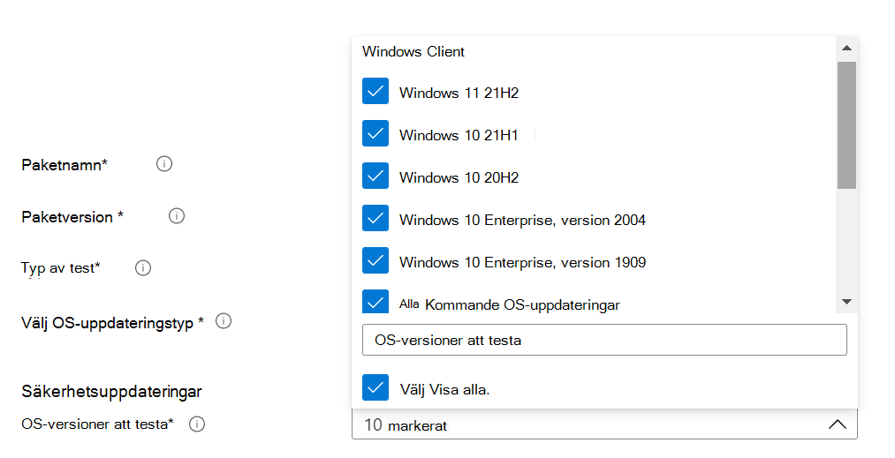

# <a name="step-2-uploading-a-package"></a><span data-ttu-id="867cc-103">Steg 2: Ladda upp ett paket</span><span class="sxs-lookup"><span data-stu-id="867cc-103">Step 2: Uploading a Package</span></span>

<span data-ttu-id="867cc-104">På sidan Test Base-portalen går du till alternativet för Upload nytt paket i det vänstra navigeringsfältet enligt nedan: Upload </span><span class="sxs-lookup"><span data-stu-id="867cc-104">On the Test Base portal page, navigate to the ‘Upload new package option on the left navigation bar as shown below: </span></span>

<span data-ttu-id="867cc-105">När du är där följer du stegen nedan för att ladda upp ett nytt paket.</span><span class="sxs-lookup"><span data-stu-id="867cc-105">Once there, follow the steps below to upload a new package.</span></span>

## <a name="enter-details-for-your-package"></a><span data-ttu-id="867cc-106">Ange information om ditt paket</span><span class="sxs-lookup"><span data-stu-id="867cc-106">Enter details for your package</span></span>

<span data-ttu-id="867cc-107">På fliken Testinformation skriver du in paketets namn, version och annan information som efterfrågas.</span><span class="sxs-lookup"><span data-stu-id="867cc-107">On the Test details tab, type in your package's name, version and other details as requested.</span></span> 

<span data-ttu-id="867cc-108">**Du kan testa de färdiga funktionerna** via **den** här instrumentpanelen.</span><span class="sxs-lookup"><span data-stu-id="867cc-108">**Out-of-Box** and **Functional testing** can be done via this dashboard.</span></span>

<span data-ttu-id="867cc-109">Stegen nedan ger en guide om hur du fyller i paketinformationen:</span><span class="sxs-lookup"><span data-stu-id="867cc-109">The steps below provides a guide on how to fill out your package details:</span></span>

1.  <span data-ttu-id="867cc-110">**Ange det namn som ska anges för paketet i ```“Package name``` fältet.**</span><span class="sxs-lookup"><span data-stu-id="867cc-110">**Enter the name to be given your package in the ```“Package name``` field.**</span></span>

> [!Note]  
> <span data-ttu-id="867cc-111">Den paketnamns- och versionskombination som har angetts måste vara unik inom din organisation.</span><span class="sxs-lookup"><span data-stu-id="867cc-111">The package name and version combination entered must be unique within your organization.</span></span> <span data-ttu-id="867cc-112">Detta valideras av bockmarkeringen enligt nedan.</span><span class="sxs-lookup"><span data-stu-id="867cc-112">This is validated by the checkmark as shown below.</span></span>
  
  - <span data-ttu-id="867cc-113">Om du väljer att använda paketets namn på nytt måste versionsnumret vara unikt (d.v.s. aldrig ha använts med ett paket som kan innehålla det specifika namnet).</span><span class="sxs-lookup"><span data-stu-id="867cc-113">If you choose to re-use an package's name, then the version number must be unique (i.e. never been used with an package bearing that particular name).</span></span>
  - <span data-ttu-id="867cc-114">Om kombinationen av paketnamnet + versionen inte klarar unikhetskontrollen visas ett felmeddelande med meddelandet "Paketera med den här paketversionen *finns redan".*</span><span class="sxs-lookup"><span data-stu-id="867cc-114">If the combination of the package name + version does not pass the uniqueness check, you will see an error message which reads, *“Package with this package version already exists”*.</span></span> 


2. <span data-ttu-id="867cc-116">**Ange en version i fältet Paketversion.**</span><span class="sxs-lookup"><span data-stu-id="867cc-116">**Enter a version in the “Package version” field.**</span></span>


3.  <span data-ttu-id="867cc-118">**Välj vilken typ av test du vill köra på paketet**</span><span class="sxs-lookup"><span data-stu-id="867cc-118">**Select the type of test you want to run on this package**</span></span>

    <span data-ttu-id="867cc-119">Ett **OOB-test (Out-of-Box)** utför en *installation*, *start,* *stängning* och *avinstallation* av paketet.</span><span class="sxs-lookup"><span data-stu-id="867cc-119">An **Out-of-Box (OOB)** test performs an *install*, *launch*, *close* and *uninstall* of your package.</span></span> <span data-ttu-id="867cc-120">Efter installationen upprepas stängningsrutin för start 30 gånger innan en enskild avinstallation körs.</span><span class="sxs-lookup"><span data-stu-id="867cc-120">After the install, the launch-close routine is repeated 30 times before a single uninstall is run.</span></span> 
    
    <span data-ttu-id="867cc-121">Detta OOB-test förser dig med standardiserad telemetri på ditt paket för att jämföra Windows olika byggen.</span><span class="sxs-lookup"><span data-stu-id="867cc-121">This OOB test provides you with standardized telemetry on your package to compare across Windows builds.</span></span>

    <span data-ttu-id="867cc-122">Ett **funktionstest** skulle köra dina uppladdade testskript på paketet.</span><span class="sxs-lookup"><span data-stu-id="867cc-122">A **Functional test** would execute your uploaded test script(s) on your package.</span></span> <span data-ttu-id="867cc-123">Skripten körs i överföringssekvens och ett fel i ett visst skript stoppar efterföljande skript att köras.</span><span class="sxs-lookup"><span data-stu-id="867cc-123">The scripts are run in upload sequence and a failure in a particular script will stop subsequent scripts from executing.</span></span>

> [!Note]
> <span data-ttu-id="867cc-124">**Alla** skript körs högst i 80 minuter.</span><span class="sxs-lookup"><span data-stu-id="867cc-124">**All** scripts run for 80 minutes at the most.</span></span> 
    
4.  <span data-ttu-id="867cc-125">**Välj typ av OS-uppdatering**</span><span class="sxs-lookup"><span data-stu-id="867cc-125">**Select the OS update type**</span></span>

   - <span data-ttu-id="867cc-126">Med säkerhetsuppdateringarna kan paketet testas mot stegvisa fallande Windows månads säkerhetsuppdateringar.</span><span class="sxs-lookup"><span data-stu-id="867cc-126">The ‘Security updates’ enables your package to be tested against incremental churns of Windows pre-release monthly security updates.</span></span> 
   - <span data-ttu-id="867cc-127">Funktionsuppdateringarna gör att ditt paket kan testas mot Windows versioner av funktionsuppdateringar per år från Windows Insider Program.</span><span class="sxs-lookup"><span data-stu-id="867cc-127">The ‘Feature updates’ enables your package to be tested against Windows pre-release bi-annual feature updates builds from the Windows Insider Program.</span></span>
<!---
Change to the correct picture
-->


5.  <span data-ttu-id="867cc-129">**Välj OS-versionerna för säkerhetsuppdateringstester.**</span><span class="sxs-lookup"><span data-stu-id="867cc-129">**Select the OS version(s) for Security update tests.**</span></span>

<span data-ttu-id="867cc-130">I listrutan för flerval väljer du operativsystemets versioner Windows ditt paket ska installeras på.</span><span class="sxs-lookup"><span data-stu-id="867cc-130">In the multi-select dropdown, select the OS version(s) of Windows your package will be installed on.</span></span> 

  - <span data-ttu-id="867cc-131">Om du vill testa paketet Windows endast klient-OSes väljer du de Windows 11 OS-versionerna i menylistan.</span><span class="sxs-lookup"><span data-stu-id="867cc-131">To test your package against Windows Client OSes only, select the applicable Windows 11 OS versions from the menu list.</span></span>
  - <span data-ttu-id="867cc-132">Om du vill testa paketet Windows endast server-OSes väljer du de Windows Server OS-versionerna i menylistan.</span><span class="sxs-lookup"><span data-stu-id="867cc-132">To test your package against Windows Server OSes only, select the applicable Windows Server OS versions from the menu list.</span></span>
  - <span data-ttu-id="867cc-133">Om du vill testa paketet Windows server- och klient-OSes markerar du alla tillämpliga OSes i menylistan.</span><span class="sxs-lookup"><span data-stu-id="867cc-133">To test your package against Windows Client and Server OSes, select all applicable OSes from the menu list.</span></span> 

> [!Note]
> <span data-ttu-id="867cc-134">Om du väljer att testa paketet mot både server- och klient-OSes kontrollerar du att paketet är kompatibelt och kan köras på båda OSes</span><span class="sxs-lookup"><span data-stu-id="867cc-134">If you select to test your package against both Server and Client OSes, please make sure that the package is compatible and can run on both OSes</span></span>



<!---
Change to the correct picture
-->
6.  <span data-ttu-id="867cc-136">**Välja alternativ för funktionsuppdateringstester:**</span><span class="sxs-lookup"><span data-stu-id="867cc-136">**Select options for Feature update tests:**</span></span>

  - <span data-ttu-id="867cc-137">När du väljer "Välj Insider-kanal" väljer du ```Windows Insider Program Channel``` den version som paketen ska testas mot.</span><span class="sxs-lookup"><span data-stu-id="867cc-137">On the option to “Select Insider Channel”, select the ```Windows Insider Program Channel``` as the build which your packages should be tested against.</span></span>
  
    <span data-ttu-id="867cc-138">Vi använder för närvarande versionerna i Insider Beta-kanalen.</span><span class="sxs-lookup"><span data-stu-id="867cc-138">We currently use builds flighted in the Insider Beta Channel.</span></span>

  - <span data-ttu-id="867cc-139">På alternativet för att "Välj OS-baslinje för Insikt" väljer du den Windows OS-version som ska användas som baslinje när du jämför testresultaten.</span><span class="sxs-lookup"><span data-stu-id="867cc-139">On the option to “Select OS baseline for Insight”, select the Windows OS version to be used as a baseline in comparing your test results.</span></span> 

> [!Note]
> <span data-ttu-id="867cc-140">Vi stöder INTE funktionsuppdateringstestning för server-OSes för stunden</span><span class="sxs-lookup"><span data-stu-id="867cc-140">We DO NOT support Feature update testing for Server OSes at this time</span></span>
<!---
Note to actual note format for markdown
-->
<!---
Change to the correct picture
-->


7.  <span data-ttu-id="867cc-142">En färdig sida med testinformation ska se ut så här:</span><span class="sxs-lookup"><span data-stu-id="867cc-142">A completed Test details page should look like this:</span></span> 


## <a name="next-steps"></a><span data-ttu-id="867cc-144">Nästa steg</span><span class="sxs-lookup"><span data-stu-id="867cc-144">Next steps</span></span>

<span data-ttu-id="867cc-145">Vår nästa artikel handlar om att ladda upp binärfiler till vårt serivce.</span><span class="sxs-lookup"><span data-stu-id="867cc-145">Our next article covers Uploading your Binaries to our serivce.</span></span>
> [!div class="nextstepaction"]
> [<span data-ttu-id="867cc-146">Nästa steg</span><span class="sxs-lookup"><span data-stu-id="867cc-146">Next step</span></span>](binaries.md)

<!---
Add button for next page
-->

